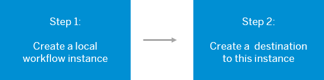

<!-- loio304a2187bf6e449a87e857ee843dec23 -->

# Deploying a Content Package with Workflow Content to SAP SuccessFactors Work Zone

To deploy a content package that includes workflow modules to your SAP SuccessFactors Work Zone, you need to do some configuration steps.


## Prerequisites

-   In your subaccount, you've enabled Cloud Foundry and created a new space.

-   An entitlement for the SAP Workflow service, standard plan has been configured. This is required to expose the *Workflow* tile in the Service Market Place.


<a name="loio304a2187bf6e449a87e857ee843dec23__section_oy2_rfn_y4b"/>

## Overall flow

When you deploy a content package with workflow content to SAP SuccessFactors Work Zone, you need to do the following steps:




<a name="loio304a2187bf6e449a87e857ee843dec23__section_k1z_f3m_y4b"/>

## Step 1: Create a workflow instance

In this step, you'll create a local instance of the SAP Workflow service in your subaccount.

1.  In the SAP BTP cockpit, open your subaccount.

2.  From the side menu, open the *Service Marketplace* and search for the *Workflow* tile.

3.  Click *Create* to create a workflow instance.

    > ### Note:  
    > The *Service*, *Plan*, *Runtime Environment*, and *Space* fields are already populated.

4.  Provide a name for the instance \(for example, ***Workflow\_API***\).

5.  Click *Next* to open the *Parameters* tab.

6.  Enter the following instance parameters:

    ```
    {
                      "authorities": [
                                  "WORKFLOW_DEFINITION_GET",
                                  "WORKFLOW_DEFINITION_GET_MODEL",
                                  "WORKFLOW_DEFINITION_UNDEPLOY",
                                  "FORM_DEFINITION_GET_MODEL",
                                  "FORM_DEFINITION_UNDEPLOY"
                      ]
          }
    
    ```

7.  Click *Create* to create the instance.


## Step 2: Create a destination to your workflow instance

In this step, you'll create a destination to the workflow instance that you've just created.

1.  In your subaccount, from the side menu of the SAP BTP cockpit, select *Destinations*.

2.  Click *New Destination*.

3.  In the *Destination Configuration* area, select the *Service Instance* tab.

4.  From the dropdown list, select the instance that you've just created called ***Workflow\_API***.
5.  Name the destination ***Workflow\_API***.

6.  Add to the destination the following parameter: `HTML5.DynamicDestination` and set its value to `true.`

7.  Click *Next*.

8.  Click *Edit* and replace the `Authentication` property value `OAuth2JWTBearer` with this value: `OAuth2UserTokenExchange`.
9.  Click *Save*.


For more information, see [**Creating Destinations to SAP Workflow Service**](https://help.sap.com/docs/SAP_SUCCESSFACTORS_WORK_ZONE/04877e17a5da4908a6fea94949e160b5/69e2305f80a94e85bf812693a6ea41fe.html)

You can now deploy a content package that contains workflow content into SAP SuccessFactors Work Zone.

