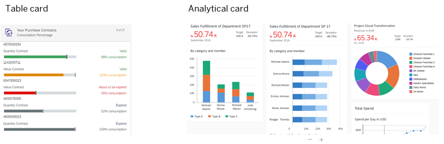

<!-- loioa202464ade1048169f68537036fe3140 -->

# About Cards

Cards are a major part of SAP Build Work Zone, advanced edition. They provide a quick and easy way to share content without having to add too much code.

You can use cards to group information, add links to more details, present a summary, and much more. As a result, users get the information they need all on one screen. A card can represent a single app or multiple apps with links to other apps and pages.

UI integration cards can also be developed in a way that makes them interact with each other on the same page. For more information, see [Interaction Between Cards](interaction-between-cards-e3dd5cc.md).

<a name="loioa202464ade1048169f68537036fe3140__section_msw_s3k_4qb"/>

## Overview

Each card is designed in a different style and contains various content formats and layouts depending on the card type that you choose. Here are some examples of the cards you can add:

-   List cards

-   Table cards

-   Timeline cards display items on a timeline.

-   Analytical cards allow you to analyze data in charts.

-   Object cards display information about a specific object in a structured way.

-   Component cards show parts of the UI of SAP Fiori apps or SAPUI5 apps.

For more information about the different card types, see [Card Explorer for UI Integration Cards.](https://ui5.sap.com/test-resources/sap/ui/integration/demokit/cardExplorer/webapp/index.html) 

Card examples:

> ### Tip:  
> Cards that are mobile compatible can be added to the SAP Mobile Cards app. For more information, see [Using Mobile Cards](using-mobile-cards-fa6adb3.md).

You can also add the out-of-the-box *Web Content Card* to embed content of any web page on to your workpage. For more information about the flow of adding this card, see [UI Integration Cards](ui-integration-cards-0bf9adc.md).

<a name="loioa202464ade1048169f68537036fe3140__section_g5r_hb5_pqb"/>

## Adding custom cards

Any custom cards that were developed in SAP Business Application Studio or sent to you by a different vendor, must be uploaded to your subaccount and activated by an administrator in the *Administration Console* \> *UI Integration* \> *Cards* screen. Once activated, they become visible in the *Cards* section of the widget gallery and you can add them to your workpages.

> ### Note:  
> If a developer updates a card that you've already added to your workpage, you'll need to remove it and add it again after the changes have been made.

For more information about managing and integrating cards, see [UI Integration Cards](ui-integration-cards-0bf9adc.md).

For more information about how to add cards to workpages, see [How to Add Content to Workspaces](how-to-add-content-to-workspaces-19bf8aa.md).

<a name="loioa202464ade1048169f68537036fe3140__section_mrt_fxt_pqb"/>

## Cards used in Content Packages

Cards can be deployed as part of a content package. A content package is a collection of content items such as cards, workspace templates, workspaces, and other content that is bundled together in a ZIP file and uploaded and installed by your administrator. All content items including the cards that are part of the content package must be activated by the administrator in order to add them to your workpages.

For more information, see [Content Packages](content-packages-da203f9.md).

