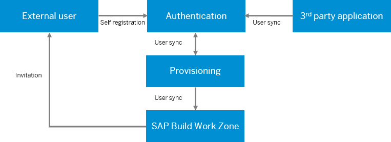

<!-- loio43782128ec724e10943efa74bfc63a47 -->

# About External Users

Information about adding and authenticating external users, what external users can do in the site and how to manage the external user settings.

<a name="loio43782128ec724e10943efa74bfc63a47__section_prw_gzr_mqb"/>

## Overview

External users are guests of your organization and as such they should not have access to any confidential or internal information. Before they can access the system, the company administrator must complete all the necessary configuration steps that will enable authentication of these users.

**Internal Vs. External Users** 

<table>
<tr>
<th valign="top">

Internal Users

</th>
<th valign="top">

External Users

</th>
</tr>
<tr>
<td valign="top">

Have access to the company and area home pages.

</td>
<td valign="top">

Have access to external-facing home page.

</td>
</tr>
<tr>
<td valign="top">

Can create workspaces.

</td>
<td valign="top">

Can't create workspaces.

</td>
</tr>
<tr>
<td valign="top">

Can have admin privileges - manage workspace settings, edit workspace content, invite users, etc.

</td>
<td valign="top">

Can't be assigned as workspace admin.

</td>
</tr>
<tr>
<td valign="top">

Can be invited as members to public and private workspaces.

</td>
<td valign="top">

Can be invited as members to public and private workspaces that allow external user access.

</td>
</tr>
<tr>
<td valign="top">

Have a personal workspace "My Workspace".

</td>
<td valign="top">

Don't have a personal workspace.

</td>
</tr>
<tr>
<td valign="top">

Can be invited as members to private and public workspaces.

</td>
<td valign="top">

Can be invited to external workspaces.

</td>
</tr>
<tr>
<td valign="top">

Can access any public workspace without being a member, unless the access was restricted to specific users or roles.

</td>
<td valign="top">

Can access public workspaces without being a member, as long as their user/DL/role is specified in the access policy settings.

</td>
</tr>
<tr>
<td valign="top">

Can search for any public workspace without being a member, unless the access was restricted to specific users or roles.

</td>
<td valign="top">

Can search for public workspaces without being a member, as long as their user/DL/role is specified in the access policy settings.

</td>
</tr>
<tr>
<td valign="top">

Can collaborate in a workspace, according to their collaboration level \(full, restricted, none\).

</td>
<td valign="top">

Can collaborate in a workspace, according to their collaboration level \(full, restricted, none\).

</td>
</tr>
<tr>
<td valign="top">

Can tag people, add kudos.

</td>
<td valign="top">

Can't tag people, can't add kudos.

</td>
</tr>
<tr>
<td valign="top">

Can manage own profile.

</td>
<td valign="top">

Can manage own profile.

</td>
</tr>
<tr>
<td valign="top">

Use SAP Build Work Zone, advanced edition mobile app.

</td>
<td valign="top">

Use SAP Build Work Zone, advanced edition mobile app.

</td>
</tr>
</table>

<a name="loio43782128ec724e10943efa74bfc63a47__section_wzl_yhf_mqb"/>

## Creating External Users

Before external users can access the system, they must be created on Identity Authentication \(no mater if the Identity Authentication service is used as the IdP or if it used as a proxy of a corporate IdP\), and be provisioned by the Identity Provisioning service to SAP Build Work Zone, advanced edition.

External users are added to Identity Authentication in one of the following ways:

-   **Invitation-based self-registration** - external users are invited to join a workspace via email, and upon accepting the invitation perform a self-registration to SAP Build Work Zone, advanced edition. This option is relevant when the Identity Authentication service is used as the primary IdP and it's configured as a trusted IdP. Upon registration, the Identity Provisioning service syncs the new users \(via SCIM API\) with SAP Build Work Zone, advanced edition. If a user is already registered, when accepting the invitation, he/she is prompted to login with their credentials. For more information, see [Using the SCIM API](using-the-scim-api-6bd5237.md).

-   **SAML-based creation** - external users are created "on the fly" based on their initial login via the connected IdP \(SAP or 3rd party\), in addition to creating them via the SCIM API. Note: Updating or removing users can only be done via the SCIM API. For more information, see [Allow SAML Assertion-Based Creation of External Users](allow-saml-assertion-based-creation-of-external-users-1c88797.md).

    > ### Note:  
    > External users can also be provisioned from SAP SuccessFactors Work Zone as the source system.

<a name="loio43782128ec724e10943efa74bfc63a47__section_ff3_r11_h1c"/>

## External User Authentication Flow

To be able to access SAP Build Work Zone, advanced edition, external users must be authenticated. The following configuration steps are required to enable external user authentication.

For more information, see [Configuring External Users Authentication](configuring-external-users-authentication-df89bb3.md).

<a name="loio43782128ec724e10943efa74bfc63a47__section_qqc_1nj_31c"/>

## Managing External Users

Once external users were added to Identity Authentication or a corportate IdP, and then provisioned by the Identity Provisiong service to SAP Build Work Zone, advanced edition, you can view and manage the users in the Admin Console *Users* \> *External Users* screen. For more information, see [Managing External Users](managing-external-users-983b77d.md).

<a name="loio43782128ec724e10943efa74bfc63a47__section_ps5_fwx_31c"/>

## Migrating External Users from SAP Jam

If you've created your SAP Build Work Zone, advanced edition tenant based on an SAP Jam tenant, and you would like to migrate the active external users from SAP Jam, see [Migrating SAP Jam External Users](migrating-sap-jam-external-users-9969e14.md).

