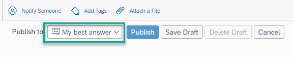
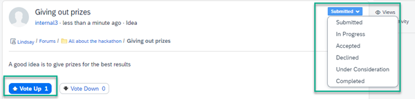
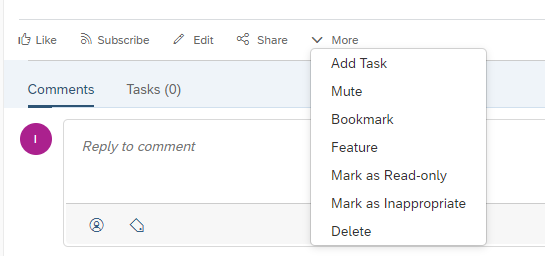

<!-- loio83e4c9ad3c454068b126eebe447590b1 -->

# About Forums

To discuss ideas with the members of your workspace or to ask them questions and find solutions together, you can use forums.

Forums structure your exchange of ideas and become a knowledge base where you can later look up topics that were already discussed or questions that were already answered.

To add Forums to a workpage, see [How to Create and Manage Forums](how-to-create-and-manage-forums-ee3546a.md).

There are different types of forums for different purposes. Your workspace administrator defines which of the following forum types are enabled for the workspace:

<table>
<tr>
<th valign="top">

Forum Type

</th>
<th valign="top">

Description

</th>
</tr>
<tr>
<td valign="top">

*Questions* 

</td>
<td valign="top">

In a *Question* forum, you can only ask questions.

Workspace members can reply to a question by posting a comment as an answer.

Question creators and workspace administrators can mark the best answer to indicate to everyone that the question has been resolved.

Workspace administrators and question creators can mark a particular answer as a best answer. This answer moves to the top of the replies section to easily stand out amongst all answers. Only one answer can be marked as the best answer.

This allows other users to quickly identify the correct or most up-to-date information when they search the forum. In the questions list view, workspace administrators can easily see which questions have been answered without clicking them to see which ones need attention.

</td>
</tr>
<tr>
<td valign="top">

*Ideas* 

</td>
<td valign="top">

In an *Ideas* forum, you can only add ideas. Post an idea to share it with other workspace members and get feedback from them.

Workspace members can reply to an idea by voting for the idea or by posting comments. *Up* votes and *Down* votes are tracked independently of one another, rather than ‘down’ votes detracting from ‘up’ vote counts.

In the single item view of an idea, workspace administrators can set the status of the idea.

</td>
</tr>
<tr>
<td valign="top">

*Discussions* 

</td>
<td valign="top">

In a *Discussions* forum, every forum item is a discussion topic.

Workspace members can take part in the discussion by posting comments.

</td>
</tr>
<tr>
<td valign="top">

*Questions, Ideas, and Discussions* 

</td>
<td valign="top">

A *Questions, Ideas, and Discussions* forum is a general forum that allows workspace members to ask questions, add ideas, or start discussions.

</td>
</tr>
</table>

<a name="loio83e4c9ad3c454068b126eebe447590b1__section_mks_2s3_skb"/>

## Actions for Questions, Ideas, and Discussions

To answer a question, to give feedback to an idea, or to contribute to a discussion, choose the question, idea, or discussion to open it. You can then post comments and reply to comments by other users.

Once you've created a question, idea, or started a discussion, you need to publish it so that others can see it. Once you've published your forum item, there are various actions that users can do when they click your item: These include:

<table>
<tr>
<th valign="top">

Action

</th>
<th valign="top">

Description

</th>
</tr>
<tr>
<td valign="top">

*Subscribe*/*Unsubscribe*

</td>
<td valign="top">

Subscribe to a forum item to receive notifications for all important updates on that topic.

</td>
</tr>
<tr>
<td valign="top">

*Share*

</td>
<td valign="top">

Share your forum item with everyone in the company or only with workspace colleagues.

</td>
</tr>
<tr>
<td valign="top">

*Edit*

</td>
<td valign="top">

Clicking Edit opens up the editor where you created the forum item and you can update it.

</td>
</tr>
<tr>
<td valign="top">

*Add Task*

</td>
<td valign="top">

Under More, you can:

-   *Add Task*: Opens an editor so that you can create tasks with reminders, a due date, and more. For more information, see [Tasks](tasks-8b083e5.md).

-   *Mute*: If you don't want to get notifications or updates about a question, idea, or discussion, you can mute it.

-   *Bookmark*: Add a question, idea, or discussion to your bookmarks. For more information, see [Bookmarks](bookmarks-c757e77.md).

-   *Feature*: Draw attention to a question, idea, or discussion, by featuring it. Featured items can be displayed within a dedicated *Featured* content widget on a workpage.

-   *Mark as Read Only*: Set questions, ideas, or discussions within a selected forum to read-only so that members can no longer contribute to them. These questions, ideas, or discussions are closed to further comments or edits.

-   *Delete*: Delete a forum item.

</td>
</tr>
</table>

<a name="loio83e4c9ad3c454068b126eebe447590b1__section_als_dyk_3dc"/>

## More Information

-   For more information about how to add a forum, see [How to Create and Manage Forums](how-to-create-and-manage-forums-ee3546a.md).

-   For more information about the *Forum* widget, see [Forum Widget](forum-widget-617530d.md)

