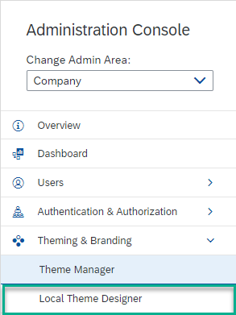

<!-- loiof68b18b6486b41568161d7b4f226532e -->

# About Local and Global Themes

In SAP Build Work Zone, advanced edition, you can either use global themes, created in the UI theme designer and managed in the Theme Manager tool, or you can use local themes that are created in the Local Theme Designer in the Administration Console.

<a name="loiof68b18b6486b41568161d7b4f226532e__section_trn_vpf_m5b"/>

## Where do I manage themes and branding?

In the Administration Console, under *Theming & Branding* \> *Theme Manager* screen, you manage global and local themes.

> ### Remember:  
> You can either use a global theme or a local theme, but not both. We highly recommend using global themes rather than local themes because they're centrally managed and apply to the entire user interface. Local themes only partially affect the user interface.

<a name="loiof68b18b6486b41568161d7b4f226532e__section_ifg_gjp_xkb"/>

## Working with Global Themes

You can create your own themes and apply your corporate branding to your site using the following tools:

-   *UI theme designer* - use one of SAP's standard themes and base your new theme on the one you select.

-   *Theme Manager* - manage your themes in this tool - you can:

    -   Select the default theme for your site.

    -   Enable or disable theme selection when users personalize their *Appearance* settings that you can access from the User Actions menu under *Settings*.

    -   Preview a theme.

    -   Directly access the UI Theme Designer tool.

For more information about creating and managing global themes, see [Overview of Theming and Branding](overview-of-theming-and-branding-c9299d9.md)

> ### Note:  
> You have to disable any theme that you may have created locally before switching to a global theme in the Theme Manager.

### Disabling Existing Local Themes

1.  On the *Theme Manager* page, in the *Local Themes* section, go to the *Company Theme* tab.

2.  Select the *Don't use company theme* option.

3.  If you defined a local theme for external users, go to the *External User Theme* tab, and select *Don't use external user theme*.

4.  If you defined a local theme for a specific area, switch to that area in the *Change Admin Area* dropdown at the top of the Administration Console, and then disable it the same way as you did above.

<a name="loiof68b18b6486b41568161d7b4f226532e__section_qyn_gjp_xkb"/>

## Working with Local Themes

> ### Note:  
> Local themes only affect some parts of the UI and are supported mainly for compatibility reasons. Therefore, we recommend that you use global themes instead.

You create local themes in the *Theming & Branding* \> *Local Theme Designer* screen, where you have a selection of branding attributes that you can modify.

### Enabling Local Themes

To apply a local theme, make sure that local themes are enabled:

1.  On the *Theme Manager* page, in the *Local Themes* section, go to the *Company Theme* tab.

    

2.  Select the *Use company theme* option.

3.  If you defined a local theme for external users, go to the *External User Theme* tab, and select *Use external user theme*.

4.  If you defined a local theme for a specific area, switch to that area in the *Change Admin Area* dropdown at the top of the Administration Console. On the *Theme Manager* screen, go to the *Local Themes* section, and then select not to use that local theme.

