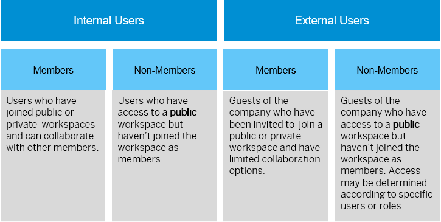

<!-- loio0d2d491f857642c29eb7021dc0ef25d0 -->

# About Members and Non-Members

Users \(internal or external\), who are invited to join a workspace \(public or private\) become members of the workspace. Non-members are users who can access a workspace without joining it. Only public workspaces allow non-member access.

<a name="loio0d2d491f857642c29eb7021dc0ef25d0__section_pkz_g54_k1c"/>

## Overview

The diagram below gives an overview of the what members and non-members are, and what they can do in a workspace depending on the workspace settings that have been defined.

<a name="loio0d2d491f857642c29eb7021dc0ef25d0__section_gl1_s3x_31c"/>

## Member and Non-Members Privileges

-   Public workspaces - depending on the collaboration level, defined in the workspace settings, members and non-members of a workspace can perform different actions in a workspace.
-   Private workspaces - only members can access and collaborate in the workspace.

<table>
<tr>
<th valign="top">

Action

</th>
<th valign="top">

Collaboration Level

</th>
<th valign="top">

Members

</th>
<th valign="top">

Non-Members

</th>
</tr>
<tr>
<td valign="top">

Invite users

</td>
<td valign="top">

All

</td>
<td valign="top">

Yes

</td>
<td valign="top">

No

</td>
</tr>
<tr>
<td valign="top">

Request admin privileges

</td>
<td valign="top">

All

</td>
<td valign="top">

Yes

</td>
<td valign="top">

No

</td>
</tr>
<tr>
<td valign="top">

View and download content

</td>
<td valign="top">

All

</td>
<td valign="top">

Yes

</td>
<td valign="top">

Yes

</td>
</tr>
<tr>
<td valign="top">

View member details

</td>
<td valign="top">

All

</td>
<td valign="top">

Yes

</td>
<td valign="top">

Yes, unless collaboration level is set to None.

</td>
</tr>
<tr>
<td valign="top">

Handle tasks according to what is selected in the *Task Policy* options

</td>
<td valign="top">

Full, Limited

</td>
<td valign="top">

Full - policy applies to new and existing tasks. Limited -policy only applies to existing tasks.

</td>
<td valign="top">

Same as members, unless collaboration level is set to None.

</td>
</tr>
<tr>
<td valign="top">

Trigger notifications when *@@Notify* is enabled

</td>
<td valign="top">

Full, Limited

</td>
<td valign="top">

Yes

</td>
<td valign="top">

Same as members, unless collaboration level is set to None.

</td>
</tr>
<tr>
<td valign="top">

Rate content when *Content Rating* is enabled

</td>
<td valign="top">

Full, Limited

</td>
<td valign="top">

Yes

</td>
<td valign="top">

Same as members, unless collaboration level is set to None.

</td>
</tr>
<tr>
<td valign="top">

Upload content when the *Upload Policy* is enabled

</td>
<td valign="top">

Full

</td>
<td valign="top">

Yes

</td>
<td valign="top">

Same as members, unless collaboration level is set to None.

</td>
</tr>
<tr>
<td valign="top">

Approve content according to what is selected in the *Content Approval* options

</td>
<td valign="top">

Full

</td>
<td valign="top">

Yes

</td>
<td valign="top">

Same as members, unless collaboration level is set to None.

</td>
</tr>
<tr>
<td valign="top">

Access workspace

</td>
<td valign="top">

All

</td>
<td valign="top">

Yes

</td>
<td valign="top">

Non-member can access public workspaces based on the *Access Policy* setting.

Access that is based on user email or a user list can be defined by the workspace admin, while access based on roles can only be defined by the company admin.

</td>
</tr>
<tr>
<td valign="top">

Pin a workspace as a favorite

</td>
<td valign="top">

All

</td>
<td valign="top">

Yes

</td>
<td valign="top">

Yes

</td>
</tr>
</table>

**Related Information**  

[How to Edit Workspace Settings](how-to-edit-workspace-settings-98ae51c.md "Workspace administrators can enable and configure a variety of settings that determine how workspace members can engage with their workspace.")

