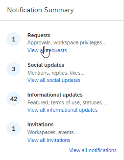

<!-- loiofc1ef68f111e49b48fdb23fbd9ee5010 -->

# About Notifications

You can get notifications about content updates using bell notifications and email digests.

<a name="loiofc1ef68f111e49b48fdb23fbd9ee5010__section_jrg_jz2_nkb"/>

## Notification Types

The following types of notifications are available:

<table>
<tr>
<th valign="top">

Type of notification

</th>
<th valign="top">

Purpose

</th>
<th valign="top">

Setup steps

</th>
</tr>
<tr>
<td valign="top">

Bell

</td>
<td valign="top">

To notify you of important updates, invitations, and approval requests.

</td>
<td valign="top">

No setup steps required.

</td>
</tr>
<tr>
<td valign="top">

Email

</td>
<td valign="top">

To notify you by email of important and periodic updates.

</td>
<td valign="top">

Go to the User Actions menu and choose *Settings* \> *Advanced Settings* \> *Email* to select which notifications you want to receive, and select the frequency of email notifications for each workspace you belong to.

</td>
</tr>
</table>

<a name="loiofc1ef68f111e49b48fdb23fbd9ee5010__section_x1m_vlk_mkb"/>

## Notification Features

<table>
<tr>
<th valign="top">

Feature

</th>
<th valign="top">

What it does

</th>
</tr>
<tr>
<td valign="top">

@mention

</td>
<td valign="top">

Lets you notify specific users.

You can @mention a user by typing @ and then selecting the user's name from the dropdown list. When you type the first few characters of the name, a list of matching names is displayed.

Depending on the context in which you use the @mention feature, the list of user names is based on:

-   **@mention within a workspace**: the list of possible user names is restricted to the members of that workspace.

-   **@mention outside a workspace**: the list includes all users.

</td>
</tr>
<tr>
<td valign="top">

@@notify

</td>
<td valign="top">

Lets you notify multiple users at the same time.

You can @@notify users by typing @@ and then selecting the recipients from the list.

Depending on the context in which you use the @@notify feature, the list of user names is based on:

-   **@@notify within a workspace**: notifies all members of that workspace about your content or activity.

-   **@@notify outside of a workspace/on your profile page**: notifies all users who follow you.

</td>
</tr>
</table>

<a name="loiofc1ef68f111e49b48fdb23fbd9ee5010__section_bh4_wmp_5xb"/>

## Email Notifications

Email notifications inform you of important and regular updates.

**Settings**

To access your email notification settings, go to the User Actions menu that opens when you select your avatar at the right side of the header bar. Choose *Settings* \> *Advanced Settings* \> *Email*.

****

<table>
<tr>
<th valign="top">

Tab

</th>
<th valign="top">

What you can do

</th>
</tr>
<tr>
<td valign="top">

*Notifications* 

</td>
<td valign="top">

Select events for which you want to receive email notifications from the following categories:

-   *Activity that involves you*

-   *Daily Summary Emails*

</td>
</tr>
<tr>
<td valign="top">

*Workspace Notifications* 

</td>
<td valign="top">

Choose when and how often you want to receive email notifications from workspaces of which you're a member.

You can select the email frequency for all workspaces or just for one specific workspace from the dropdown list.

</td>
</tr>
<tr>
<td valign="top">

*Collaboration* 

</td>
<td valign="top">

Update your home feed by email. You can choose if you want to send updates from the default email address or provide another email address.

</td>
</tr>
</table>

<a name="loiofc1ef68f111e49b48fdb23fbd9ee5010__section_qxz_qnp_5xb"/>

## Notification Summary

The *Notifications Summary* tile is only visible on the Home Page if the company administrator or area administrator has added the *Notifications* widget to a workpage.

The summary displays the number of unread notifications by category and will look like this:

<table>
<tr>
<th valign="top">

Category

</th>
<th valign="top">

Examples

</th>
</tr>
<tr>
<td valign="top">

*Social update* 

</td>
<td valign="top">

Mentions, replies, and likes

</td>
</tr>
<tr>
<td valign="top">

*Invitations* 

</td>
<td valign="top">

Workspace and event invitations

</td>
</tr>
<tr>
<td valign="top">

*Requests* 

</td>
<td valign="top">

Requests to join a workspace, requests to approve content

</td>
</tr>
<tr>
<td valign="top">

*Tasks* 

</td>
<td valign="top">

Tasks assigned, task reminders

</td>
</tr>
<tr>
<td valign="top">

*Informational updates* 

</td>
<td valign="top">

Featured in a workspace, workspace access granted

</td>
</tr>
</table>

