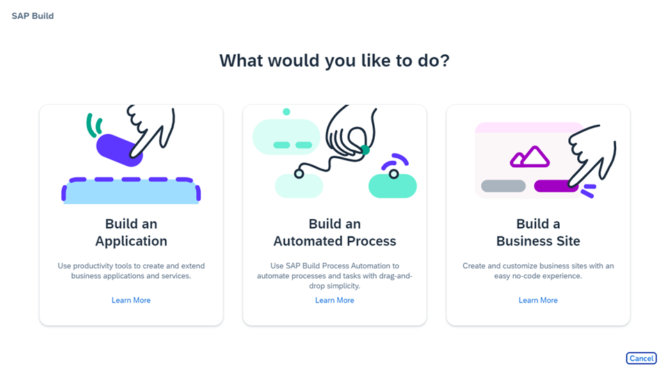

<!-- loio3d61413105714954a1cec2e416f1f439 -->

# About SAP Build

SAP Build Work Zone is one of the components of SAP Build.

<a name="loio3d61413105714954a1cec2e416f1f439__section_q4n_3g1_c2c"/>

## What is SAP Build?

SAP Build is an ecosystem that comprises of a number of services designed to empower innovation. Through a comprehensive suite of solutions, including both low-code and pro-code offerings, the platform caters to a spectrum of developers, ranging from citizen developers to professional developers and business experts.

SAP Build enables anyone, no matter what their skill level is, to create and augment enterprise applications, process automation, and business sites with drag-and-drop simplicity.

For more information, see [What is SAP Build?](https://help.sap.com/docs/build/sap-build-core/what-is-sap-build?version=Cloud)

## SAP Build Lobby

The SAP Build lobby is a central page for creating, accessing, and managing projects. You can access business applications, processes, company-configured templates, and other resources though the lobby.

You access the lobby from the SAP BTP cockpit. If you have a subscription to either SAP Build Apps, SAP Build Code, or SAP Build Process Automation, when accessing the service from the cockpit, the lobby will open.

Upon opening the lobby, select what you would like to do. Each option is enabled based on the subscription to the relevant SAP Build service.

<table>
<tr>
<th valign="top">

Action

</th>
<th valign="top">

Related Component

</th>
<th valign="top">

More Information

</th>
</tr>
<tr>
<td valign="top" rowspan="2">

Build an Application

</td>
<td valign="top">

SAP Build Apps

</td>
<td valign="top">

SAP Build Apps is a low-code development platform to create apps for the Web and native mobile use. Business users can build enterprise-grade apps without writing a single line of code. Professional developers can reduce coding effort in the creation of complex data models and business logic.

For more info, see [What Is SAP Build Apps?](https://help.sap.com/docs/BUILD_APPS/431746e4c663458aa68d9754b237bfc6/daece9f87abf4f7187a14ae0b1f8b2ab.html).

</td>
</tr>
<tr>
<td valign="top">

SAP Build Code

</td>
<td valign="top">

SAP Build Code offers an AI-powered cloud development environment specifically tailored for SAP Cloud Application Programming Model \(CAP\), SAP Fiori, mobile, and SAPUI5 developers. SAP Build Code streamlines the application development process on SAP BTP, and it combines SAP Business Application Studio with the most essential services and SDKs on SAP BTP.

For more information, see [What is SAP Build Code](https://help.sap.com/docs/build_code/d0d8f5bfc3d640478854e6f4e7c7584a/504854f457cc4fbf9f79136dbc773618.html).

</td>
</tr>
<tr>
<td valign="top">

Build an Automated Process

</td>
<td valign="top">

SAP Build Process Automation

</td>
<td valign="top">

SAP Build Process Automation is a citizen developer solution to adapt, improve, and innovate business processes with no-code workflow management and robotic process automation capabilities. For example, creating forms-based workflows and automating repetitive tasks within existing process flows.

For more information, see [What Is SAP Build Process Automation?](https://help.sap.com/docs/PROCESS_AUTOMATION/a331c4ef0a9d48a89c779fd449c022e7/c20b4e77201b4cde9ce4227e21850deb.html).

</td>
</tr>
<tr>
<td valign="top">

Build a Business Site

</td>
<td valign="top">

SAP Build Work Zone

</td>
<td valign="top">

Using SAP Build Work Zone, you can create business sites that serve as a unified point of access to SAP, custom-built, and third party applications and extensions, both on the cloud and on premise.

After creating a business app, you can deploy it to your subaccount in SAP BTP and integrate it into a business site to make it available for users.

</td>
</tr>
</table>

