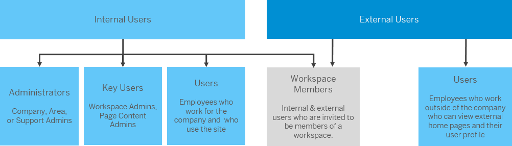

<!-- loio4b3d40bf86f24f90afc21713f6d4ab49 -->

# About Users

SAP Build Work Zone, advanced edition personas are made up of internal and external users.

Internal users are users who work in the company. They can be administrators with different privileges, or key users who are designated to add content or create workspaces, or end users who simply do their daily work and are members of the workspaces that they've been invited to.

External users are those users who are not employed by the company. They can become a member of a specific workspace that they've been invited to and they can also access external home pages or their user profiles.

This diagram gives you a high-level view of the different user types:

To summarize:

-   Key users:

    -   Page content administrators who are generally subject matter experts who can maintain specific content and design custom home pages. They've been designated their permissions by the company administrator.

    -   Workspace administrators who have created a workspace and manage the content in that particular workspace. They can also be invited to manage a workspace created by someone else.

-   Users who are regular employees of a company. They're referred to as internal users.

-   Users who are not employees of the company. They have access to a specific workspace, to external home pages, as well as their user profile. They are referred to as external users.

-   Workspace members who can be internal or external users and have been invited to join a workspace.

**More Information**

-   For more information about user privileges, see [User Privileges](user-privileges-b60b0fe.md).

-   For more information about administrators, see [Administrators](https://help.sap.com/viewer/b03c84105ff74f809631e494bd612e83/Cloud/en-US/63a91fb1d4dd4fefaf46358be0f8bfa4.html).

-   For more information about external users, see [External Users.](https://help.sap.com/viewer/b03c84105ff74f809631e494bd612e83/Cloud/en-US/43782128ec724e10943efa74bfc63a47.html)

