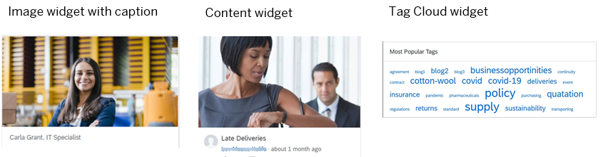
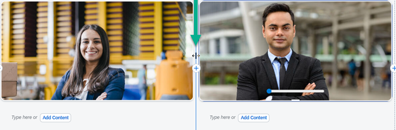

<!-- loio5a73a41dcfd04a5bb11ba3d3b42b8d64 -->

# About Widgets

Widgets are containers for a variety of content types such as video, feeds, and photos and many other types of content.

<a name="loio5a73a41dcfd04a5bb11ba3d3b42b8d64__section_s4d_l2g_pnb"/>

## Introduction

When you add a widget to a workpage, you're adding specific content of the widget type. For example, if you select an *Image* widget type from the content finder, you can select any image that you've saved on your computer or directly from the workspace content repository. You can then define the image settings such as adding a caption, changing the widget's style, as well as the layout and alignment.

To add widgets to your workpages, use a tool called the workpage editor. You can insert, remove, edit, and reposition widgets as needed. For more information, see: [How to Use the Workpage Editor](how-to-use-the-workpage-editor-9164929.md).

Your site contains a variety of out-of-the box widgets. Here are some examples for you to see:

The following table lists the available out-of-the-box widgets that you can add to your site and more information about each type:

<table>
<tr>
<th valign="top">

Widget type

</th>
<th valign="top">

More information

</th>
</tr>
<tr>
<td valign="top">

Application Group

</td>
<td valign="top">

Select a group of apps. You can only select apps that you have permission to access. The group of apps that you select is added to your workpage.

For more information, see [Business Content](business-content-cb936ef.md)

</td>
</tr>
<tr>
<td valign="top">

Multimedia

</td>
<td valign="top">

-   Link to an external audio or video file such as YouTube.

-   Select existing multimedia content from a local computer folder.

-   Choose a playlist.

For more information, see [Multimedia Widget](multimedia-widget-27b9bd1.md).

</td>
</tr>
<tr>
<td valign="top">

Image

</td>
<td valign="top">

Select an image from a local computer folder or directly from the workspace content repository.

> ### Note:  
> Use the dividers between columns to align images in a row.
> 
> 

You also have some editing options such as adding a title, caption, link to a website, or even changing the widget style.

> ### Note:  
> There's an option to select a checkbox called *Show text and image widgets as cards*. Selecting this option, displays your image widgets as cards. In other words, the widgets will display colors, borders, and rounded corners.
> 
> When you edit the widget, you can override this setting by choosing one of the following options:
> 
> -   *Follow page setting*
> 
>     The widget is displayed according to what you selected in the *Show text and image widgets as cards* checkbox on the workpage.
> 
> -   *Card style*
> 
>     Displays the widget with card styling - this is useful if the checkbox is unchecked for other widgets and you want a particular widget to display as a card.
> 
> -   *Without card style*
> 
>     Displays widget without card styling – no color, border, or rounded corners.

For more information, see [Image Widget](image-widget-df9e203.md).

</td>
</tr>
<tr>
<td valign="top">

Text

</td>
<td valign="top">

Insert and format text using a rich text editor. You can also include tables and lists.

> ### Note:  
> There's an option to select a checkbox called *Show text and image widgets as cards*. Selecting this option, displays your text widgets as cards. In other words, the widgets will display colors, borders, and rounded corners.
> 
> When you edit the widget, you can override this setting by choosing one of the following options:
> 
> -   *Follow page setting*
> 
>     The widget is displayed according to what you selected in the *Show text and image widgets as cards* checkbox on the workpage.
> 
> -   *Card style*
> 
>     Displays the widget with card styling - this is useful if the checkbox is unchecked for other widgets and you want a particular widget to display as a card.
> 
> -   *Transparent*
> 
>     Displays widget without card styling – no color, border, or rounded corners.
> 
> -   *Color*
> 
>     Displays widget with a different background color that you select. Other settings remain the same.

</td>
</tr>
<tr>
<td valign="top">

Poll

</td>
<td valign="top">

Select a poll from the content list to add to the widget.

</td>
</tr>
<tr>
<td valign="top">

Search

</td>
<td valign="top">

Display a search box for finding content.

</td>
</tr>
<tr>
<td valign="top">

People

</td>
<td valign="top">

Display a list or carousel of members.

</td>
</tr>
<tr>
<td valign="top">

Feed

</td>
<td valign="top">

Insert an activity feed based on a selected filter.

> ### Note:  
> Only one feed widget can be inserted per workpage. In a workspace, if you need to add more than one feed, you can add a new feed on a separate workpage.

On a workpage, workspace members can participate in workspace feed activities by entering, liking, and replying to feed updates. Home pages display the company or area feed only.

</td>
</tr>
<tr>
<td valign="top">

Content

</td>
<td valign="top">

Show content such as documents, blog posts, videos, images, links, and much more in a list or grid view.

For more information, see [Content Widget](content-widget-a2a6f73.md).

</td>
</tr>
<tr>
<td valign="top">

Workspaces

</td>
<td valign="top">

Display links to workspaces and sub-workspaces that you select.

</td>
</tr>
<tr>
<td valign="top">

Action

</td>
<td valign="top">

Show a list of popular actions for the user to choose from.

</td>
</tr>
<tr>
<td valign="top">

External Content

</td>
<td valign="top">

Show content form external applications from an external folder.

</td>
</tr>
<tr>
<td valign="top">

Slideshow

</td>
<td valign="top">

Select a PDF file or a presentation to display as a slideshow.

</td>
</tr>
<tr>
<td valign="top">

Forum

</td>
<td valign="top">

Show questions, ideas, and discussions.

For more information, see [Forum Widget](forum-widget-617530d.md).

</td>
</tr>
<tr>
<td valign="top">

Tool Content

</td>
<td valign="top">

Show the pro/con comparison table, agenda, or extensions \(for example, Google Maps\).

</td>
</tr>
<tr>
<td valign="top">

Notification

</td>
<td valign="top">

Show a summary of all notifications.

</td>
</tr>
<tr>
<td valign="top">

Recommendation

</td>
<td valign="top">

Show a list of recommended content, people, and workspaces.

</td>
</tr>
<tr>
<td valign="top">

Recent Items

</td>
<td valign="top">

Show a list of recently viewed content and workspaces.

</td>
</tr>
<tr>
<td valign="top">

Name

</td>
<td valign="top">

Display the avatar and name of the logged-in user.

</td>
</tr>
<tr>
<td valign="top">

Tag Cloud

</td>
<td valign="top">

Show the most popular hashtags in a tag cloud.

</td>
</tr>
<tr>
<td valign="top">

Business Record

</td>
<td valign="top">

Show details for a specific business record such as Service Requests, Corporate Accounts Opportunities, and more.

</td>
</tr>
<tr>
<td valign="top">

Event

</td>
<td valign="top">

Show an upcoming or recent event.

For more information, see [Event Widget](event-widget-6d0cdcd.md).

</td>
</tr>
<tr>
<td valign="top">

Rotating Banner

</td>
<td valign="top">

Display a carousel with up to 10 slides of headlines or news. You can link the slide to a URL or to existing content in the content repository of your workspace.

For more information, see [Rotating Banner Widget](rotating-banner-widget-c2e89b7.md).

</td>
</tr>
<tr>
<td valign="top">

Knowledge Base

</td>
<td valign="top">

Show featured, last updated, most viewed, or most liked articles.

For more information, see [Knowledge Base Widget](knowledge-base-widget-08ab831.md).

</td>
</tr>
</table>

> ### Note:  
> If you have access to a private folder, you can select content from these folders for the following widgets: Content, Image, Slideshow, Multimedia, and Rotating Banner.

