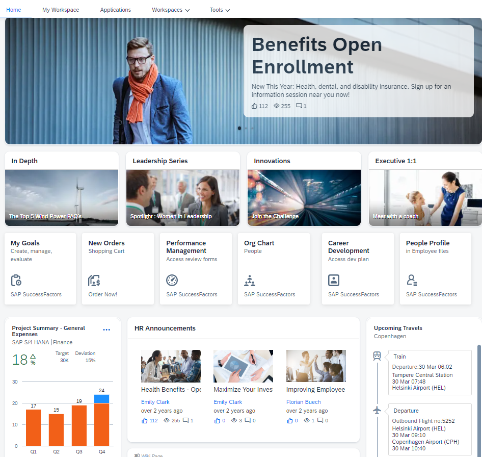
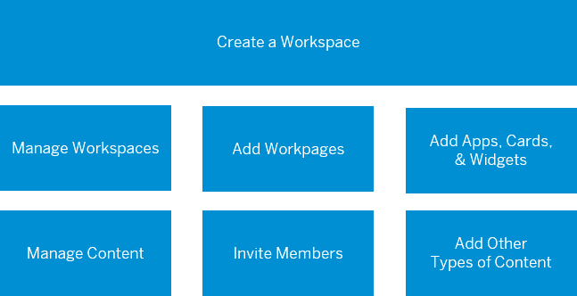

<!-- loio8ff3df94802449f3877af5c380b22c4b -->

# About Workspaces

A workspace is a collaborative environment that is designed to encourage users to share and communicate with each other about a specific subject, project, event, goal, or a team from a specific department.

<a name="loio8ff3df94802449f3877af5c380b22c4b__section_nb4_cr1_5xb"/>

## Overview

When you create a workspace, you automatically become the workspace administrator. However, you can designate other members to be an admin too. Users who join a workspace are called members.

Under the *Workspaces*, menu item, you can navigate to and filter the workspaces according to those that you recently viewed, your favorite workspaces, and you can view all workspaces including those you manage.

<a name="loio8ff3df94802449f3877af5c380b22c4b__section_y1k_rkn_m5b"/>

## An example of a typical workspace

<a name="loio8ff3df94802449f3877af5c380b22c4b__section_afz_5vt_rnb"/>

## More information

Here are some quick links to help you get started. But there's so much more that you can do in your workspace.

