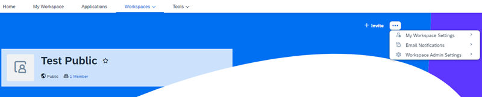
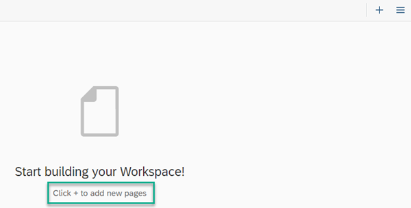
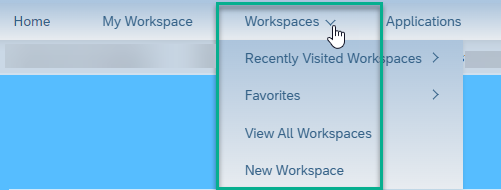
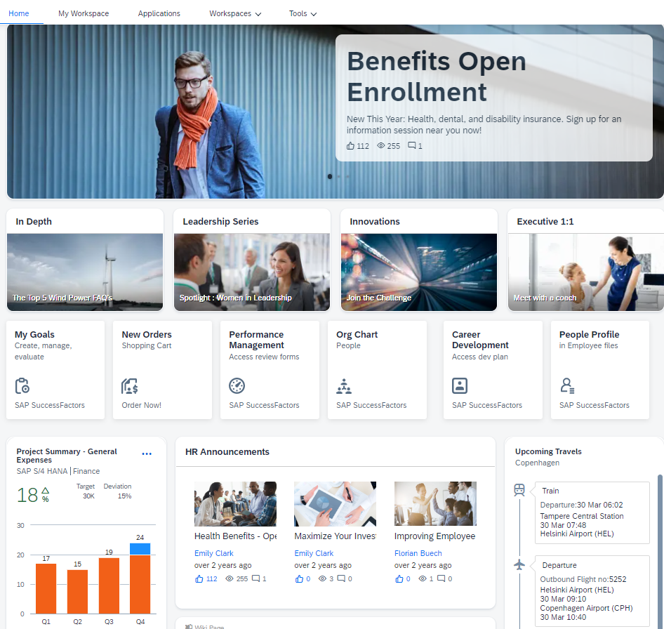
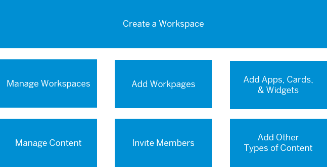

<!-- loio8ff3df94802449f3877af5c380b22c4b -->

<link rel="stylesheet" type="text/css" href="css/sap-icons.css"/>

# About Workspaces

A workspace is a collaborative environment that is designed to encourage users to share and communicate with each other about a specific subject, project, event, goal, or a team from a specific department.

<a name="loio8ff3df94802449f3877af5c380b22c4b__section_nb4_cr1_5xb"/>

## Overview

You can create a workspace using various templates or you can choose not to use a template at all, in which case you'll design your own workspace layout. In both cases when you first create the workspace, you'll see the following:

-   **Header of the workspace**:

    The header has a default background and your avatar - for both you can replace it with you own images. You can also see an indication if the workspace is public or private, as well as links to the workspace member list, an invite button to invite more members, and a menu that opens various user and admin settings.

    

-   **The workspace navigation bar** 

    If you've chosen a template when you created the workspace, you'll probably see a default *Overview* workpage in the navigation bar. If you didn't choose a template, you can create your own workpages by adding *Workpage* tabs to the navigation bar.

    On the right of the navigation bar, you'll see these icons:

    

    <table>
    <tr>
    <td valign="top">
    
    :heavy_plus_sign:
    
    </td>
    <td valign="top">
    
    Click this icon to open a selection of tabs that you can add to the navigation bar of your workspace. Examples of tabs that you can enter are: Workpages, Feed Updates, Members, Forums, Content and more.

    Once you've added a tab to the navigation bar, it's easy to directly navigate to the respective content.
    
    </td>
    </tr>
    <tr>
    <td valign="top">
    
    :gear:
    
    </td>
    <td valign="top">
    
    Use this icon to manage your tabs. You can reorder them, rename, translate and delete them.

    In the case of a workpage, you can also define who can access it. For more information, see [How to Manage Access to Your Workpages](how-to-manage-access-to-your-workpages-0b7e4f6.md).
    
    </td>
    </tr>
    <tr>
    <td valign="top">
    
    
    
    </td>
    <td valign="top">
    
    This is the workspace navigator icon. Select the content that you want to navigate to from the dropdown list of items.
    
    </td>
    </tr>
    </table>
    
-   Underneath the workspace navigation bar, is the area where you can build your workspace with widgets, cards, feeds, forums, as well as all kinds of other available content.

    

<a name="loio8ff3df94802449f3877af5c380b22c4b__section_z4t_jbf_qdc"/>

## Other things to know about a workspace

-   When you create a workspace, you automatically become the workspace administrator. However, you can designate other members to be an admin too.

-   Users who join a workspace are called members. Non members can also be invited to a workspace.

    For more information, see [About Members and Non-Members](about-members-and-non-members-0d2d491.md).

-   In the site menu, under *Workspaces*, you can navigate to and filter the workspaces according to those that you recently visited, your favorite workspaces, and those that you manage.

    

<a name="loio8ff3df94802449f3877af5c380b22c4b__section_y1k_rkn_m5b"/>

## An example of a typical workspace

<a name="loio8ff3df94802449f3877af5c380b22c4b__section_irn_wzn_mzb"/>

## Types of workspaces

To work together with members of a workspace, you have to join the workspace. You can either be invited to the workspace or you can search for the workspace and request to join. The members of a workspace can communicate with each other using the workspace feed or forums and they can use the workpages of the workspace to share information and content.

There are different types of workspaces:

**Public workspaces**

Workspaces that all users can view, join, and collaborate in. Members can be invited to join or they can search for the workspace using the search tool or by browsing on the *Workspaces* screen and then request to join. Non-members can join a public workspace depending on the settings defined by the administrator.

**Private workspaces**

Workspaces that only users who are invited to the workspace can join and collaborate in. In general, private workspaces are hidden and can't be found with the search tool. If you're not invited to a private workspace, you can't see it on the *Workspaces* screen unless the workspace administrator has set a private workspace to *Allow users to request to join this workspace*.

**My Workspace**

*My Workspace* is a personal workspace that only you can see and access. You can't invite others to it. This workspace is only available if your company administrator has enabled it for all users. For more information, see [About My Workspace](about-my-workspace-8918e00.md).

<a name="loio8ff3df94802449f3877af5c380b22c4b__section_afz_5vt_rnb"/>

## More information

Here are some quick links to help you get started. But there's so much more that you can do in your workspace.

