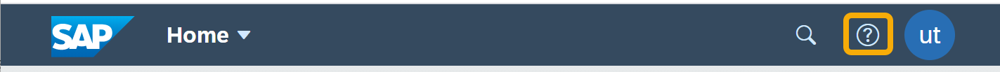

<!-- loio8f77268d2a954de48a8e3570a685b835 -->

# Activating SAP Companion Content

SAP Companion provides on-screen help for your end users. Activating this capability enables the end user to view SAP Companion content for the Applications page and for apps.

<a name="loio8f77268d2a954de48a8e3570a685b835__section_klz_zb3_5pb"/>

## Activating SAP Companion

To enable SAP Companion on the Applications page:

1.  In the Site Directory, open the *Site Settings* screen of the relevant site, and turn on the *SAP Companion* setting.

2.  Specify the following parameter names and values, which are all **case sensitive**:

    > ### Note:  
    > The parameters in the following table are relevant to the Applications pageof SAP Build Work Zone, advanced edition.
    > 
    > If necessary, you can define other parameters, as described in the [SAP Companion Authoring Guide](https://help.sap.com/doc/eb66dd06beb64bd1b03810fef94d469d/2206/en-US/SAP_Companion_Authoring_Guide_en-US.pdf).

    <table>
    <tr>
    <th valign="top">

    Parameter

    
    </th>
    <th valign="top">

    Value

    
    </th>
    </tr>
    <tr>
    <td valign="top">
    
    product

    
    </td>
    <td valign="top">
    
    LAUNCHPADS\_BTP\_CF

    
    </td>
    </tr>
    <tr>
    <td valign="top">
    
    version

    
    </td>
    <td valign="top">
    
    latest

    
    </td>
    </tr>
    <tr>
    <td valign="top">
    
    stateUACP

    
    </td>
    <td valign="top">
    
    PRODUCTION

    
    </td>
    </tr>
    <tr>
    <td valign="top">
    
    dataUrlUACP

    
    </td>
    <td valign="top">
    
    https://help.sap.com/webassistant/

    
    </td>
    </tr>
    <tr>
    <td valign="top">
    
    resourceUrl

    
    </td>
    <td valign="top">
    
    https://webassistant.enable-now.cloud.sap/web\_assistant/framework/

    
    </td>
    </tr>
    </table>
    
3.  Save.

As a result, when you go to the site,the SAP Companion icon is displayed in the header barof the Applications page:

Clicking this icon, opens a vertical panel on the right of the screen, with help content about the screen and the UI elements that it contains.

For more information, see [SAP Companion User Guide](https://help.sap.com/doc/49a88466f215455eaaf966aaaa460ece/2206/en-US/SAP_Companion_User_Guide_en-US.pdf).

<a name="loio8f77268d2a954de48a8e3570a685b835__section_ywc_nd3_5pb"/>

## Enabling SAP Companion on the App Level

### SAP S/4HANA federated SAPUI5 Apps

In the SAP BTP cockpit, in the *Destinations* screen, add the following parameters to the runtime destination of the S/4HANA system.

These properties specify the product and version of the SAP Companion content that corresponds to these apps:

<table>
<tr>
<th valign="top">

Name

</th>
<th valign="top">

Value

</th>
</tr>
<tr>
<td valign="top">

`launchpad.wa.productId` 

</td>
<td valign="top">

-   Use: `SAP_S4HANA_ON-PREMISE`

    If you are using:

    -   SAP S/4HANA
    -   SAP S/4HANA Cloud, private edition
    -   SAP S/4HANA Cloud, extended edition

-   Use: `SAP_S4HANA_CLOUD`

    If you are using:

    -   SAP S/4HANA Cloud

-   Use: `SAP_INTEGRATED_BUSINESS_PLANNING`

    If you are using:

    -   SAP Integrated Business Planning for Chain Supply \(SAP IBP\)

</td>
</tr>
<tr>
<td valign="top">

`launchpad.wa.productVersion` 

</td>
<td valign="top">

-   Use: `<yearly release number>.latest`, for example: `2020.latest`

    If you are using:

    -   SAP S/4HANA
    -   SAP S/4HANA Cloud, private edition
    -   SAP S/4HANA Cloud, extended edition

-   Use: `<year and month of release>.latest`, for example: `2202.latest`

    If you are using:

    -   SAP S/4HANA Cloud

-   Use: `<year and month of release>`, for example: `2202`

    If you are using:

    -   SAP Integrated Business Planning for Chain Supply \(SAP IBP\)

    > ### Note:  
    > This value has to be updated after every upgrade to a new version of SAP IBP \(quarterly release\).

</td>
</tr>
</table>

As a result, when you launch an SAP S/4HANA app that has SAP Companion content, the SAP Companion icon is available.

### HTML5 Apps and Launchpad modules deployed on your subaccount

Unlike content that is provided by SAP, for apps that are developed and deployed to the subaccount, help content needs to be delivered together with the app. To create custom help content, customers need to use the SAP Enable Now Manager tool, by SAP Enable Now, which requires a license.

As part of the help content creation flow, a product name and a product version are defined, which are then used when configuring a destination. For more information, see the [SAP Companion Authoring Guide](https://help.sap.com/doc/eb66dd06beb64bd1b03810fef94d469d/2206/en-US/SAP_Companion_Authoring_Guide_en-US.pdf) 

In the SAP BTP cockpit, in the *Destinations* screen, create a new destination.

<table>
<tr>
<th valign="top">

Name

</th>
<th valign="top">

Value

</th>
</tr>
<tr>
<td valign="top">

Name

</td>
<td valign="top">

Paste here the ID of the content provider \(HTML5 Apps or launchpad module provider\) as appears in the Channel Manager.

</td>
</tr>
<tr>
<td valign="top">

URL

</td>
<td valign="top">

Enter any mock URL. This value is not validated.

</td>
</tr>
<tr>
<td valign="top">

\(Additional parameter\) `launchpad.wa.productId`

</td>
<td valign="top">

Paste here the product name defined for the app, when creating the help content in the SAP Enable Now Manager.

</td>
</tr>
<tr>
<td valign="top">

\(Additional parameter\) `launchpad.wa.productVersion`

</td>
<td valign="top">

Paste here the product version defined for the app, when creating the help content in the SAP Enable Now Manager.

</td>
</tr>
</table>

> ### Note:  
> If you encounter issues, please open a support ticket on component: KM-SEN-CMP.

