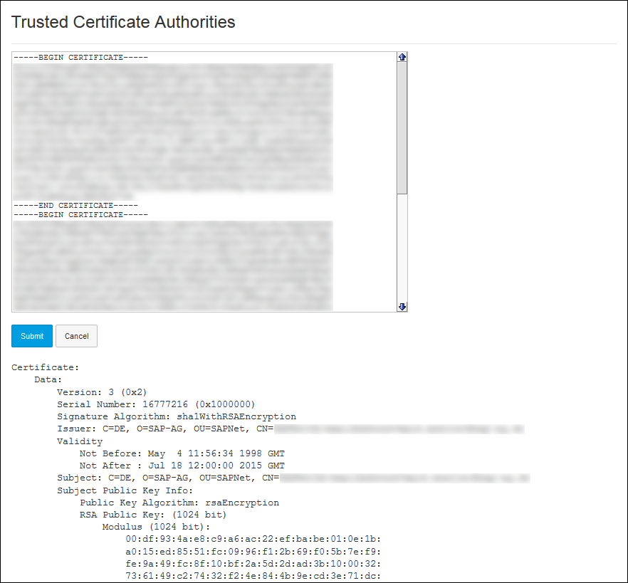

<!-- loiof8d9305a90d542d49cc4bfacc9822262 -->

# Add a Trusted Certificate Authority

If your organization's network uses unrecognized or self-signed certificates, then you must perform the following steps for SAP Build Work Zone, advanced edition to accept the certificate. This then allows access to the external application data.

Note that this can also be a good way to establish a secure connection to your document repositories via CMIS.

> ### Note:  
> Adding a trusted certificate authority disables the use of certificates in the default Certificate Authority store. Therefore, if you add a trusted certificate authority, you must manually add all required Certificate Authorities in this section of the *Administration Console*.

1.  To find the certificate to add to SAP Build Work Zone, advanced edition, you must open a page in your browser and view the certificate of the external application that you are trying to integrate.

    The way that you do this will vary with each browser, so you must refer to your browser's documentation for instructions.

2.  Export the certificate into **Base-64 encoded X.509 \(.cer\)** format.
3.  Open the exported certificate in a text editor and copy the entire certificate, including the "Begin Certificate" and "End Certificate" lines.
4.  Open the SAP Build Work Zone, advanced edition *Admininstration Console*, select *External Integrations* \> *External Solutions* from the left navigation sidebar, and click *Trusted Certificate Authorities* at the top of the *External Solutions* page.

    The *Trusted Certificate Authorities* dialog box is displayed.

5.  Paste the copied certificate into the *Trusted Certificate Authorities* text box, and click *Submit*.

    This registers the unrecognized certificate with SAP Build Work Zone, advanced edition, which will enable the connection to your external application.

      
      
    **The add Trusted Certificate Authorities form**

    

> ### Note:  
> **Next:** You have dealt with configuring a trusted certificate authority to provide access to external services that use self-signed or unrecognized TLS or SSL certificates. You must also perform any other required authorization configuration procedures required in SAP Build Work Zone, advanced edition:
> 
> -   If you want to display the external application's business records in SAP Build Work Zone, advanced edition, you must [Configure SAP Build Work Zone, advanced edition as a SAML Local Identity Provider](configure-sap-build-work-zone-advanced-edition-as-a-saml-local-identity-provider-39a4f6b.md). This step ensures that users can view only the content from the external application that they have been authorized to view when that material is displayed in SAP Build Work Zone, advanced edition.
> -   If you want to display SAP Build Work Zone, advanced edition content in the external application, you must:
>     -   [Add an OAuth Client](add-an-oauth-client-5310092.md). This configuration provides the external application with authorized access to the SAP Build Work Zone, advanced edition API.
>     -   [Add a SAML Trusted IDP](add-a-saml-trusted-idp-dad776e.md). This step ensures that users can view only the content from SAP Build Work Zone, advanced edition that they have been authorized to view when that material is displayed in the external application.

