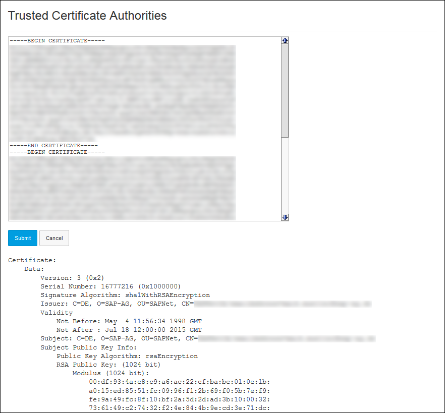

<!-- loiof8d9305a90d542d49cc4bfacc9822262 -->

# Add a Trusted Certificate Authority

If your organization's network uses unrecognized or self-signed certificates, complete this procedure to allow access to the external application data.

> ### Note:  
> Adding a trusted certificate authority disables the use of certificates in the default Certificate Authority store. Therefore, if you add a trusted certificate authority, you must manually add all required Certificate Authorities the *Administration Console*.

1.  Open your browser and view the certificate of the certificate of the external application that you are trying to integrate.
2.  Export the certificate into **Base-64 encoded X.509 \(.cer\)** format.
3.  Open the exported certificate in a text editor and copy the entire certificate, including the "Begin Certificate" and "End Certificate" lines.
4.  In the Administration Console, go to *External Integrations* \> *External Solutions*, and click *Trusted Certificate Authorities* at the top of the *External Solutions* page.
5.  Paste the copied certificate into the *Trusted Certificate Authorities* text box, and click *Submit*.   
  
**The add Trusted Certificate Authorities form**

    

> ### Note:  
> -   To display the external application's business records in SAP Build Work Zone, advanced edition, you must also configure a SAML Local Identity Provider for it. This step ensures that users will view only the content that they are authorized to view from the external application. For more info, see [Configure SAP Build Work Zone, advanced edition as a SAML Local Identity Provider](configure-sap-build-work-zone-advanced-edition-as-a-saml-local-identity-provider-39a4f6b.md).
> -   To display SAP Build Work Zone, advanced edition content in the external application, you must:
>     -   Add the external application as an OAuth client. This will allow the external application access to the SAP Build Work Zone, advanced edition API. For more information, see [Add an OAuth Client](add-an-oauth-client-5310092.md).
>     -   Add the external application as a SAML Trusted IdP. This step ensures that users will view only the content that they are authorized to view from SAP Build Work Zone, advanced edition. For more information, see [Add a SAML Trusted IDP](add-a-saml-trusted-idp-dad776e.md).

