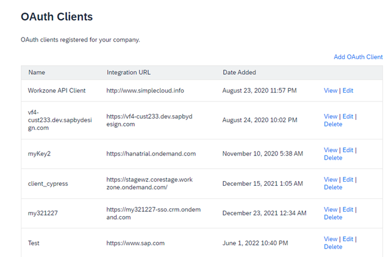

<!-- loio5310092b5b184397a06a5df9fde9a76b -->

# Add an OAuth Client

You can authorize an external application to access the SAP Build Work Zone, advanced edition by registering the application as an OAuth client.

You can manage OAuth clients in the Admin Console, *External Integrations* \> *OAuth Clients*.

  
  
**OAuth Clients catalog**

For more information about how to add a new OAuth Client, see the Admin Guide [Add an OAuth Client](https://help.sap.com/docs/WZ/b03c84105ff74f809631e494bd612e83/b3c804e1f999448b8011a475fea1da6c.html).

