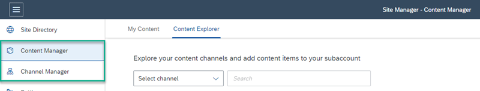
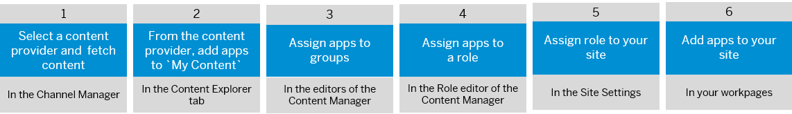
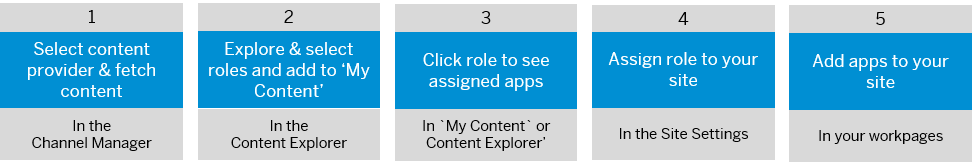
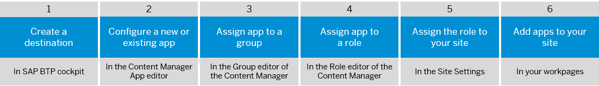

<!-- loio8bf719ed5011400aa92ec76ee0366323 -->

<link rel="stylesheet" type="text/css" href="css/sap-icons.css"/>

# Add Business Apps

To add apps to your site, you need to first add them to your subaccount.

<a name="loio8bf719ed5011400aa92ec76ee0366323__section_ntr_szd_15b"/>

## Introduction

You can integrate business content \(apps, groups, catalogs, roles\) into your subaccount from content channels \(remote content providers or SAP BTP content providers\) or you can add the content manually.

-   For more detailed information and a high-level diagram explaining the possibilities of integrating content, see [Integrating Business Content](https://help.sap.com/docs/Portal_Service/ad4b9f0b14b0458cad9bd27bf435637d/b7fa275656b94a3cb4f65e70c31d6ef1.html).

-   **Adding apps from content channels** 

    Content providers enable you to integrate business apps and content from different sources. This process is called federating content. The content can then be integrated into the SAP Build Work Zone, advanced edition *Applications* page. Content providers can expose content from cloud or on-premise systems. Currently the following content providers are supported and they expose content as follows:

    -   SAP BTP content providers - the *Content Explorer* displays the apps exposed by the content provider.

    -   Remote content providers - the *Content Explorer* displays the roles exposed by the content provider. Clicking a role displays the list of apps assigned to it.

    Content providers are managed from a tool called the *Channel Manager*, which you can access from the side navigation panel of the Site Manager. Once you create a content provider, it's tile is added to the *Content Explorer* in the *Content Manager*.

    

    For more information about content providers, see

    -   [Federation of Remote Content Providers](https://help.sap.com/docs/Portal_Service/ad4b9f0b14b0458cad9bd27bf435637d/fa46cc3ffdb048e9bbadafb2429480d9.html)

    -   [Manage Content Providers \(On Premise\)](https://help.sap.com/docs/Portal_Service/ad4b9f0b14b0458cad9bd27bf435637d/021bc1192cbd455d898542dcf584440e.html)

    -   [Manage Content Providers \(Cloud\)](https://help.sap.com/docs/Portal_Service/ad4b9f0b14b0458cad9bd27bf435637d/3cf52387374d4f91892e48c5fc3c4a01.html)

-   **Adding apps manually**

    Business content such as apps, groups, catalogs are added manually by the administrator and are assigned to business roles. This is done in the *My Content*tab of the *Content Manager*.

    For more information, see [Manual Integration of Apps](https://help.sap.com/docs/Portal_Service/ad4b9f0b14b0458cad9bd27bf435637d/ddb655ae45e44d499f2fa0ce503a46d9.html).

<a name="loio8bf719ed5011400aa92ec76ee0366323__section_eqc_dwp_nqb"/>

## Overall process for adding apps to your site

In this section, we explain how to add business apps manually or from different types of content providers to the workpages of your site.

### Adding apps from an SAP BTP content provider

This provider type exposes apps that have been deployed to SAP BTP.

For more information, see [Federation of SAP BTP Content Providers](https://help.sap.com/docs/Portal_Service/ad4b9f0b14b0458cad9bd27bf435637d/2551d53ed46a4b53bc133f9eac398535.html)

The high-level overall process is as follows:

<table>
<tr>
<th valign="top">

No.

</th>
<th valign="top">

Step

</th>
<th valign="top">

Where it's done

</th>
<th valign="top">

More information

</th>
</tr>
<tr>
<td valign="top">

**1** 

</td>
<td valign="top">

Select a content provider and fetch its latest content.

</td>
<td valign="top">

Channel Manager

</td>
<td valign="top">

1.  From the Site Manager side panel, click  to open the Channel Manager. You'll see a table with all available content providers.

2.  Select the content provider from which you want to add apps and click :arrows_clockwise: in the *Actions* column to fetch the content.

</td>
</tr>
<tr>
<td valign="top">

**2** 

</td>
<td valign="top">

Explore the available apps in the selected content provider and add them to *My Content*.

</td>
<td valign="top">

*Content Explorer* 

</td>
<td valign="top">

1.  In the *Content Explorer* tab of the *Content Manager*, find and select the content provider from which you want to add apps.

    A table displays a list of all the apps and shell plugins that the selected provider exposes.

2.  Select the apps that you want to add to your subaccount and click *\+Add to My Content*.

    If you click the *My Content* tab, you'll see your apps in the list of apps in your subaccount.

</td>
</tr>
<tr>
<td valign="top">

**3** 

</td>
<td valign="top">

Assign the app to a group.

</td>
<td valign="top">

In the Group editor of the *Content Manager* 

</td>
<td valign="top">

To make sure that your apps are visible in the*Applications* page of your work zone, assign your apps to an existing group or a new one that you created.

For more information, see [Assign Apps to Groups](assign-apps-to-groups-8073d11.md).

> ### Note:  
> To display your apps in the App Finder, assign them to a catalog using the Catalog editor. This step is optional.

</td>
</tr>
<tr>
<td valign="top">

**4** 

</td>
<td valign="top">

Assign your apps to a role.

</td>
<td valign="top">

In the Role editor of the *Content Manager* 

</td>
<td valign="top">

Assign your app to at least one role, to determine which users can access it.

> ### Note:  
> If the role already exists in the Role editor, use the*Assignments* panel to search for the app and assign it to this role.
> 
> If the role doesn't exist, you need to create one.

For more information, see:

-   [Assign Apps to Roles](assign-apps-to-roles-d084226.md)

-   [About Roles and Role Assignment](about-roles-and-role-assignment-f38de6b.md)

</td>
</tr>
<tr>
<td valign="top">

**5** 

</td>
<td valign="top">

Assign the role to your site

</td>
<td valign="top">

*Site Settings* – *Assignments* panel

</td>
<td valign="top">

To access the apps in the *Applications* page, assign the same role assigned to your apps to your site.

For more information, see: [Assign Roles to Your Site](assign-roles-to-your-site-7afe670.md).

</td>
</tr>
<tr>
<td valign="top">

**6** 

</td>
<td valign="top">

Add apps to the workpages in your site

</td>
<td valign="top">

The workpage from where you want to launch the apps.

</td>
<td valign="top">

Add apps to your workpages using the page designer widget gallery.

For more information, see [Add Apps to Your Workpages](add-apps-to-your-workpages-e7c9cef.md).

</td>
</tr>
</table>

### Adding apps from remote content providers

This provider type exposes on premise and cloud apps from external sources. The integration of the exposed content is done at the role level. All content items related to these roles, including apps, groups, and catalogs, are also integrated and are all visible in the runtime.

For more information, see [Federation of Remote Content Providers](https://help.sap.com/docs/Portal_Service/ad4b9f0b14b0458cad9bd27bf435637d/fa46cc3ffdb048e9bbadafb2429480d9.html)

The high-level overall process is as follows:

<table>
<tr>
<th valign="top">

No.

</th>
<th valign="top">

Step

</th>
<th valign="top">

Where it's done

</th>
<th valign="top">

More information

</th>
</tr>
<tr>
<td valign="top">

**1** 

</td>
<td valign="top">

Select a content provider and fetch its latest content.

</td>
<td valign="top">

*Channel Manager* 

</td>
<td valign="top">

1.  From the Site Manager side panel, click  to open the Channel Manager. You'll see a table with all available content providers.

2.  Select the content provider from which you want to add apps and click :arrows_clockwise: in the *Actions* column to fetch the content.

</td>
</tr>
<tr>
<td valign="top">

**2** 

</td>
<td valign="top">

Explore the roles in the selected content provider and add them to *My Content*.

</td>
<td valign="top">

*Content Explorer* 

</td>
<td valign="top">

1.  In the *Content Explorer* tab of the *Content Manager*, find and select the content provider from which you want to add apps.

    A table displays a list of all the roles that the selected provider exposes.

2.  Select the roles that you want to add to your subaccount and click *\+Add to My Content*.

    > ### Note:  
    > You only need to do this second step if the content addition mode of the content provider is set to manual. If set to automatic, the adding of roles to your subaccount is done automatically when the content provider was created or updated.

</td>
</tr>
<tr>
<td valign="top">

**3** 

</td>
<td valign="top">

Click the role to see the assigned apps

</td>
<td valign="top">

In *My Content* or in the *Content Explorer* 

</td>
<td valign="top">

Click a role to display the list of apps assigned to it.

</td>
</tr>
<tr>
<td valign="top">

**4** 

</td>
<td valign="top">

Assign the role to your site

</td>
<td valign="top">

*Site Settings* – *Assignments* panel

</td>
<td valign="top">

To access the apps in the *Applications* page, assign the same role assigned to your apps to your site.

For more information, see: [Assign Roles to Your Site](assign-roles-to-your-site-7afe670.md)

</td>
</tr>
<tr>
<td valign="top">

**5** 

</td>
<td valign="top">

Add apps to the workpages in your site

</td>
<td valign="top">

Workpages from where you want to launch the apps.

</td>
<td valign="top">

Add apps to your workpages using the page designer widget gallery.

For more information, see [Add Apps to Your Workpages](add-apps-to-your-workpages-e7c9cef.md).

</td>
</tr>
</table>

### Adding apps manually

You can also add apps manually by configuring existing apps in the App editor of the *Content Manager* or by creating and configuring a new app.

The overall high-level process is as follows:

<table>
<tr>
<th valign="top">

No.

</th>
<th valign="top">

Step

</th>
<th valign="top">

Where it's done

</th>
<th valign="top">

More information

</th>
</tr>
<tr>
<td valign="top">

**1**

</td>
<td valign="top">

Create a destination

</td>
<td valign="top">

SAP BTP cockpit

</td>
<td valign="top">

To integrate different app UI technologies in your site, such as SAP S/4HANA apps \(SAP GUI for HTML, Web Dynpro ABAP, and SAPUI5\), and apps deployed on SAP BTP, Cloud Foundry environment \(SAPUI5\), you need to create an HTTP destination on the platform for each app provider system.

> ### Note:  
> If you select *URL* as the *App UI Technology*, no system is required.

For more information, see [Create Runtime Destinations to Access Apps](https://help.sap.com/docs/Portal_Service/ad4b9f0b14b0458cad9bd27bf435637d/a57c27ce348241a89d56874bef9a7a07.html).

</td>
</tr>
<tr>
<td valign="top">

**2**

</td>
<td valign="top">

Select an existing app or create a new one and configure it.

</td>
<td valign="top">

In the App editor of the *Content Manager* 

</td>
<td valign="top">

Add an app to your subaccount by manually configuring its general, navigation, visualization, and translation properties.

For more information, see [Configure Apps for Your Subaccount](https://help.sap.com/docs/Portal_Service/ad4b9f0b14b0458cad9bd27bf435637d/4ba745b26b0e4ca494d99b94a858551d.html).

</td>
</tr>
<tr>
<td valign="top">

**3**

</td>
<td valign="top">

Assign the app to a group

</td>
<td valign="top">

In the Group editor of the *Content Manager* 

</td>
<td valign="top">

To make sure that your apps are visible in the*Applications* page of your site, assign your apps to an existing group or a new one that you created.

For more information, see [Assign Apps to Groups](assign-apps-to-groups-8073d11.md).

> ### Note:  
> To display your apps in the App Finder, assign them to a catalog using the Catalog editor.

</td>
</tr>
<tr>
<td valign="top">

**4**

</td>
<td valign="top">

Assign your apps to a role

</td>
<td valign="top">

In the Role editor of the *Content Manager* 

</td>
<td valign="top">

Assign your apps to at least one role, to determine which users can access them.

> ### Note:  
> If the role already exists, in the Role editor, use the *Assignments* panel to search for your apps and assign them to this role.
> 
> If the role doesn't exist, you need to create one.

For more information, see:

-   [Assign Apps to Roles](assign-apps-to-roles-d084226.md).

-   [About Roles and Role Assignment](about-roles-and-role-assignment-f38de6b.md).

</td>
</tr>
<tr>
<td valign="top">

**5**

</td>
<td valign="top">

Assign the role to your site

</td>
<td valign="top">

*Site Settings* – *Assignments* panel

</td>
<td valign="top">

To access the apps in the *Applications* page, assign the same role assigned to your apps to your site.

For more information, see: [Assign Roles to Your Site](assign-roles-to-your-site-7afe670.md).

</td>
</tr>
<tr>
<td valign="top">

**6**

</td>
<td valign="top">

Add apps to the workpages in your site

</td>
<td valign="top">

Home page or workspace in your work zone where you want to launch the apps from.

</td>
<td valign="top">

Add apps to your workpages using the page designer widget gallery.

For more information, see [Add Apps to Your Workpages](add-apps-to-your-workpages-e7c9cef.md).

</td>
</tr>
</table>

