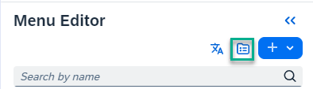
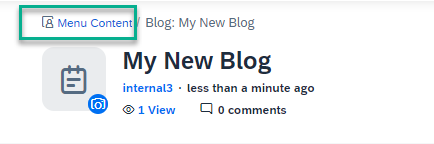
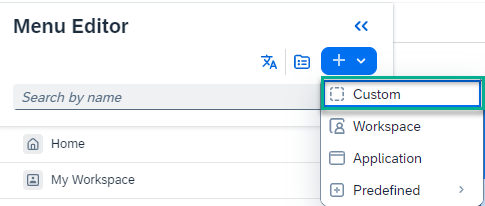

<!-- loiobd70f4559d9c4a818aba1a4c396a58bd -->

<link rel="stylesheet" type="text/css" href="css/sap-icons.css"/>

# Add Content to Your Site Menu

In this topic we explain how to add various types of content to your site menu.

When you create or upload content in your site menu, it's added to the *Menu Content* list - this content list only displays content that can be referenced by the menu. However, not all the content in the list has to be referenced by the menu.

<a name="loiobd70f4559d9c4a818aba1a4c396a58bd__section_b1q_4dj_nyb"/>

## Create or upload content to add to your site menu

1.  Click :pencil2: to open the site menu.

2.  Click the  \(content\) icon to open the Menu Content list.

    

3.  In the *Menu Content* screen, click *\+ Create* and select the type of content you want to create.

4.  Create the content \(such as a wiki page, blog post, or a workpage\), give it a title, and when you're done, publish it.

    > ### Note:  
    > You can also upload a content item from your computer.

5.  Using the breadcrumbs at the top of the screen, go back to the *Menu Content* list to see the new content item there.

    

6.  To reference the content from the site menu, go back to the menu using the :pencil2: icon and add it.

    For more information, see [Overview of the Site Menu](overview-of-the-site-menu-620515b.md).

<a name="loiobd70f4559d9c4a818aba1a4c396a58bd__section_otl_nkj_nyb"/>

## Example of how to add a workpage to your site menu

1.  In the top header bar of your site, click :pencil2: on the far right to open the menu editor.

2.  At the top of the left menu panel, click :heavy_plus_sign: and then select *Custom*.

    

3.  Select *Workpage*.

4.  Select an existing workpage from the dropdown list.

5.  You can also create a new workpage in the *Menu Content* screen as follows:

    1.  Click  to open the *Menu Content* screen.

    2.  Click *\+ Create* \> *Workpage*.

    3.  Give the workpage a title and publish it.

    4.  Now, open the menu editor again. Your new workpage is now available for you to select from the dropdown list, and you can add it to your site menu.

    > ### Note:  
    > Widgets in workpages that are part of the site menu, can reference content from any public or private workspace. Supported widgets are *Multimedia*, *Image*, *Poll*, *Slide Show*, and *Rotating Banner* widgets.

