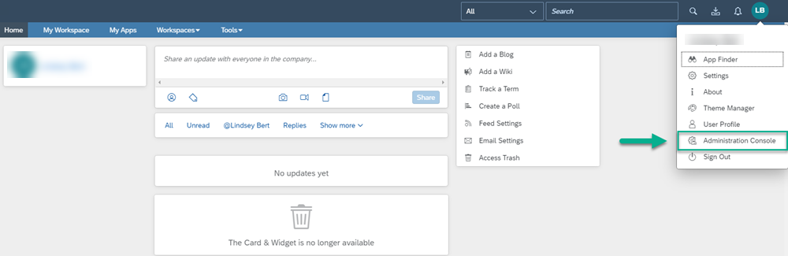
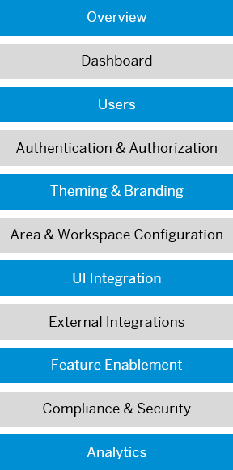

<!-- loio29ff49a0824b4b5098bfa301f2c0b60d -->

# Administration

As an administrator for SAP Build Work Zone, advanced edition, this topic helps you access the *Administration Console* and quickly navigate through the different features that you can configure to set up a site for your end users.

SAP Build Work Zone, advanced edition administration is performed in the *Administration Console*.

<a name="loio29ff49a0824b4b5098bfa301f2c0b60d__section_clr_kx4_jlb"/>

## How to get there

When you log on to SAP Build Work Zone, advanced edition, it opens on the Home page. Under your avatar, open the User Actions menu and click *Administration Console* as follows:

### Switch between company level and administrative area

You can switch between administrative areas in the *Change Admin Area* menu at the top of the Administration Console.

-   Company administrators have access to both the entire company and all administrative areas that are configured for a particular site.

    When creating administrative areas, company administrators choose which parts the area administrators for the given area are allowed to configure.

-   If you're an area administrator, you have access to only the pages and workspaces for your particular area. All the changes that you make only apply to the selected area.

-   If you're a company administrator, and you select an administrative areas from the menu, you'll see what an area administrator sees. All changes that you make only apply to the selected area. You'll see the full picture of the area administration, even if area administrators are allowed to configure only some parts of this specific administrative area.

    For a few tasks, company administrators must be assigned additionally the area or workspace administrator role, for example, to manage an area home page or a workspace.

<a name="loio29ff49a0824b4b5098bfa301f2c0b60d__section_x2w_fyv_zkb"/>

## Administration information map

Navigate to the different areas in the *Administration Console* and configure the site for your end users.

### Overview

Get key information about your site in general as well as some initial tasks that you may want to do.

For example, you can:

-   See how many user licenses you've purchased and how many you've used so far.

-   Find out what version of the product you're using.

-   Subscribe to receive product news and updates.

For more information, see [Overview](overview-120b50d.md).

### Dashboard

The dashboard summarizes what's happening in the site and where you can find key information that you need on a daily basis to do your job.

From here you can:

-   Get key information about your workspaces and user activities. For example, most viewed items, most visited workspaces.

-   Choose a timeframe for the information you want to see.

-   Download information to a spreadsheet and print it.

For more information, see [Dashboard](dashboard-9f3df9c.md).

### Users

Configure the settings for the different user types of your site. For more information about the different user types, see [Users](users-3173953.md).

From this area, you can access the following screens:

<table>
<tr>
<th valign="top">

Screen

</th>
<th valign="top">

What you can do

</th>
</tr>
<tr>
<td valign="top">

*Internal Users* 

</td>
<td valign="top">

Manage your internal users as follows:

-   Add users by name, email address, or by importing a file in CSV format.

-   Edit user profiles including whether they get emails or not.

-   Access *Content Administration* \(via the *View Usage* option next to each user\), to allow company and support admins to gain access to and manage all workspaces in a specific site. For more information, see [Compliance and Content Administration](compliance-and-content-administration-9174e97.md).

-   Get reports about user activity and status.

-   Grant or revoke administrator privileges to users.

-   Grant page content admin rights to users.

-   Show alumni profiles and permanently remove them if you want.

-   Revoke a user's access to certain applications \(if a device is lost or stolen or if a user leaves the company\).

-   Access the trash of users to restore deleted workspaces.

For more information, see [Internal Users](internal-users-888ef2f.md).

</td>
</tr>
<tr>
<td valign="top">

*External Users* 

</td>
<td valign="top">

Manage users who aren’t part of the company as follows:

-   Configure external users

-   Migrate SAP Jam external users

-   Manage external users

For more information, see [External Users - Overview](external-users-overview-4378212.md).

</td>
</tr>
<tr>
<td valign="top">

*User Lists* 

</td>
<td valign="top">

Rather than invite individual users to a workspace, you can save time and invite many users simultaneously using published user lists.

For more information, see [User Lists](user-lists-8d23bc7.md).

</td>
</tr>
<tr>
<td valign="top">

*Alias Accounts* 

</td>
<td valign="top">

Create alias accounts so that end users can use them on behalf of their organization. For example, for new hire employees of a large, global organization, it’s easier to contact a user named `HR Helpdesk` with HR-related questions than it is to find out the name of the exact person.

> ### Note:  
> Alias users can also be used as a system user to work with other applications. For example, a program or a chatbot.

For more information, see [Alias Accounts](alias-accounts-8857401.md).

</td>
</tr>
<tr>
<td valign="top">

*SCIM Provisioning* 

</td>
<td valign="top">

Control how company administrators are managed.

For more information, see [Manage Administrators Using SCIM API](manage-administrators-using-scim-api-ff793e6.md).

</td>
</tr>
</table>

### Authentication & Authorization

SAP Build Work Zone, advanced edition provides various ways to ensure authentication and authorization.

From this area, you can access the following screens:

<table>
<tr>
<th valign="top">

Screen

</th>
<th valign="top">

What you can do

</th>
</tr>
<tr>
<td valign="top">

*SAML Trusted IDPs* 

</td>
<td valign="top">

Register an external application as a SAML trusted Identity Provider \(IDP\) to allow the application to access your user ID and authorization information. Manage your identity providers as follows:

-   View a list of trusted identity providers for the entire company.

-   Edit or delete these identity providers if necessary.

-   Register an external application as a SAML trusted IDP.

For more information, see [SAML Trusted IDPs](saml-trusted-idps-c2f81fd.md).

</td>
</tr>
<tr>
<td valign="top">

*SAML Local Identity Provider* 

</td>
<td valign="top">

Configure your site as a SAML local identity provider for external applications. Site users can then have SSO access to those applications.

For more information, see [SAML Local Identity Provider](saml-local-identity-provider-176e87b.md).

</td>
</tr>
<tr>
<td valign="top">

*SAML Local Service Provider* 

</td>
<td valign="top">

Configure a SAML local service provider when you need the site to act as a Service Provider for SAML requests issued to a third-party Identity Provider.

For more information, see [Configure a SAML Local Service Provider](configure-a-saml-local-service-provider-361d445.md).

</td>
</tr>
</table>

### Theming & Branding

Theming is the process of adjusting the look & feel or graphical appearance of a user interface. Branding is the process of applying a product or company brand to a user interface. There are various ways you can do this in SAP Build Work Zone, advanced edition.

From this area, you have the following options to add themes and brand your site:

<table>
<tr>
<th valign="top">

Screen

</th>
<th valign="top">

What you can do

</th>
</tr>
<tr>
<td valign="top">

*Theme Manager* 

</td>
<td valign="top">

-   Directly access the *Theme Manager* where you can:

    -   Assign themes to your site. Once you assign themes to a particular site, end users can then select one of the assigned themes.

    -   Create your own custom theme by launching the UI theme designer directly from the *Theme Manager*.

        > ### Note:  
        > The UI theme designer lets you modify theme templates provided by SAP or edit one of the existing custom themes. For example, you can choose a different color scheme or logo.

-   Disable your current company theme \(that you created in the local theme designer\).

    > ### Note:  
    > You need to disable any theme you created locally in order to use one of the themes from the *Theme Manager*.

For more information, see:

-   [Theming & Branding](theming-branding-5a791b3.md).
-   [Overview of Theming and Branding](overview-of-theming-and-branding-c9299d9.md).

</td>
</tr>
<tr>
<td valign="top">

*Local Theme Designer* 

</td>
<td valign="top">

Create themes locally for your site.

> ### Note:  
> We recommend that you use the*Theme Manager* to brand your site as local themes only partially affect the user interface.

For more information about local themes, see [About Local and Global Themes](about-local-and-global-themes-f68b18b.md).

</td>
</tr>
<tr>
<td valign="top">

*Email Templates* 

</td>
<td valign="top">

Manage your emails as follows:

-   Change the style of email notifications in your site.

-   Set up different email templates for internal and external recipients and publish them when they're ready.

For more information, see [Email Templates](email-templates-b998d91.md).

</td>
</tr>
</table>

### Area & Workspace Configuration

SAP Build Work Zone, advanced edition is made up of different areas that include workspaces, pages, tools, and app spaces.

From here, you can access the following screens to set this up:

<table>
<tr>
<th valign="top">

Screen

</th>
<th valign="top">

What you can do

</th>
</tr>
<tr>
<td valign="top">

*Administrative Areas* 

</td>
<td valign="top">

Create, edit, and delete administrative areas.

For example, you can create a dedicated area for your Sales Department or for your HR team.

Once you create an area, you can go directly to the *General Settings* screen of the area. From here, you can also quickly access tasks that you'll want to get started with to set up these areas.

For more information, see [Administrative Areas](administrative-areas-34e3ab0.md).

</td>
</tr>
<tr>
<td valign="top">

*Home Page* 

</td>
<td valign="top">

Design your home page as follows:

-   Use the Page Designer to add content such as widgets, blogs, wikis, feeds, announcements, and more.

-   Enrich your home page with key information such as recently visited or viewed content, people to follow, workspaces to join, and recommended content.

-   Share feeds and updates with everyone in the company or members of a specific workspace.

-   Get a preview of your home page in a mobile device.

-   Enable users to post comments about the content.

For more information, see [Home Pages](home-pages-000e8a1.md).

</td>
</tr>
<tr>
<td valign="top">

*Profiles* 

</td>
<td valign="top">

Customize user profiles with basic personal information, contact details, job information, and more.

For more information, see [Profiles](profiles-5c61b54.md).

</td>
</tr>
<tr>
<td valign="top">

*Content Templates* 

</td>
<td valign="top">

Create templates for blog posts and wiki pages. The templates are then available to all your users who can use the wiki and blog content or your organization's preapproved graphics.

For more information, see [Content Templates](content-templates-e36ead1.md).

</td>
</tr>
<tr>
<td valign="top">

*Workspaces* 

</td>
<td valign="top">

Create and configure workspaces for your end users.

Workspaces are an important part of SAP Build Work Zone, advanced edition – it's where your users come together and connect with key people in your organization to get their work done.

For more information, see [Workspaces](workspaces-b5d14d2.md).

To learn how to quickly create your first workspace, see, [Quick Guide for Creating Your First Workspace.](https://help.sap.com/viewer/fec5ca6e3229418f84a932c745cbe985/Cloud/en-US/1fb26da9372e4e5cbbb97003f9760879.html)

</td>
</tr>
<tr>
<td valign="top">

*Workspace Templates* 

</td>
<td valign="top">

Workspace templates contain a predefined layout of widgets and content that make it simpler for users to create their own workspace pages.

Manage workspace templates as follows:

-   Enable or disable prebuilt templates.

    > ### Note:  
    > When a prebuilt template is enabled by the company administrator, it’s available to the entire company.

-   Create your own templates or import someone else's template.

-   Edit, copy, export, or delete existing templates.

-   Change the language of a template.

-   Determine which administrative areas can use the template.

    > ### Note:  
    > Area administrators can only use pre-built templates that a company administrator has enabled company-wide by copying the template to their area, and then customizing it for their area usage.

For more information, see [Workspace Templates](workspace-templates-8a27022.md).

</td>
</tr>
</table>

### UI Integration

Use the page designer to add a variety of cards, widgets, and gadgets to your pages and workspaces.

From this area, you can access the following screens:

<table>
<tr>
<th valign="top">

Screen

</th>
<th valign="top">

What you can do

</th>
</tr>
<tr>
<td valign="top">

*Content Packages*

</td>
<td valign="top">

A content package is a collection of cards, widgets, and workspace templates that are bundled together in a ZIP file that can easily be uploaded and installed in a site. Once the content items in a content package have been activated, they’re ready for use in workpages.

For more information, see [Content Packages](content-packages-da203f9.md).

</td>
</tr>
<tr>
<td valign="top">

*Cards* 

</td>
<td valign="top">

Enable cards so that users of the site can add them to their workpages.

For more information, see [UI Integration Cards](ui-integration-cards-0bf9adc.md).

</td>
</tr>
<tr>
<td valign="top">

*Widget Builders* 

</td>
<td valign="top">

Use widget builders to create and customize widgets that display content in an HTML page.

For more information, see [Widget Builders](widget-builders-d3e18a9.md).

</td>
</tr>
</table>

### External Integrations

From this area, you can connect to and integrate your site with the following systems and applications:

<table>
<tr>
<th valign="top">

Screen

</th>
<th valign="top">

What you can do

</th>
</tr>
<tr>
<td valign="top">

*Business Content* 

</td>
<td valign="top">

Directly access the *Content Manager* where you can manage your local or provider-based business content such as apps, roles, and groups.

For more information, see [Adding Apps to Your Site](adding-apps-to-your-site-cb936ef.md).

</td>
</tr>
<tr>
<td valign="top">

*Microsoft Teams* 

</td>
<td valign="top">

Enable integration between SAP Build Work Zone, advanced edition and Microsoft Teams. This allows users to consume the site content in Microsoft Teams.

For more information, see [Integrating with Microsoft Teams](integrating-with-microsoft-teams-bfa596d.md).

</td>
</tr>
<tr>
<td valign="top">

*Mobile Service Administration* 

</td>
<td valign="top">

Get information about your SAP Build Work Zone, advanced edition mobile apps and configure the settings if necessary.

For more information, see [Mobile Apps](mobile-apps-274e234.md).

</td>
</tr>
<tr>
<td valign="top">

*External Solutions* 

</td>
<td valign="top">

Set up and configure applications to integrate them with your site.

For more information, see:

-   [External Solutions](external-solutions-d51825b.md).

-   [Add a Trusted Certificate Authority](add-a-trusted-certificate-authority-0f5c6b2.md).

</td>
</tr>
<tr>
<td valign="top">

*OAuth Clients* 

</td>
<td valign="top">

Manage OAuth Clients for your company as follows:

-   Register new OAuth Clients.

-   View, edit, and delete existing OAuth Clients.

For more information, see [Add an OAuth Client](add-an-oauth-client-b3c804e.md).

</td>
</tr>
<tr>
<td valign="top">

*Chatbot Configuration* 

</td>
<td valign="top">

Create and configure bots.

> ### Note:  
> From here you can create, configure, and enable one or more chatbots to make them available for selection by end users.

For more information, see [Chatbot Configuration](https://help.sap.com/viewer/7d3b9c7211ca4d7a9630b524205ee836/Cloud/en-US/1b275f8e2b624a1092f07b864b34515c.html).

</td>
</tr>
<tr>
<td valign="top">

*Notifications* 

</td>
<td valign="top">

Create and manage subscriptions to a push notification mechanism using webhooks. This mechanism captures events that occur in your site and sends them to bots or third-party applications.

For more information, see [External Integrations](external-integrations-969acf7.md).

</td>
</tr>
<tr>
<td valign="top">

*Extensions Catalog* 

</td>
<td valign="top">

View the extensions that are available for your site in the SAP App Center.

</td>
</tr>
</table>

### Feature Enablement

Enable site features for your end users and configure them to suit your corporate culture and work processes.

From this area, you can access the following screens:

<table>
<tr>
<th valign="top">

Screen

</th>
<th valign="top">

What you can do

</th>
</tr>
<tr>
<td valign="top">

*Kudos* 

</td>
<td valign="top">

Manage kudos as follows:

-   Add new custom kudos.

-   Show or hide kudos and the ability to send them.

For more information, see the relevant table entry in [Feature Enablement](feature-enablement-b7a59ee.md).

</td>
</tr>
<tr>
<td valign="top">

*Hashtags* 

</td>
<td valign="top">

Create files of the words or phrases that users can enter for hashtag auto-completion.

For more information, see the relevant table entry in [Feature Enablement](feature-enablement-b7a59ee.md).

</td>
</tr>
<tr>
<td valign="top">

*Knowledge Base* 

</td>
<td valign="top">

Create and edit a multilevel category hierarchy for knowledge base articles so that users can organize their articles and find them easily.

For more information, see the relevant table entry in [Feature Enablement](feature-enablement-b7a59ee.md).

</td>
</tr>
<tr>
<td valign="top">

*Features* 

</td>
<td valign="top">

Enable or disable a range of features for your site.

For more information, see [Features](features-992318c.md).

</td>
</tr>
</table>

### Compliance & Security

Configure the compliance options and security settings that specifically apply to your site.

From this area, you can access the following screens:

<table>
<tr>
<th valign="top">

Screen

</th>
<th valign="top">

What you can do

</th>
</tr>
<tr>
<td valign="top">

*External User Terms of Service* 

</td>
<td valign="top">

Create a customized terms of service agreement for external users of your site.

For more information, see [Compliance and Content Administration](compliance-and-content-administration-9174e97.md).

</td>
</tr>
<tr>
<td valign="top">

*Custom Terms of Service* 

</td>
<td valign="top">

Create a customized terms of service for the users of your site.

For more information, see [Compliance and Content Administration](compliance-and-content-administration-9174e97.md).

</td>
</tr>
<tr>
<td valign="top">

*Content Administration* 

</td>
<td valign="top">

Manage content as follows:

-   Enable *Content Administration*. In this way, any company admin can access all workspaces or content for a particular site.

-   Monitor activity for a particular workspace or user.

-   Manage inappropriate content.

-   Configure the time after which the users' trash cans will be purged.

-   Generate an audit usage report.

For more information, see [Compliance and Content Administration](compliance-and-content-administration-9174e97.md).

</td>
</tr>
<tr>
<td valign="top">

*Compliance* 

</td>
<td valign="top">

Monitor compliance as follows:

-   Create lists or dictionaries with words that indicate inappropriate communications or sensitive company information. Users posts and private messages can then be scanned for matches with the words in the dictionaries.

-   Alert relevant administrators if there are flagged items in a workspace or in a user profile.

    > ### Note:  
    > Flagged items are comments or private messages that contain works listed in the configured profanity or compliance dictionaries.

-   Define one or more email addresses that should receive a copy of each feed event or private message sent to anyone in your company.

-   Download compliance reports.

For more information, see [Compliance and Content Administration](compliance-and-content-administration-9174e97.md).

</td>
</tr>
<tr>
<td valign="top">

*Security* 

</td>
<td valign="top">

Edit the security settings for your company and network.

For more information, see [Security](security-c0101f6.md).

</td>
</tr>
</table>

### Analytics

Monitor user activity and system behaviour.

From this area, you can access the following screens:

<table>
<tr>
<th valign="top">

Screen

</th>
<th valign="top">

What you can do

</th>
</tr>
<tr>
<td valign="top">

*Reports* 

</td>
<td valign="top">

Run reports on many aspects of your site usage, including adoption metrics—such as user information, user contribution and consumption activity, and disk usage statistics.

For more information, see [Reports](reports-9fd82e0.md).

</td>
</tr>
<tr>
<td valign="top">

*Third-Party Analytics* 

</td>
<td valign="top">

Use page view traffic analytics to gather metrics such as number of page visitors by unit of time, usage patterns, and content interaction.

For more information, see [Third-Party Analytics](third-party-analytics-73a4199.md).

</td>
</tr>
</table>

