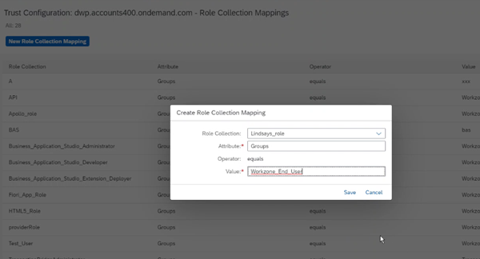

<!-- loio7afe6706346844d9b9879997a0b9f350 -->

<link rel="stylesheet" type="text/css" href="css/sap-icons.css"/>

# Assign Roles to Your Site

To determine which users can access your site, you need to assign one or more roles to your site.

Users who are assigned to a particular role, will have access to the apps and groups that are assigned to the same role as the site.

For more information about roles, see [About Roles and Role Assignment](about-roles-and-role-assignment-f38de6b.md).

To assign a role to your site, do the following:

1.  From the Site Directory, click :gear: to open the *Site Settings* screen.

2.  Click *Edit* at the top right of the screen.

3.  In the *Assignments* panel, start typing the role name in the search box to limit the search results.

4.  In the *Results* list, click :heavy_plus_sign: next to the roles you want to assign to your site.

    You'll see that the icon changes.

5.  Click *Save*.

Now, make sure that the users of the site have been assigned to these same roles.

In SAP Build Work Zone, advanced edition, we use SAP Cloud Identity Services - Identity Authentication to manage users and user groups. You need to verify that the role collection in SAP BTP cockpit contains the required roles that are assigned to the relevant Identity Authentication user groups as follows:

1.  In the SAP BTP cockpit, go to *Security* \> *Trust Configuration*.

2.  Click the *Active* trust configuration link.

3.  From the left navigation panel, go to the *Role Collection Mappings* screen.

4.  Make sure that the role collection that contains the required roles is assigned to the relevant SAP Cloud Identity Services - Identity Authentication user groups.

    

