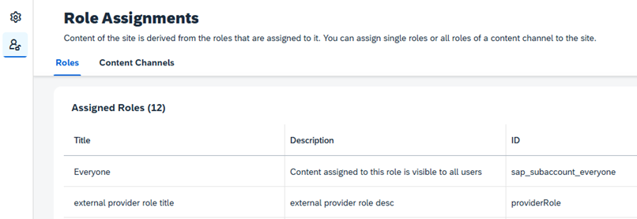

<!-- copy8362c8aba0ef419d8a7d478fb72d055f -->

<link rel="stylesheet" type="text/css" href="css/sap-icons.css"/>

# Assign Roles to Your Site

To allow access to content displayed in the site, the same roles that are assigned to the users need to also be assigned to the site and to the site content.

After making sure that the roles are assigned to the content \(apps and groups/spaces\), and assigned to the users, the next step is to assign the roles to the site.

> ### Note:  
> Role assignment to users is either done by the Identity Provisioning service or by SAP BTP, depending on the content provider settings. If you integrate an app manually, once you create a local role in the Content Manager, a corresponding role collection is created in the SAP BTP cockpit. To assign this role collection to users, go to *Security* \> *Role Collections* in the cockpit, search for the new role collection, click *Edit*, and in the *Users* section, search for the relevant users and assign them this role collection.

For more information about roles, see [About Roles Types](about-roles-types-f38de6b.md).

<a name="copy8362c8aba0ef419d8a7d478fb72d055f__section_nh2_lgk_32c"/>

## Assigning Single Roles and Content Channels

You assign roles and content channels to the site in the *Role Assignments* screen.

To access this screen, from the Site Directory, click :gear: on the site tile to open the *Site Studio*. The Site Studio consists of the Site Settings screen and the Role Assignments screen.

### Assigning Single Roles

The *Roles* tab in the Role Assignments table displays all the roles, local and remote, that are available for assignment in the subaccount.

The roles are sorted according to the last modified date in a descending order. Last modified indicates the last time the role was updated, it can be a change in the title or a change in assignment. For federated roles, the last modified date shows when the role was updated on the content provider side.

To assign/unassign a role, click *Edit* and search for the role by its ID, title or description. Then use the *Assignment Status* toggle button to change the assignment. Changes will be applied only after saving.

### Assigning Content Channels

The *Content Channels* tab in the Role Assignments table displays all the channels that are available for assignment in the subaccount. The content channels list is sorted by title in an ascending order. When assigning/unassigning a content channel rather than a single role, you can perform a bulk assignment to all the roles that are integrated from a given content channel in one click, instead of having to assign multiple roles one by one.

To assign/unassign a content channel, click *Edit* and search for the channel by its ID, title or description. Then use the *Assignment Status* toggle button to change the assignment. Changes will be applied only after saving. This operation might take some time if the content channels include many roles. While the assignment process is running in the background, an information bar will be displayed and you will receive a notification when the process is complete. Similarly, it may take time until all the content associated with the new assignment is visible in the site.

> ### Note:  
> -   When assigning a channel, it’s not possible to select only part of its roles. If you previously assigned single roles from this content channel, upon assigning the channel, the single role assignment will become read-only and you will not be able to make changes to the individual assignment.
> -   Once a content channel is assigned, any change to its roles will automatically be applied to the site assignment. This includes adding new roles, deleting roles, and updating the roles.
> -   You can only assign content channels that are set to automatic content addition. Content channels that allow manual selection of content will not be available for selection in the table. Nevertheless, you can assign single roles from these channels in the *Roles* tab.
> -   The restriction regarding the max number of content items per site \(site content cannot exceed more than 200,000 items in total\), is applicable to the role assignment flow.

