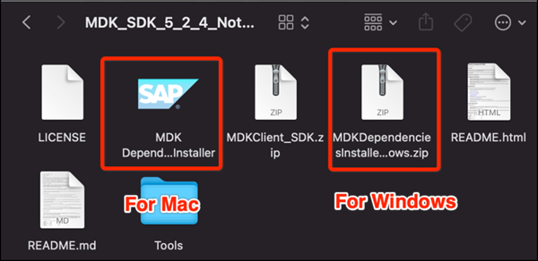
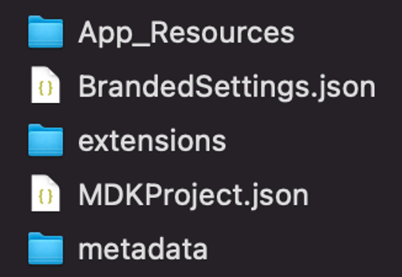

<!-- loio7ee81002c3904cb182b3c9e1badec3af -->

# Building a Customized Mobile Application

Developers can build customized mobile apps based on the source code that is delivered with SAP Build Work Zone, advanced edition.


## Overview

Using the Mobile Development Kit for SAP Mobile Services, developers can customize the source code delivered with SAP Build Work Zone, advanced edition to create mobile apps.

For more information about Mobile Development Kit, see [Mobile Development Kit - Introduction](https://help.sap.com/doc/f53c64b93e5140918d676b927a3cd65b/Cloud/en-US/docs-en/guides/getting-started/mdk/overview.html)


<a name="loio7ee81002c3904cb182b3c9e1badec3af__section_asg_gyj_vqb"/>

## Prerequisites

1.  Install the Mobile Development Kit \(MDK\)
    1.  Download the MDK from SAP Developer Center: [Mobile development kit client](https://developers.sap.com/trials-downloads.html?search=mdk_sdk)
    2.  Verify that your system is set up to run builds for SAP Build Work Zone, advanced edition by running the MDK Dependencies Installer tool. This tool detects all the components to install or update, allowing you to update or install them instantly.
        -   Select the relevant installer for your operating system.

            

        -   Ensure that all the checks have passed.

    3.  Unzip the file `MDKClient_SDK.zip`
    4.  Execute the `./install.command` in the terminal
        -   Use `install.cmd` for Windows
        -   Use `install.command` for Mac

    5.  You should receive a message about successfully installing the MDK.

        For more information, see [Creating Custom Clients](https://help.sap.com/doc/f53c64b93e5140918d676b927a3cd65b/Cloud/en-US/docs-en/guides/getting-started/mdk/custom-client/custom-client.html)


2.  Download the source ZIP file from the following location: [SAP Build Work Zone, advanced edition source](https://launchpad.support.sap.com/#/softwarecenter/template/products/_APP=00200682500000001943&_EVENT=DISPHIER&HEADER=Y&FUNCTIONBAR=N&EVENT=TREE&NE=NAVIGATE&ENR=73555000100200016343&V=MAINT) and unzip it. The ZIP file contains the following structure:

    


<a name="loio7ee81002c3904cb182b3c9e1badec3af__section_xv4_jck_vqb"/>

## Procedure

1.  Open the `MDClient_SDK` folder.
2.  Open a terminal, go to the `MDClient_SDK` folder and run the create-client command relevant to your OS:
    -   Use the `create-client.cmd` for Windows
    -   Use the `create-client.command` for Mac

3.  Enter the path of the `.mdkproject` directory.

**Result:** the project will be generated under the current path.


<a name="loio7ee81002c3904cb182b3c9e1badec3af__section_h3m_zck_vqb"/>

## Branding Your Customized App

1.  Open the `DWP.mdkproject` folder and in there, open the `BrandedSettings.json` file.
2.  Customize the app by modifying the `BrandedSettings.json` as explained in detail in the table below.

```
{
    "ApplicationDisplayName": "$(L,app_display_name)",
    "DetailLabelViewText": "$(L,detail_label_view_text)",
    "DefaultAppLanguage": "en",
    "ConnectionSettings": {
        "EnableOverrides": false,
        "AppId": "com.sap.mobile.platform.workzone",
        "ClientId": "cfb755ab-269d-44fc-9da1-4a2d67f24454",
        "ServerUrl": "WZ domain",
        "AuthorizationEndpointUrl": "WZ domain/oauth2/api/v1/authorize",
        "RedirectUrl": "WZ domain",
        "TokenUrl": "WZ domain/oauth2/api/v1/token"
    },
    "DebugSettings": {
        "DebugODataProvider": false,
        "TracingEnabled": false
    },
    "LogSettings": {
        "FileName": "DWPLog.txt",
        "MaxFileSizeInMegaBytes": 5,
        "LogLevel": "Warn"
    },
    "EncryptDatabase": false,
    "PasscodeTimeout": 120,
    "OnboardingCustomizations": {
        "eulaTitleString": "$(L,new_eula_title)"
    }
}

```


<table>
<tr>
<th valign="top">

Property


</th>
<th valign="top">

Action


</th>
<th valign="top">

Value


</th>
</tr>
<tr>
<td valign="top">

"ApplicationDisplayName"


</td>
<td valign="top">

Modify


</td>
<td valign="top">

Enter app display name.

Open the i18n.properties file \(located under `DWP.mdkproject/metadata/i18n`\), and enter a value for the key “app\_display\_name”


</td>
</tr>
<tr>
<td valign="top">

"DetailLabelViewText"


</td>
<td valign="top">

Modify


</td>
<td valign="top">

Enter a description for the app.

Open the i18n.properties file \(located under `DWP.mdkproject/metadata/i18n`\), and enter a value for the key “detail\_label\_view\_text”

This description will be shown in the mobile welcome page when launching it for the first time.


</td>
</tr>
<tr>
<td valign="top">

"EnableOverrides"


</td>
<td valign="top">

Modify


</td>
<td valign="top">

Change the value from true to false


</td>
</tr>
<tr>
<td valign="top">

“AppId”


</td>
<td valign="top">

Add


</td>
<td valign="top">

To find the App ID:

1.  Open the Administration Console *External Integrations* \> *Mobile Service Administration*
2.  Click *Mobile Application* button.
3.  In the Mobile Application screen, you can find the "ID" in the "Application Details"


</td>
</tr>
<tr>
<td valign="top">

“ServerUrl”


</td>
<td valign="top">

Add


</td>
<td valign="top">

Replace the “*WZ domain*” in the code sample above with the server URL that can be found as follows:

1.  Still in the Mobile Application screen, switch to the *APIs* tab.
2.  The Server URL is listed in the APIs section.


</td>
</tr>
<tr>
<td valign="top">

“AuthorizationEndpointUrl”


</td>
<td valign="top">

Add


</td>
<td valign="top">

\[“*WZ domain*”\]/oauth2/api/v1/authorize


</td>
</tr>
<tr>
<td valign="top">

“RedirectUrl”


</td>
<td valign="top">

Add


</td>
<td valign="top">

\[“*WZ domain*”\]


</td>
</tr>
<tr>
<td valign="top">

“TokenUrl”


</td>
<td valign="top">

Add


</td>
<td valign="top">

\[“*WZ domain*”\]/oauth2/api/v1/token


</td>
</tr>
</table>

> ### Note:  
> In the i18n folder, create a properties file for every language you want to support.

