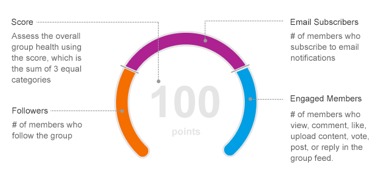

<!-- loio0227f8007f124b519fd66419b9635104 -->

# Collaboration score tile

The collaboration score tile displays various scores averaged over the time frame selected.

## Overall score

On the Overall tab, the overall score is visualized as a dial which is made up of three equal segments: follower score, email subscribers score, and engaged users score. Based on the historical time frame selected, a score is awarded to each individual category, and summarized in the table on the right.

Each category score is a value between 0 and 33.3, rounded to the nearest 0.1. The overall score is a value between 0 and 100, rounded to the nearest 1, and is the sum of the three category scores. An overall score rating is assigned based on the following: Fair \(< 50 points\), Good \(\>=50 and <70 points\), Excellent \(\>=70 and <100\), Perfect \(100\). The value change and percent change in score compared to the previous period also displays under the dial, where applicable.

To view a category for more details, click the category on the dial or click the category tab. You can also click *View Details* at the bottom of the tile to view the line graphs that visually represent the scores over time. See [Collaboration score graph](collaboration-score-graph-895ee36.md) for more details.

## Followers score

On the Followers tab, the followers score is based on the percentage of members who followed the workspace to receive regular updates in their home feed. It is computed as the average number of followers divided by the average number of members for the selected time frame, multiplied by 33.3.

A followers score is a value between 0 and 33.3, rounded to the nearest 0.1 It is assigned a rating based on the following: Fair \(< 50% or 16.7 points\), Good \(\>=50% or 16.7 points and <70% or 23.3 points\), Excellent \(\>=70% or 23.3 points\), or Perfect \(100% or 33.3 points\). Tips are offered to help an administrator improve the score.

## Email subscribers score

On the Email subscribers tab, the email subscribers score is based on the percentage of members who subscribed to either immediate, daily, or weekly workspace email notifications. It is the average number of subscribers divided by the average number of members for the selected time frame, multiplied by 33.3.

An email subscribers score is a value between 0 and 33.3, rounded to the nearest 0.1 It is assigned a rating \(Fair, Good, Excellent, Perfect\) based on similar criteria as the follower score. Tips are offered to help an administrator improve the score.

## Engaged users score

Engaged users score is awarded based on how much users interact with content in a workspace. It is computed as the average number of engaged users divided by the average number of members for the selected time frame, multiplied by 33.3. See [Content and activities](content-and-activities-b20ff4d.md) for a list of activities that contribute to the score.

The score is a number between 0 and 33.3, rounded to the nearest 0.1.

> ### Note:  
> In a public workspace, anyone can engage without becoming a member. Although it is possible to have more engaged users than members, the engaged users score is capped at 33.3.

The score is assigned a rating \(i.e., Fair, Good, Excellent, Perfect\) based on similar criteria as the followers score. Specific recommendations are offered to help an administrator improve the score.

