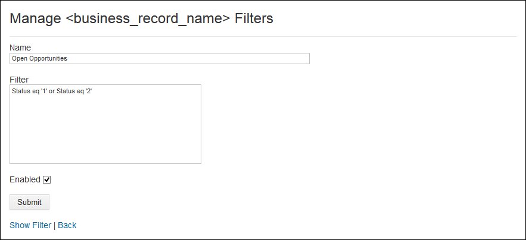

<!-- loiofea324de76d2460e8aa2d39a8e119c81 -->

# Configure a business record filter

Many External Application Objects come with predefined filters that narrow the range of data that is displayed in a UI object.

**To add an external object filter:**

1.  Open the *Administration Console* from under your avatar.
2.  Select *External Integrations* \> *External Solutions* from the left navigation panel.
3.  The list of external applications is displayed. Click *Action* next to the external application to which you want to add a business record filter, and select *Manage Record Types* from the context menu.
4.  Click *Filters* beside the record type to which you want to add a filter.

    The *Manage <name of business record\> Filters* page is displayed.

5.  Click *New Filter*.

    The *Manage <name of business record\> Filters* page is displayed.

    

6.  In the *Name* field, enter a meaningful name for the filter that you want to add.
7.  In the *Filter* field, enter the filter expression that you want to use.
8.  Optionally, you can set the filter to *Enabled*, which will make it immediately available.
9.  When you are done, click *Submit*.

    You are returned to the *Manage <name of business record\) Filters* panel.

10. In the *Manage <name of business record\> Filters* panel, you can do the following:
    -   Click *true* \(or *false*\) in the *Enabled* column to toggle the filter's enabled status.
    -   Click *Show Filter* to view the text of the filter.
    -   Click *Delete Filter* to remove the filter, including from future use.
    -   Click *Edit Filter* or to modify an existing filter.

> ### Note:  
> **Next:** 
> 
> You can now, optionally, [Configure a business record sort order](configure-a-business-record-sort-order-05e657e.md) to set the order in which the external data is arranged in a particular external application data object.
> 
> If you do not want or need to add Sort Fields to your External Application Objects, you can proceed to [Configuring access to business records in SAP Build Work Zone, advanced edition](configuring-access-to-business-records-in-sap-build-work-zone-advanced-edition-0f029d3.md) or [Manage "external objects" \(business records\) using the SAP Build Work Zone, advanced edition API](manage-external-objects-business-records-using-the-sap-build-work-zone-advanced-edition-a-808fe4c.md).

