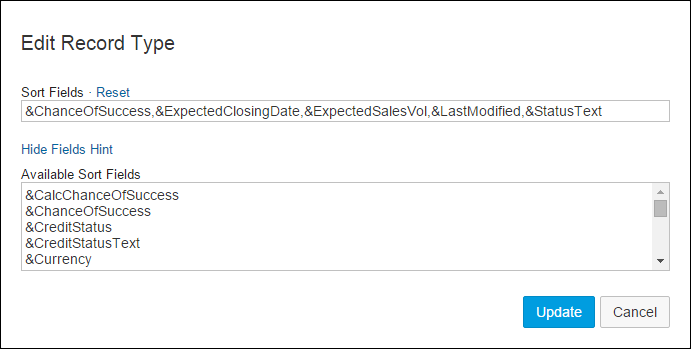

<!-- loio05e657e5d9c64f719fe6d806c950a83b -->

# Configure a business record sort order

Each business record type contains a set of attributes that can be displayed and sorted in SAP Build Work Zone, advanced edition.

**To add a record type sort field:**

1.  Open the *Administration Console* from under your avatar.
2.  Select *External Integrations* \> *External Solutions* from the left navigation panel.
3.  The list of external applications is displayed. Click *Action* next to the external application to which you want to set sort fields, and select *Manage Record Types* from the context menu.
4.  Click *Sort Fields* next to the record type to which you want to set the sort fields.

    The *Edit Record Type* dialog box is displayed.

      
      
    **Add a business record sort order**

    

5.  Click *Show Fields Hint* to view the list of available fields.

    A list of the available fields is displayed.

6.  Copy and past the fields from the list of those available into the *Sort Fields* text box in the order in which you want them displayed.
7.  Click *Update*.

    You are returned to the *Manage <External\_Application\> Record Types* page.

> ### Note:  
> **Next:** You can now proceed to [Configuring access to business records in SAP Build Work Zone, advanced edition](configuring-access-to-business-records-in-sap-build-work-zone-advanced-edition-0f029d3.md) or [Manage "external objects" \(business records\) using the SAP Build Work Zone, advanced edition API](manage-external-objects-business-records-using-the-sap-build-work-zone-advanced-edition-a-808fe4c.md).

