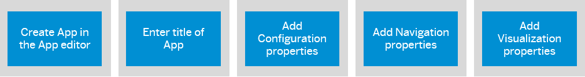

<!-- loio4ba745b26b0e4ca494d99b94a858551d -->

<link rel="stylesheet" type="text/css" href="css/sap-icons.css"/>

# Configure Apps

Add a local app to your subaccount by manually configuring its properties in the dedicated editors.

<a name="loio4ba745b26b0e4ca494d99b94a858551d__section_q4t_1xl_lgc"/>

## Apps that you can configure

-   [URL and Dynamic URL Apps](url-and-dynamic-url-apps-3254887.md)
-   [Native iOS and Android Apps](https://help.sap.com/docs/build-work-zone-standard-edition/sap-build-work-zone-standard-edition/native-ios-and-android-apps)
-   [SAPUI5 Apps](sapui5-apps-d430ae7.md)
-   [SAP GUI for HTML Apps](sap-gui-for-html-apps-e2e52a5.md)
-   [Web Dynpro ABAP Apps](web-dynpro-abap-apps-35a2b71.md)
-   [WebClient UI Apps](webclient-ui-apps-7255021.md)

<a name="loio4ba745b26b0e4ca494d99b94a858551d__section_sxp_bpx_kgc"/>

## Flow for configuring your apps

> ### Note:  
> You can already save your app after you've added the navigation properties. The visualization properties are optional but will make your app easier to identify.

## App Properties

In the *Configuration* tab, define the following properties:

<table>
<tr>
<th valign="top">

Property Name

</th>
<th valign="top">

Type

</th>
<th valign="top">

Description

</th>
</tr>
<tr>
<td valign="top">

<code><b>Open App</b></code> 

</td>
<td valign="top">

Default - In place

</td>
<td valign="top">

You can change the default behavior to open the app in a new tab instead of in place \(replacing the content in the current browser tab\).

> ### Note:  
> -   To open an app in place, the app **must** be able to render in an inner frame \(**iframe**\).
> 
> -   To open an app that doesn't render in an iframe, select to open it in a new tab.
> 
>     > ### Note:  
>     > Apps that rely on the shell APIs, might not run as expected. For example, the following functionality may be affected: forward navigation, user personalization, and getting the application state data.

</td>
</tr>
<tr>
<td valign="top">

<code><b>System</b></code> 

</td>
<td valign="top">

 

</td>
<td valign="top">

There are two types of values you can select: either *No System* and then the *App UI Technology* is *URL*, or you can select the name of the system on which your app is running. The system names in the list reflect the destinations defined in the SAP BTP cockpit. For more information, see [Create Runtime Destinations to Access Apps](create-runtime-destinations-to-access-apps-a57c27c.md).

> ### Note:  
> It may take several minutes until a destination that is defined on the platform appears in the list.

</td>
</tr>
<tr>
<td valign="top">

<code><b>App UI Technology</b></code> 

</td>
<td valign="top">

 

</td>
<td valign="top">

When you select *No System* as the *System*, you can select *URL*.

When you select the name of the system on which your app is running, you need to select the UI technology of the app and configure its properties.

The following table lists the available UI technologies and provides links to their configuration details.

<table>
<tr>
<th valign="top">

App UI Technology

</th>
<th valign="top">

Configuration Details

</th>
</tr>
<tr>
<td valign="top">

*Dynamic URL* 

</td>
<td valign="top">

[URL and Dynamic URL Apps](url-and-dynamic-url-apps-3254887.md) 

</td>
</tr>
<tr>
<td valign="top">

*SAPUI5* 

</td>
<td valign="top">

[SAPUI5 Apps](sapui5-apps-d430ae7.md) 

</td>
</tr>
<tr>
<td valign="top">

*SAP GUI for HTML* 

</td>
<td valign="top">

[SAP GUI for HTML Apps](sap-gui-for-html-apps-e2e52a5.md) 

</td>
</tr>
<tr>
<td valign="top">

*Web Dynpro ABAP* 

</td>
<td valign="top">

[Web Dynpro ABAP Apps](web-dynpro-abap-apps-35a2b71.md) 

</td>
</tr>
</table>

</td>
</tr>
</table>

> ### Note:  
> Before you can configure an app based on a Dynamic URL, SAPUI5, SAP GUI for HTML, or Web Dynpro ABAP, you need to define an HTTP destination in the SAP BTP cockpit. For more information, see [Create Runtime Destinations to Access Apps](create-runtime-destinations-to-access-apps-a57c27c.md).

<a name="loio4ba745b26b0e4ca494d99b94a858551d__section_czz_j4j_phb"/>

## App Navigation

In the *Navigation* tab, you define an intent for the app. The intent is based on an abstract representation that is resolved to a concrete navigation target. It consists of a semantic object, an action, and an optional set of parameters.

The format of an intent in runtime is: `<semantic object>-<action>?<semantic object parameter>=<value1>`

For example, you could use an intent such as the following to display open leave requests:

<code>https://&lt;site domain URL&gt;/site?&lt;site ID&gt;#<b>LeaveRequest-display?status=open</b></code>

The intent, used when navigating to an app in runtime, enables you to launch the same application in different views or modes depending on the end user's role or the device type. For example, for a specific intent, you may want to define that a manager will see one view of your application, while a non-manager employee will see a different view.

Specify the navigation properties of the app:

<table>
<tr>
<th valign="top">

Property Name

</th>
<th valign="top">

Type

</th>
<th valign="top">

Description

</th>
</tr>
<tr>
<td valign="top">

<code><b>Semantic Object</b></code> 

</td>
<td valign="top">

**Mandatory** 

</td>
<td valign="top">

Enter the business entity on which the action is to be performed. For example, a leave request or a travel expense.

</td>
</tr>
<tr>
<td valign="top">

<code><b>Action</b></code> 

</td>
<td valign="top">

**Mandatory** 

</td>
<td valign="top">

Enter the operation to perform on the semantic object. For example, display or approve.

</td>
</tr>
<tr>
<td valign="top">

<code><b>Parameters</b></code> 

</td>
<td valign="top">

Optional

</td>
<td valign="top">

Enter one or more parameters, as required by the app. The parameters are passed to the app when accessing it in runtime.

-   **Name** - Enter a unique name for your parameter.
-   **Default Value** - Set your preferred default value. A default value can be set to mandatory or optional \(using the *Required* toggle\).
-   **Filter Value** - Set your preferred filter value. When setting a filter value, the *Required* toggle is automatically set to Yes.
-   **Rename To** - Rename the parameter. If for example, the parameter name is ReceivingCostCenter and you rename it to CostCenter, the application opens with the CostCenter parameter.

</td>
</tr>
<tr>
<td valign="top">

<code><b>Allow additional parameters</b></code> 

</td>
<td valign="top">

Selected by default

</td>
<td valign="top">

When selected, you can specify additional parameters to pass to the app at runtime.

</td>
</tr>
</table>

### Configure Inner App Routes

Configuring an innerAppRoute parameter on an SAPUI5 application, enables launching the application in a specific route / path.

> ### Note:  
> For ABAP applications that are added through a remote content provider, inner app route is also supported \(app should be preconfigured with this parameter\).

1.  In the Content Manager, open the SAPUI5 app for editing.
2.  In the *Navigation* tab, add the following parameter: `sap-ushell-innerAppRoute`.
3.  Set a default value for the parameter.

    > ### Note:  
    > 1.  The default value can’t start with a "/" or "&".
    > 2.  Other config parameters such as `required`, `renameTo`, are not supported in this flow and therefore should be removed from the parameter list.

**Example:**

If the navigation intent and parameter are as follows:

-   Semantic Object: Semantic
-   Action: Action
-   Parameter \(name/default value\): sap-inner-route = <inner-route\>

Then the generated URL is: \{URL\}\#Semantic-action&/<inner-route\>

<a name="loio4ba745b26b0e4ca494d99b94a858551d__section_pfdb_xcr_bxv_3pb"/>

## App Visualization

In the *Visualization* tab, specify how the app is displayed.

<table>
<tr>
<th valign="top">

Property Name

</th>
<th valign="top">

Type

</th>
<th valign="top">

Description

</th>
</tr>
<tr>
<td valign="top">

<code><b>Visualization Type</b></code> 

</td>
<td valign="top">

**Mandatory** 

</td>
<td valign="top">

Select the visual representation of the app in runtime:

-   *Static App Launcher* - a standard tile that launches the app inplace or in a new browser tab, and displays static content.

-   *Dynamic App Launcher* - a tile that launches the app inplace or in a new browser tab, and displays data that is updated at regular intervals. The data is retrieved from a back-end system using OData services.

    > ### Note:  
    > Dynamic tiles aren't supported:
    > 
    > -   When using direct access.
    > 
    > -   For apps that were developed with a launchpad module.

-   *Card* - a self-contained user interface element, that displays business content in a predefined structure such as a list, a table, or a chart.

-   *None* - The app isn't visible in the site.

</td>
</tr>
<tr>
<td valign="top">

<code><b>Subtitle</b></code> 

</td>
<td valign="top">

Optional

</td>
<td valign="top">

Displayed below the title, which is the name of the app.

</td>
</tr>
<tr>
<td valign="top">

<code><b>Information</b></code> 

</td>
<td valign="top">

Optional

</td>
<td valign="top">

Additional text that is displayed at the bottom of the tile.

</td>
</tr>
<tr>
<td valign="top">

<code><b>Icon</b></code> 

</td>
<td valign="top">

Optional

</td>
<td valign="top">

Specify the icon to display at the bottom left corner of the tile, using one of the following options:

-   Select a standard icon from the list of provided icons by typing its name or by browsing for it.

-   Enter the URL path to the location of an image of a different icon. The location must be public. The supported file types include: `APNG`, `AVIF`, `GIF`, `JPEG`, `PNG`, `SVG`, `WebP`.

</td>
</tr>
<tr>
<td valign="top">

<code><b>Supported Devices</b></code>

</td>
<td valign="top">

Optional

</td>
<td valign="top">

Configure the device types on which the app will be visible at runtime: desktop, tablet, mobile.

> ### Note:  
> When configuring an app in the App editor, the device type configurations that you set will determine whether the app tile will be hidden or displayed in the workspace workpages.

</td>
</tr>
<tr>
<td valign="top">

<code><b>Parameters</b></code>

</td>
<td valign="top">

Optional

</td>
<td valign="top">

Enter the *Name* and *Value* of each parameter that you need to pass to the app.

-   Every time you enter a parameter name and value, a new pair of empty fields is added automatically.

-   Use  \(Delete\) to delete a parameter.

> ### Note:  
> When using the keyboard to navigate between the parameter rows and fields, the following keys apply:
> 
> -   First use the F2 key to place focus on a row, and then use the up/down arrow keys to move between the rows.
> 
> -   Once you reach the row you want to edit, use the TAB key to focus on the *Name* field and then again to move to the *Value* field.

</td>
</tr>
</table>

When you select a *Dynamic App Launcher* tile, you also need to select the system \(destination\) of the service and the URL service from which the dynamic data is read.

The following table describes the properties of a dynamic tile:

<table>
<tr>
<th valign="top">

Property Name

</th>
<th valign="top">

Type

</th>
<th valign="top">

Description

</th>
</tr>
<tr>
<td valign="top">

<code><b>System</b></code> 

</td>
<td valign="top">

**Mandatory** 

</td>
<td valign="top">

Select the system \(destination\) of the service.

> ### Note:  
> You can select a value that is different value from the one specified in the Properties tab.

</td>
</tr>
<tr>
<td valign="top">

<code><b>Service URL</b></code> 

</td>
<td valign="top">

**Mandatory** 

</td>
<td valign="top">

Specify the URL of the service from which the dynamic data is read.

> ### Note:  
> The URL must **not** start with '/'.

The response is expected in JSON format.

When the service is called, the values that are provided by the service override the values that have been configured manually in the tile.

Note that the service is executed at runtime only. At design time, sample data is displayed.

</td>
</tr>
<tr>
<td valign="top">

<code><b>Refresh Interval</b></code> 

</td>
<td valign="top">

Optional

</td>
<td valign="top">

The number of seconds after which dynamic content is reloaded from the data source and the display is refreshed:

-   The default is 0, which updates the dynamic tile only once upon loading.

-   Use the +/- symbols to increase/decrease the interval by 10 seconds at a time.

</td>
</tr>
</table>

> ### Note:  
> You also need to add an additional property to the destination in the cockpit: `HTML5.DynamicDestination=true`.
> 
> For more information, see, [Create Runtime Destinations to Access Apps](create-runtime-destinations-to-access-apps-a57c27c.md)

> ### Caution:  
> Adding an `HTML5.DynamicDestination`property and setting it to true, enables dynamic access to the destination to any logged-in user.
> 
> Therefore before adding this property to the destination, make sure that the underlying API is not public and requires the correct user credentials.

<a name="loio4ba745b26b0e4ca494d99b94a858551d__section_pz2_kmj_rhb"/>

## Translation

In the *Translation* tab, you can maintain the translation of the app fields.

For more information, see [Translate Your Site](translate-your-site-23a32f3.md).

<a name="loio4ba745b26b0e4ca494d99b94a858551d__section_f32_yr5_vxb"/>

## Additional Info

In the *Additional Info* tab, you can review facts about the app such as when it was created and by who it was created. You can also see the app ID, what channel it originates from, and when it was last modified.

Optionally specify the following information:

<table>
<tr>
<th valign="top">

Property Name

</th>
<th valign="top">

Description

</th>
</tr>
<tr>
<td valign="top">

<code><b>Keywords</b></code>

</td>
<td valign="top">

Enter one or more keywords that can be used for searching for the apps in runtime.

> ### Note:  
> You must press the [Enter\] key after entering or modifying the keywords and before clicking *Save*.

</td>
</tr>
</table>

**Related Information**  

[Supported Browsers and Languages](supported-browsers-and-languages-99a0a18.md "")

[Manual Integration of Apps](manual-integration-of-apps-ddb655a.md "Learn how to integrate apps manually.")

