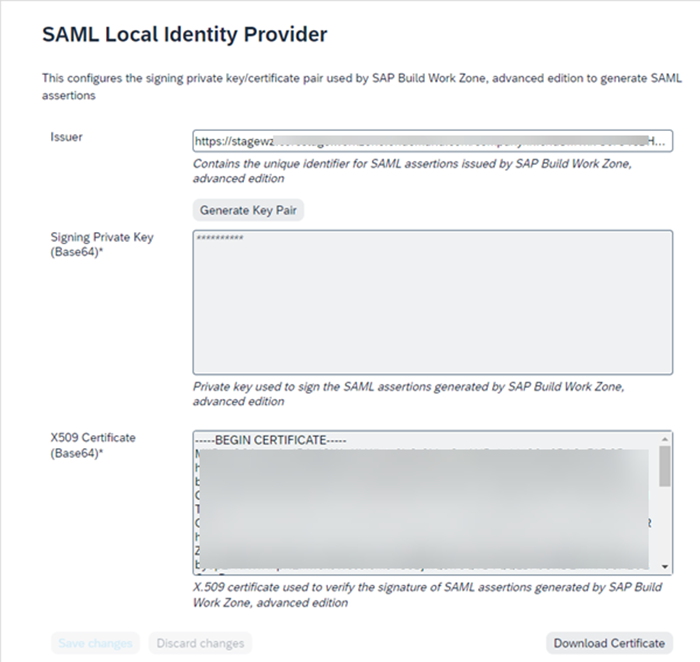

<!-- loio39a4f6bc6ddf4004990731e1386d2650 -->

# Configure SAP Build Work Zone, advanced edition as a SAML Local Identity Provider

This procedure configures SAP Build Work Zone, advanced edition to allow it to access an external application's user ID and authorization information so that it will display only the material that a user is authorized to view in pages that contain external application business records.

To configure SAP Build Work Zone, advanced edition as a SAML identity provider, do the following:

1.  From the sidebar menu of the Admin Console, select *Authentication & Authorization* \> *SAML Local Identity Provider*.

    The *SAML Local Identity Provider* screen is displayed.

    For more information, see [SAML Local Identity Provider.](https://help.sap.com/docs/WZ/b03c84105ff74f809631e494bd612e83/176e87bb4f464b508370302398d00878.html)

      
      
    **SAML Local Identity Provider screen**

    

    The *Issuer* field contains the URI that shows the issuer's identity, in this case, your company's SAP Build Work Zone, advanced edition instance.

2.  Click *Generate Key Pair* to automatically fill the *Signing Private Key* and *X509 Certificate* text boxes.

    The two text boxes are automatically filled with the signing private key and the X509 certificate \(in base64 format\), that are required.

3.  Copy the information in the *Issuer* and *X509 Certificate* fields to configure SAP Build Work Zone, advanced edition as the SAML identity provider in an external application, which provides users with SSO access to the external applications.

> ### Note:  
> **Next:** You have now configured SAP Build Work Zone, advanced edition as a local SAML identity provider, which ensures that users can view only the content from the external application that they have been authorized to view when that material is displayed in SAP Build Work Zone, advanced edition. If you also want to display SAP Build Work Zone, advanced edition content in the external application, you must:
> 
> -   [Add an OAuth Client](add-an-oauth-client-5310092.md). This configuration provides the external application with authorized access to the SAP Build Work Zone, advanced edition API.
> -   [Add a SAML Trusted IDP](add-a-saml-trusted-idp-dad776e.md). This step ensures that users can view only the content from SAP Build Work Zone, advanced edition that they have been authorized to view when that material is displayed in the external application.

