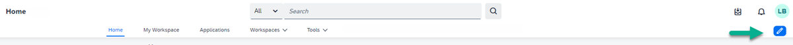

<!-- loio620515b70c3a40e0aaa64b50accb2b3d -->

<link rel="stylesheet" type="text/css" href="css/sap-icons.css"/>

# Configuring a Site Menu

SAP Build Work Zone, advanced edition includes a versatile, WYSIWYG Menu Editor that administrators can use to easily create a fully customized menu bar in their sites.

By creating a multi-level menu bar with a hierarchical structure that includes menu items and nested sub-menu items, users of your site can quickly and easily navigate to the most important information they need. One of the main advantages of the site menu is that you can use predefined out-of-the-box menu items together with your own custom menu items.

<a name="loio620515b70c3a40e0aaa64b50accb2b3d__section_ztr_qgv_pvb"/>

## Access the Menu Editor

If you're a company or a support admin, when you hover over the default menu bar, you'll see an :pencil2: \(Edit\) icon. Clicking on it opens the Menu Editor.

When you open the Menu Editor for the first time, the menu bar displays a number of predefined menu items, namely *Home*, *My Workspace*, *Applications*, *Workspaces*, and *Tools*. You can design a completely different menu bar using these predefined menu items as well as adding your own custom menu items.

<a name="loio620515b70c3a40e0aaa64b50accb2b3d__section_rxp_j3v_pvb"/>

## What can I do in the Menu Editor?

On the left of the screen, you'll see the Menu Editor panel displaying a list of menu items that are the same menu items displayed in your top menu bar. As you add menu items to the panel, they're simultaneously added to the menu bar.

Let's see how to use the Menu Editor.

<table>
<tr>
<th valign="top">

Action

</th>
<th valign="top">

Where to do it

</th>
</tr>
<tr>
<td valign="top">

Add menu items to your menu

</td>
<td valign="top">

At the top of the Menu Editor panel, click the :heavy_plus_sign: \(Add menu item\) icon and select the type of menu item that you want to add. Your options are *Custom*, *Workspace*, *Application* and *Predefined*. We’ll describe more about these menu items later in this topic.

> ### Note:  
> You can see that as you add menu items in the panel, they're simultaneously reflected in the menu bar.

</td>
</tr>
<tr>
<td valign="top">

Manage menu items

</td>
<td valign="top">

From the Menu Editor panel, you can manage your menu items by opening the  \(Actions\) icon on the right of each menu item. The list of actions that you can perform depends on the type of menu item it is.

</td>
</tr>
<tr>
<td valign="top">

Manage content

</td>
<td valign="top">

Click the  \(Content\) icon to open the *Menu Content* screen - this is where you manage and create content that you can use in the menu.

You can:

-   Use the action items on the far right of each content item to edit, copy, delete, move, feature, and view details of a specific item.

-   Select a few content items and then click the  \(Actions\) icon in the top menu bar to execute various actions on multiple items simultaneously.

-   Click *\+Create* in the top menu bar to open a list of possible content items that you can create on the fly. Once you've created the content, publish it in order to add it to the content list.

    > ### Note:  
    > All content items on this screen can only be accessed by the company or support administrator. Workpages created from here can only be referenced by the menu.

-   From the *Trash* tab, you can restore any menu content items that you may have deleted.

</td>
</tr>
<tr>
<td valign="top">

Translate menu items

</td>
<td valign="top">

Click the  \(Translate\) icon to open a dedicated screen for translating your menu items. In the left column, there's a list of all your menu items. Simply select the language you want, and start entering the translated terms. Don't forget to *Save* and then *Publish* your changes.

If you've enabled the language in the *Site Settings*, then the user can select this language in the user settings screen. The site and all translated menu items appear in the selected language.

</td>
</tr>
<tr>
<td valign="top">

Search for menu items

</td>
<td valign="top">

Search for menu items by typing a name in the search bar. As you start typing, the result list condenses.

</td>
</tr>
<tr>
<td valign="top">

Preview menu items

</td>
<td valign="top">

Click on a menu item to get a real-time preview of the menu according to how you built it. You can click menu items in the preview to open them.

> ### Note:  
> You can't preview applications while in edit mode.
> 
> There is no preview for external links because they open in a new tab.

</td>
</tr>
<tr>
<td valign="top">

Publish your menu

</td>
<td valign="top">

Use *Save Draft* to save your changes and continue working on it later. *Discard Draft* will revert your changes back to the last published version of the menu. When you are done, click *Publish* to make your changes visible to all users.

</td>
</tr>
<tr>
<td valign="top">

Use the redo and undo buttons

</td>
<td valign="top">

Use the  \(Undo\) icon to reverse any action that you made by mistake. Use the  \(Redo\) icon to restore any actions that were previously undone.

</td>
</tr>
<tr>
<td valign="top">

Hide or show the menu panel

</td>
<td valign="top">

The Menu Editor panel can be hidden and then shown again by using the arrows at the top of the panel.

</td>
</tr>
</table>

<a name="loio620515b70c3a40e0aaa64b50accb2b3d__section_yny_vrv_pvb"/>

## Using the different menu item types

In this section, we'll explain more about the types of menu items that you can select.

<table>
<tr>
<th valign="top">

Type

</th>
<th valign="top">

More information

</th>
</tr>
<tr>
<td valign="top">

*Custom*

</td>
<td valign="top">

The custom menu item is the most versatile. You can build a multi-level hierarchical menu by nesting up to three levels of sub-menu items. You can link to any external URL or to a workpage. If you choose to not link it to anything, the menu item acts as a placeholder with clickable sub-menu items nested under it.

> ### Note:  
> When you add a URL to an external link, it opens in a new tab so there is no preview.

Creating a custom menu item enables you to do any of the following actions:

-   *Edit* - clicking the edit option opens a screen enabling you to name your menu item and to link to either a URL or to any workpage. If you've created a workpage from the *Menu Content* screen, you can reference it from here.

-   *Access Control* - custom menu items include a powerful mechanism that enables you to expose different subsets of the menu items to different audiences. You can restrict the menu item to be shown to internal users, external users, or to any specific group of users defined by a User List or the members of a specific workspace.

-   *Duplicate*, *Hide*, or *Delete* a menu item.

</td>
</tr>
<tr>
<td valign="top">

*Workspace*

</td>
<td valign="top">

You can add a workspace as a menu item - once you've named your menu item, you can reference the workspace by simply selecting an existing workspace from a dropdown list. Once it's added to the menu bar, the workpages in the workspace are displayed as sub-menu items.

If a workspace is clickable, when clicking the workspace in the menu you'll see the main screen. If the workspace isn't clickable, you'll only be able to navigate to its sub-pages. Because the workspace admin manages the workspace, and because the workpages will show up on the menu as sub-menu items, the workspace admin in effect manages those sub-menu items.

> ### Remember:  
> If the workspace includes predefined page tabs like Content, Feeds, Members, and so on, they won’t be displayed.
> 
> If it's a private workspace, menu items will only be seen by the members of that workspace.

</td>
</tr>
<tr>
<td valign="top">

*Application*

</td>
<td valign="top">

You can select any application that you have permissions to view and access. You can then access these applications directly from the site menu.

</td>
</tr>
<tr>
<td valign="top">

*Predefined*

</td>
<td valign="top">

You can use any of the predefined out-of-the-box menu items to quickly customize your menu. For example, *Applications*, *Workspaces*, *My Workspace*, *Calendar*, and more. Some of these menu items appear in the menu when you first open your site and you can either hide or delete these items.

> ### Note:  
> The *Applications* predefined menu item is a single page that displays the apps configured in the Content Manager and that are assigned to roles, groups, and catalogs. Don't confuse this with the *Application* menu category that enables you to add any application directly to the menu and access it from there.
> 
> For more information, see [Adding Apps to Your Site](adding-apps-to-your-site-cb936ef.md) 

> ### Note:  
> Each type of predefined menu item can only be added once to the menu. If you've already added one of them, it will be grayed out in the dropdown list of predefined menu items. If a menu items is grayed out in the Menu Editor panel on the left, it means that the menu item has been hidden when clicking the  \(Actions\) icon and selecting*Hide*.

</td>
</tr>
</table>

