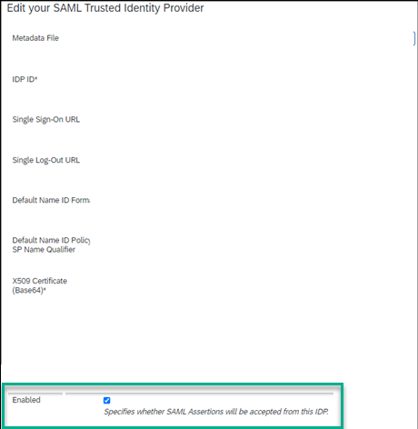

<!-- loiodf89bb34fd84421c945b70856061a1dc -->

# Configuring External Users

This topic explains how to configure external users in SAP Build Work Zone, advanced edition.

To allow Identity Authentication-based external users \(self-registration/SAP or third party\) to access your system, complete the following steps.

> ### Note:  
> Only users provisioned as `userType = public` are treated as external users. Internal users should be provisioned as `userType = employee`.

1.  **Configure the SAML Trusted IDP**

    External users use SAP Cloud Identity Services - Identity Authentication as their IdP.

    1.  To register the Identity Authentication service as an IdP for external users, in the *Administration Console*, go to *Authentication & Authorization* \> *SAML Trusted IDPs* and click the *Register your SAML Trusted IDP* button.
    2.  Enter the information retrieved from the Identity Authentication SAML 2.0 metadata file \(you should have downloaded it as part of the onboarding flow\). Register your SAML Trusted IDP.

        For more information, see [Setting Up Trust Between Identity Authentication and SAP BTP](https://help.sap.com/viewer/65de2977205c403bbc107264b8eccf4b/Cloud/en-US/9dba751c208f4435a711c26b20945980.html).

    3.  Check the *Enabled* option:

        

    4.  Click *Save* to complete the setup.

2.  **Review the SCIM OAuth Client**

    The required SCIM API OAuth Client should be generated automatically when setting up or upgrading SAP Build Work Zone, advanced edition.

    In the *Administration Console*, go to the *External Integrations* section, and on the *OAuth Clients* page, review the details of the `Workzone API Client Extranet` OAuth client.

3.  **Configure the Identity Authentication service provider API credentials**

    The Identity Authentication service provider API credentials are needed to allow users to invite external users based on their e-mail address and trigger an Identity Authentication-level invitation for the registration process.

    <table>
    <tr>
    <th valign="top">

    Step

    
    </th>
    <th valign="top">

    Description

    
    </th>
    </tr>
    <tr>
    <td valign="top">
    
    1: Generate client credentials in the Identity Authentication service.

    
    </td>
    <td valign="top">
    
    1.  In the SAP Cloud Identity Services, Identity Authentication admin console, select the application you've created for SAP SuccessFactors Work Zone.
    2.  Go to *Application API* \> *Client ID, Secrets and Certificates*.
    3.  In the *Client ID, Secrets and Certificates* page, click *Add* in the *Secret* section.
    4.  Enter the *Description*, *Expire in*, and *Scope* details. The *OpenID* scope option isn't required.
    5.  Click *Save*. This will generate client credentials.

        > ### Tip:  
        > Make sure to securely save these credentials \(for example, in a password manager\), as they won't be accessible anymore after clicking OK\).

    6.  Click *OK*.

    
    </td>
    </tr>
    <tr>
    <td valign="top">
    
    2: Enter the client credentials in SAP Build Work Zone, advanced edition.

    
    </td>
    <td valign="top">
    
    1.  In the *Administration Console*, go to *Feature Enablement* \> *Features*.

    2.  Locate the *External Workspace Creation* setting and reconfirm that this feature is set to *Yes*.

        > ### Note:  
        > You can enable it globally \(allows all users to create external workspaces\) or only to delegated admin areas \(in this case, only members of selected areas can create external workspaces\). Select either option.

    3.  Enter the client ID you got from the Identity Authentication service as the *Username* and the client secret as the *Password*.

        

        > ### Note:  
        > Allowing external users to be created through a workspace invitation email, is an optional setting. It is required to add users via self-registration.
        > 
        > Without it, only existing external users \(tagged as external in SAP Build Work Zone, advanced edition\) can be added to external workspaces.
        > 
        > In either case, they'll need to be provisioned into SAP Build Work Zone, advanced edition via Identity Provisioning.

    4.  Click *Save*. You'll get a successful confirmation message.

    
    </td>
    </tr>
    </table>
    
4.  **Configure the Identity Authentication service as a source for user provisioning**

    For more information about how to configure the Identity Authentication service as a source system, see [Identity Authentication.](https://help.sap.com/viewer/f48e822d6d484fa5ade7dda78b64d9f5/Cloud/en-US/e4e25f1fae094c2a89ad62159e1cd230.html)

    > ### Note:  
    > The Identity Authentication service reads \(queries\) only specific users from the Identity Authentication service; make sure that the Identity Provisioning service only reads user of `User Type = public`.

5.  **Configure SAP Build Work Zone, advanced edition as a target system for user provisioning**

    For more information, see [SAP Build Work Zone, advanced edition.](https://help.sap.com/viewer/f48e822d6d484fa5ade7dda78b64d9f5/Cloud/en-US/787502df6ce14225b0e7cf7821e785eb.html)

6.  **Configure real-time provisioning**

    Configure real-time provisioning from *Identity Authentication* \> *Identity Provisioning* \> **.

    Without real-time provisioning, the user invites for Identity Authentication self-registration would need to wait for the next Identity Provisioning job schedule to happen. With the real-time setup, the Identity Authentication service immediately triggers the Identity Provisioning upon successful registration in the Identity Authentication service - ensuring that the user is created in SAP SuccessFactors Work Zone as external \(as required\).

    For more information, see:

    [Configure Identity Provisioning Target Systems for User Provisioning](https://help.sap.com/viewer/6d6d63354d1242d185ab4830fc04feb1/Cloud/en-US/334964514e8b48cb88c8ed07f5ee6a14.html)

    [Real-Time Provisioning: Identity Authentication](https://help.sap.com/viewer/f48e822d6d484fa5ade7dda78b64d9f5/Cloud/en-US/70afd909734842b08ff8f1be5b01bc2a.html)

