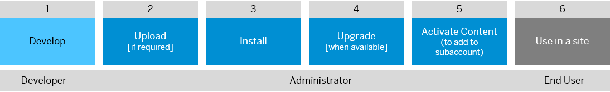

<!-- loioda203f9d1ab143f084d75688f1e9e032 -->

# Content Packages

Content packages enable you to easily install various types of content into your subaccount.

## What is a content package?

A content package is a collection of content items such as cards, workspace templates, home pages, workflows, and workspaces that are bundled together in a ZIP file that can easily be uploaded and installed into your subaccount. Once the content items in a content package have been activated, they’re ready for use in the workpages of your site.

There are two types of content packages available:

-   **Global content packages**

    These content packages are available to all users and don’t require a manual upload. However they do need to be installed by the administrator. These content packages can't be downloaded or customized.

    Global content packages consist of:

    -   Content packages that are provided by a third party and have been added to the content repository.

    -   Out-of-the-box content packages that are provided by SAP and reside in the content repository.

        These include:

        -   *Employee Onboarding* 

            For more information, see [Configuring Onboarding Guided Experience](https://help.sap.com/docs/SAP_SUCCESSFACTORS_WORK_ZONE/04877e17a5da4908a6fea94949e160b5/bfad5dec28a54dd9a37804d5508916a0.html?q=employee%20onboarding)

        -   *HR Content from SAP SucessFactors*

            To learn more about this content package, see [Working with the HR Content](https://help.sap.com/docs/SAP_SUCCESSFACTORS_WORK_ZONE/04877e17a5da4908a6fea94949e160b5/9bc38d423d3740548a8093b71adbb8ad.html)

        -   *Insights: Change Management*

            This content package is integrated with SAP Enterprise Product Development \(SAP EPD\), as part of the Insights capability. To enable the connection between SAP Enterprise Product Development and SAP Build Work Zone, advanced edition, see [Configuring Connectivity for Insights](https://help.sap.com/docs/PLM_EPD/1bfdb8b2f0264b66a818a2a889ee8c31/78f00a19c1cc413c91116d546bd3896a.html).

-   **Local content packages**

    These content packages are developed by a user or customer and manually uploaded and installed by the administrator. They can be downloaded and customized.

<a name="loioda203f9d1ab143f084d75688f1e9e032__section_ftz_vmc_2rb"/>

## What content items can be part of a content package

Content Packages can contain the following content items:

-   UI Integration cards
-   Workflows
-   Workspace templates
-   Home pages
-   Workspaces

<a name="loioda203f9d1ab143f084d75688f1e9e032__section_er1_cqg_znb"/>

## Where do I manage the content packages?

You can manage content packages from the Administration Console.

From the Administration Console, go to *UI Integration* \> *Content Packages.*

When you first open the *Content Packages* screen, you’ll immediately see all global content packages that are provided by SAP or a third party that have been published to the content repository. You can then manually upload any content packages that you or a developer have created locally.

In the *Content Packages* screen, you can search for a specific content package or you can filter them according to the provider \(source\) of the package, and you can also filter according to the status of the content package.

Possible statuses of a content package are:

-   *Ready to Install*: The content package has been uploaded and it's ready for installation.

-   *Installed*: You’ve installed the content package. Once all the content items in the package have been activated, it's ready for use.

-   *Upgrade Available*: There’s a newer version of the content package available and you can upgrade your content package.

<a name="loioda203f9d1ab143f084d75688f1e9e032__section_qyr_3zh_nnb"/>

## How do I add content packages to a site?

The overall process is as follows:

For more detailed information about each step, click the relevant box.

