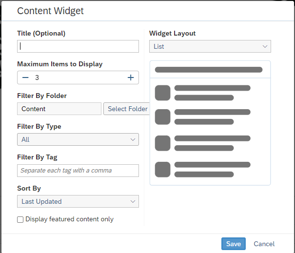
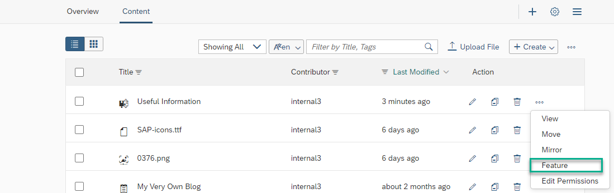

<!-- loioa2a6f73916074ed9b980affe23443f66 -->

# Content Widget

The *Content* widget enables users to upload, create, and display a variety of content to add to your workpages.

## Define display of your content

When you add a *Content* widget to your workpage, you can define how you want to filter your content, how many content items to display, and you can select content from existing folders.

<table>
<tr>
<th valign="top">

Setting

</th>
<th valign="top">

Description

</th>
</tr>
<tr>
<td valign="top">

Title

</td>
<td valign="top">

Enter a name for the content. An example could be `My Content`.

This entry is optional.

</td>
</tr>
<tr>
<td valign="top">

Maximum Items to Display

</td>
<td valign="top">

Click and drag the slider to set a maximum between 1 and 15 content items to display.

</td>
</tr>
<tr>
<td valign="top">

Filter By Folder

</td>
<td valign="top">

Choose a folder from which you will store and upload your data.

</td>
</tr>
<tr>
<td valign="top">

Filter By Type

</td>
<td valign="top">

Select the types of content you want to display. You can display all types or select individual types.

</td>
</tr>
<tr>
<td valign="top">

Filter By Tag

</td>
<td valign="top">

Enter text that refines what appears in the content; one or more tags are allowed, comma-separated.

</td>
</tr>
<tr>
<td valign="top">

Sort By

</td>
<td valign="top">

Sort your content items using various options such as *Last Updated*, *Most Liked*, and many more.

</td>
</tr>
<tr>
<td valign="top">

Display featured content only

</td>
<td valign="top">

Select to display only content that is featured.

In the Content list for your workspace, you can feature content items from the Action column of your Content list follows:

Once you feature a content item, you can filter the featured content and display it on your workpages. The display order for featured content is determined by the order in which the content has been featured.

</td>
</tr>
<tr>
<td valign="top">

Widget Layout

</td>
<td valign="top">

Choose a layout for the content \(for example: list, carousel, gallery, or thumbnail\)

</td>
</tr>
</table>

When you hover over the tool tip for the widget in the regular page view, it displays the main filter types that are selected.

> ### Note:  
> About images in the content widget:
> 
> -   When images are uploaded to the *Content* folder, a preview is available for images up to 20MB.
> 
> -   Thumbnail images used for wikis, blogs, workpages, or KBAs can be adjusted using a slider or dragging an image so that it’s displayed properly in a *Content* widget with different layouts \(thumbnail/gallery/carousel\) and in the *Content* list in grid view.

