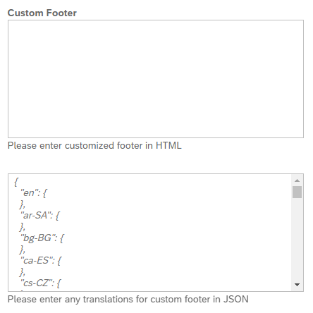

<!-- loio08dc0711602d4de698a808126919038a -->

# Custom Scripts

Create custom footer scripts for your site's theme.


## Overview

You can configure a custom footer for your site. This footer can include any HTML content and supports multilingual translations using a JSON file. Additionaly, you can maintain separate configurations for internal and external users ensuring a tailored footer experience based on user access.


<a name="loio08dc0711602d4de698a808126919038a__section_f5t_tjm_4bc"/>

## How to access custom scripts

From the Administration Console, go to *Theming & Branding* \> *Custom Scripts*.


<a name="loio08dc0711602d4de698a808126919038a__section_pff_lkm_4bc"/>

## How to configure the custom footer

**HTML content:**

In the **Custom Footer** text box, enter your HTML content. This content will be displayed in the footer of your site. Make sure that your HTML is well formed and tested for compatibility across different browsers.

> ### Sample Code:  
> ```
> <div class="custom-footer" style="text-align: center;">
>     <p>&copy; 2024 Your Company Name. All rights reserved.</p>
>     <a href=https://www.yourcompany.com/privacy>Privacy Policy</a> |
>     <a href=https://www.yourcompany.com/terms>Terms of Service</a>
> </div>
> 
> ```

**Translation content:**

In the *Translations* text box, provide the translations for your HTML content in JSON format. This ensures the footer can display in multiple languages based on user preferences.

-   Include a default-language key to specify the default language for the footer content.

-   The JSON should map language codes to their respective translations.


> ### Note:  
> To revert the custom footer back to the default, delete your HTML from the text box and save. This will reset the customized HTML back to the original \(empty\) folder.




<a name="loio08dc0711602d4de698a808126919038a__section_rlx_xlm_4bc"/>

## Best practices

-   Consisitent Styling: Ensure the custom footer matches the overall styling of your site.

-   Accessibility: Make sure the HTML content is accessible to all users, including those using screen readers.
-   Regular Updates: Periodically review and update the footer content and translations to keep the information current and relevant.

-   Testing: Thoroughly test the custom footer across different devices and user roles \(internal and external\) to ensure it displays correctly.


