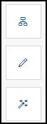

<!-- loio9164929567b64932814d7f899a955e19 -->

<link rel="stylesheet" type="text/css" href="css/sap-icons.css"/>

# Define Workpage Settings

As a workspace administrator or as a company or area administrator, you can edit your workpages.

On your workpage, you see the following icons on the right:

<table>
<tr>
<th valign="top">

Icon

</th>
<th valign="top">

Description

</th>
</tr>
<tr>
<td valign="top">

*Switch page view*



</td>
<td valign="top">

Only visible on the *Home* page.

Area administrators for multiple areas can switch between area home page views.

The home page switcher lets you quickly choose a home page to view and edit. You can:

-   Select a tab representing either *Full Access Users* or *External Users*.

    For that user type, select either Company or a specific area.

-   You can also edit the company announcement for *Full Access Users*.

</td>
</tr>
<tr>
<td valign="top">

*Edit* 



</td>
<td valign="top">

This opens the workpage editor from where you can do the following:

-   Click *Add Widget* on a workpage section to open the widget gallery. From here, you can select a variety of app tiles, cards, and widgets with various content types such as images, feeds, forums, events, and more.

-   Click :pencil2: on the widget to edit various widget settings.

    For more information about cards, see [About Cards](about-cards-a202464.md).

    For more information about widgets, see [About Widgets](about-widgets-5a73a41.md)

-   Change the layout of the workpage by moving and resizing the widgets.

-   Click :gear: to set the background color of your workpage and define how the different sections on the workpage are displayed.

</td>
</tr>
<tr>
<td valign="top">

*Enter page settings*



</td>
<td valign="top">

This icon is also called the wand. When you click it, a variety of different workpage settings opens. For more details about each setting, see the table below.

</td>
</tr>
</table>

Click  \(the wand icon\) to open, the following page setting options:

<table>
<tr>
<th valign="top">

Option

</th>
<th valign="top">

More information

</th>
</tr>
<tr>
<td valign="top">

*View*



</td>
<td valign="top">

This setting is only available on a workpage.

Displays a list of the users who have seen the workpage. When you hover over this icon, the tooltip displays the number of viewers.

</td>
</tr>
<tr>
<td valign="top">

*Translate*



</td>
<td valign="top">

Create language versions of the workpage for translation purposes.

For more information, see [Translating Workpages](translating-workpages-cc6838c.md).

</td>
</tr>
<tr>
<td valign="top">

*Versions* 



</td>
<td valign="top">

Open the version history.

By editing a workpage, you create a new version. If you want to make the new version visible for other workspace members or users, you have to publish it. If you don't want to publish the new version immediately, you can save the changes as a draft.

The next time you open the workspace you can view and edit your draft. To revert to an old version of a workpage, select the version that you want to revert to.

</td>
</tr>
<tr>
<td valign="top">

*Copy* 



</td>
<td valign="top">

You can copy a workpage and use it as a starting point for building other workpages.

-   For workspace administrators: Copy the workpage to another workspace of which you’re an administrator.

-   For company administrators or area administrators: You can copy a home page to create a home page for external users or for an administrative area.

</td>
</tr>
<tr>
<td valign="top">

*Trash* 



</td>
<td valign="top">

Delete the workpage.

</td>
</tr>
<tr>
<td valign="top">

*Home Page Content* 



</td>
<td valign="top">

This setting is available only on the Home Page for company or area administrators.

Manage the content items displayed on the home page.

</td>
</tr>
</table>

