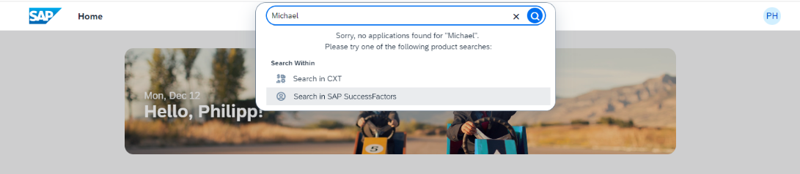

<!-- loiodc14c90bb0a24d10adaa0086b5679527 -->

# Defining a Search App in the CDM

A search app is a special business app that can be provided via CDM.


To search for specific resources within a product, for example a person or a cost center, the products can be registered as external search applications in the CDM. A product that is registered as an external search application will appear in a separate section of the search results. Instead of searching on the exposed CDM Content \(such as apps\), the search term is passed to the defined search app via a deep link.




## Define a business app as a search app

```
{
  "_version": "3.2.0",
  "identification": {
    "id": "sap.lob.search.app",
    "entityType": "businessapp",
    "title": "{{title}}"
  },
  "texts": [
    {
      "locale": "",
      "textDictionary": {
        "title": "Search App in Default Locale"
      }
    },
    {
      "locale": "en",
      "textDictionary": {
        "title": "Search in SAP SuccessFactors"
      }
    },
    {
      "locale": "de",
      "textDictionary": {
        "title": "In SAP SuccessFactors suchen"
      }
    }
  ],
  "payload": {
    "targetAppConfig": {
      "sap.app": {
        "crossNavigation": {
          "inbounds": {
            "search": {
              "semanticObject": "Product",
              "action": "search",
              "signature": {
                "parameters": {
                  "searchTerm": {
                    "required": false
                  }
                },
                "additionalParameters": "allowed"
              }
            }
          }
        },
        "tags": {
          "keywords": [],
          "technicalAttributes": ["APPTYPE_SEARCHAPP"]
        }
      },
      "sap.integration": {
        "urlTemplateId": "sap.lob.search.urltemplate"
      },
      "sap.ui": {
        "icons": {
          "icon": "sap-icon://employee"
        }
      }
    }
  }
}
```


<table>
<tr>
<th valign="top">

Property

</th>
<th valign="top">

Description

</th>
</tr>
<tr>
<td valign="top">

`identification/title`

</td>
<td valign="top">

The localized title that will appear in the search result.

</td>
</tr>
<tr>
<td valign="top">

`signature/parameters/searchTerm`

</td>
<td valign="top">

A mandatory property that will hold the reference to the search term the user provided.

</td>
</tr>
<tr>
<td valign="top">

`sap.app/tags/technicalAttributes`

</td>
<td valign="top">

Via the technical attribute `APPTYPE_SEARCHAPP`, a business application is defined as a search app.

</td>
</tr>
<tr>
<td valign="top">

`sap.ui/icons/icon`

</td>
<td valign="top">

Defines the icon that is displayed in the search results. Can be any value of the [SAP Icon font](https://sapui5.hana.ondemand.com/test-resources/sap/m/demokit/iconExplorer/webapp/index.html#/overview/SAP-icons). If no icon is provided, a default is taken.

</td>
</tr>
</table>


## Define a URL Template

```
{
  "_version": "3.2.0",
  "identification": {
    "id": "sap.lob.search.urltemplate",
    "entityType": "urltemplate"
  },
  "payload": {
    "urlTemplate": "{+_baseUrl}{+path}{?q}",
    "parameters": {
      "mergeWith": "/urlTemplates/urltemplate.base/payload/parameters/names",
      "names": {
        "path": "{./sap.integration/urlTemplateParams/path}",
        "q": "{or searchTerm, ''}"
      }
    },
    "capabilities": {
      "navigationMode": "standalone"
    }
  }
}
```


<table>
<tr>
<th valign="top">

Property

</th>
<th valign="top">

Description

</th>
</tr>
<tr>
<td valign="top">

`urlTemplate`

</td>
<td valign="top">

Defines a URL template string with a placeholder and operators that are expanded into a launchable URL that launches the search application.

</td>
</tr>
<tr>
<td valign="top">

`parameters/names/q`

</td>
<td valign="top">

Is a parameter that is used as placeholder in the `urlTemplate` string. When the URL is expanded during navigation, the `searchTerm` holds the reference to the search term the user has entered. If the search term is not present, an empty string is used instead. The name of the parameter can differ according to the desired URL.

</td>
</tr>
</table>


## Define a role

Defines which role needs to be assigned to a business user to access the search application. Usually the search application is available to every user and may be included in a general role.

```
{
  "_version": "3.2.0",
  "identification": {
    "id": "sap.lob.everyone",
    "title": "Everyone Role",
    "entityType": "role"
  },
  "payload": {
    "apps": [
      {
        "id": "sap.lob.search.app"
      }
    ]
  }
}
```

