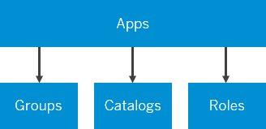
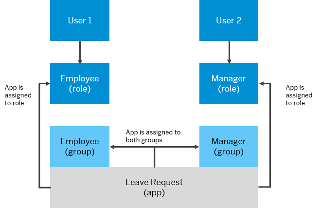
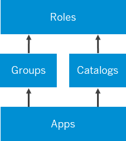
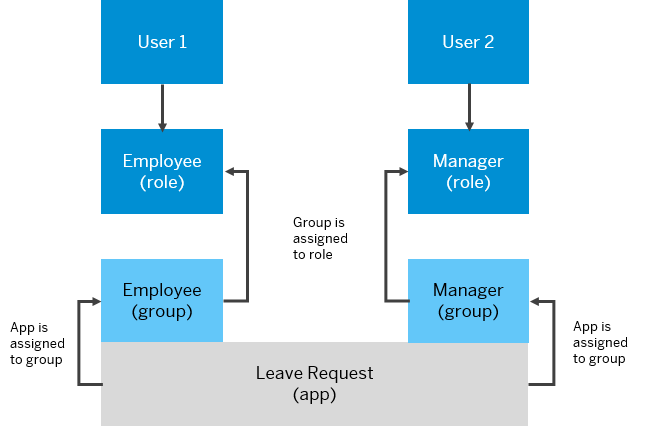

<!-- loio215517e6d4f44c96b790bbcb56d63572 -->

# Defining Optional Relations Between Roles and Groups/Catalogs

You can determine whether to expose your content to include or exclude groups and catalogs that have been directly assigned to roles when it's relevant and required by the content provider.

## Background

Each remote content provider exposes its content in a format that is suitable for rendering in the site. The integration of the exposed content is done at the role level. All content items related to these roles, including apps, groups, and catalogs, are also integrated and are all visible at runtime. This is the default behavior.

In some content providers, the relationship of groups and catalogs to roles is optional, while in other content providers \(for example SAP S/4HANA on premise and cloud\), this relationship is mandatory for building content.

Using the *Include group and catalog assignments to role* toggle switch when creating a content provider, and depending on how the provider's content is modeled, you can determine which scenario is relevant for your content:

-   Disable this feature to include all groups and catalogs in this site, without considering their assignment to roles.

-   Enable this feature to include only groups and catalogs in this site, that have been directly assigned to roles.

> ### Note:  
> This feature is relevant for groups and catalogs only. It has no affect on spaces and pages.

<a name="loio215517e6d4f44c96b790bbcb56d63572__section_zdr_gpj_ctb"/>

## What are the implications of using the toggle switch?

Using the *Include group and catalog assignments to role* toggle switch, you can select the scenario that is relevant for your content provider:

### Disabled Mode

If disabled \(default behavior\), the content from the selected provider supports the following relations \(assignments\):

-   Apps are assigned to groups.

-   Apps are assigned to catalogs.

-   Apps are assigned to roles.

In this case, the site displays all the groups and catalogs that the apps are assigned to. Users will see their apps in all groups that the app is assigned to.

You can see it more clearly in this example where the toggle switch, *Include group and catalog assignments to role*, is disabled. This scenario is relevant for content providers that don't support groups and catalog assignments to roles - for example, SAP Enterprise Portal.

**What will the user see at runtime?**

Both User 1 and User 2 will see the Employee and the Manager groups each displaying the Leave Request app. This is because the Leave Request app that is assigned to their roles, is also assigned to both groups that the app is assigned to.

### Enabled Mode

If enabled, the content from the selected provider supports the following relations \(assignments\):

-   Apps are assigned to groups and catalogs.

-   Groups are assigned to roles.

-   Catalogs are assigned to roles

In this case, the site displays **only** groups and catalogs that the user's role is assigned to. Therefore, users will see their apps only in the groups and catalogs that are assigned to their role, and will not see those groups that aren't relevant to them.

You can see it more clearly in this example where the toggle switch, *Include group and catalog assignments to role*, is enabled. This scenario is relevant for content providers that support groups and catalog assignments to roles - for example, SAP S/4HANA on premise and cloud.

**What will the user's see in their runtime site?**

User 1 sees only the Employee group with the Leave Requestapp and User 2 sees only the Manager group with the Leave Request app. This is because users only see groups that are assigned to the role that they are also assigned to. Neither User 1 orUser 2 will see groups that are not assigned to their role.

