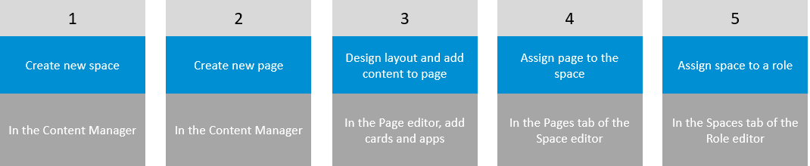
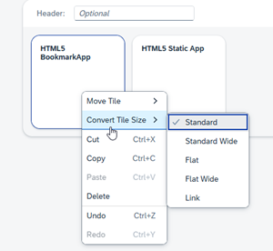

<!-- loio4360b21400e0423ab958bd1a867ab450 -->

<link rel="stylesheet" type="text/css" href="css/sap-icons.css"/>

# Design a Space and Page

In this topic we explain how to design a page using the Page editor and how to create a space.

<a name="loio4360b21400e0423ab958bd1a867ab450__section_isr_bxt_vxb"/>

## The overall process

In this flow we are manually creating spaces and pages in their dedicated editors. These are referred to as local spaces and pages. Typically, you would create a space first \(or select an existing space\) and then assign one or more pages to the space. Last you would need to assign the space to a role so that users with this role can access the spaces and the pages assigned to them.

<a name="loio4360b21400e0423ab958bd1a867ab450__section_vhh_krh_vfc"/>

## How to create a space and assign pages to it

1.  In the *Content Manager*, click *Create* and select *Space*.

2.  Enter a title.

3.  In the *Pages* tab, use the toggle buttons in the *Assignment Status* column to assign one or more pages to this space.

4.  Click *Save*.

For more information about how to assign a space to your role, see [Assign Content to a Role](assign-content-to-a-role-baeaf6e.md).

<a name="loio4360b21400e0423ab958bd1a867ab450__section_jdz_jph_vfc"/>

## How to create and design your pages

You use the Page editor to create and design your pages.

1.  From the side navigation panel of your Site Manager, click :package: to open the Content Manager.
2.  Either create a new page or use an existing one.

    -   To create a new page, click *Create* and then select the *Page* option. This opens the page editor with the *Design* tab in focus and you can start adding content.
    -   To use an existing page, use the filter in the header section of the screen and select *Pages*. Select the page you want to use and then click *Edit* to open the page editor with the *Design* tab in focus.

3.  Enter a title.

4.  Click *Add Section*.

    > ### Note:  
    > You can keep adding sections using the :heavy_plus_sign: icon under each section. You can also remove a section.

5.  Add an optional section header. You can decide later if you want to show or hide the header.

6.  Add columns on either side of the section by using the :heavy_plus_sign:icon. You can add up to four columns.

7.  Add content as follows:

    In a section or column, click *Add Widget* to open the content finder that contains the following content:

    -   *Tiles* - on this screen you'll see apps represented by tiles. Click *Add* to add the app tiles. Multiple apps will display side by side in the column.

        If you want to add apps from a specific catalog, simply select the catalog. This filters the results and displays only the apps in the catalog you selected.

        > ### Note:  
        > Once you've added your apps to a page, you can right -click on an app tile to use the context menu. From the context menu, you can move tiles to the left or right, change the size of a tile, as well as other common actions.
        > 
        > 

    -   *Cards* - on this screen you'll see the cards that are a visual representation of apps displayed in a more flexible layout. Click a card to add it automatically. You can only add one card at a time.

    > ### Note:  
    > As an administrator, you will see all the app tiles and cards in the subaccount. End users will only see the apps and cards that are assigned to their role.

