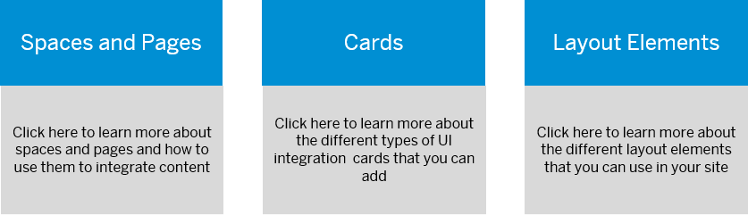

<!-- loiof24e5e4b66cf40d980bd592b1f634627 -->

# Design Your Site With the New Experience

Learn about how to work with spaces and pages using the *Spaces and Pages - New Experience* view mode.

> ### Note:  
> To design your site with spaces and pages, make sure you’ve selected *Spaces and Pages - New Experience* view mode for your site in the *Site Settings* screen.

<a name="loiof24e5e4b66cf40d980bd592b1f634627__section_bff_x4w_4gc"/>

## What's the advantage of using Spaces and Pages - New Experience view mode?

-   You can create custom spaces and pages. These are referred to as local spaces and pages and can be used across your sites in the same subaccount.

-   You can add cards to your site.

-   Use the grid-based flexible layout elements that are made up of sections and columns to organize and display your content.

## More information

