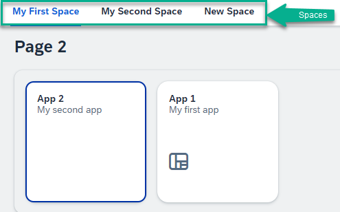
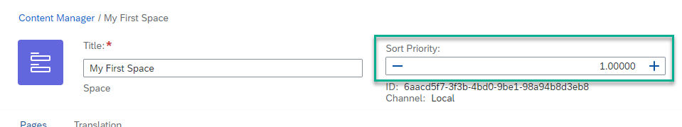

<!-- loiof5347493272f4e5a9fece772ccc8c786 -->

# Determining Sort Order of Spaces and Pages

You can change how your spaces and pages are sorted in your site.

<a name="loiof5347493272f4e5a9fece772ccc8c786__section_ufm_mdm_zbc"/>

## Spaces

Spaces are sorted according to the following logic in the navigation menu of the site as follows:

-   **Content channel**

    Spaces from the same content channel appear next to each other in the menu:

    -   Local spaces are displayed first.

    -   This is followed by **all** spaces that originate from a content channel \(content providers or content packages\). The content channels appear next to each other and are sorted by their ID.

-   **Sort priority**

    Spaces from the **same** content channel are sorted according to their sort priority from low to high. The sort range is from -999.99999 to 999.99999.

    Sort priorities are either defined in the content channel or for local spaces, using the*Sort Priority* value located at the top of the Space editor \(as in the screenshot below\).

    

    > ### Note:  
    > When no sort priority is defined, the default value is set to zero.

-   **Title**

    If the content channel and sort priority are the same, then the spaces are sorted according to title.

-   **ID**

    If the content channel, sort priority, and title are the same, then the spaces are sorted according to the space ID.

<a name="loiof5347493272f4e5a9fece772ccc8c786__section_t3y_cwk_zbc"/>

## Pages

**Pages that originate from a content channel \(federated pages\)** 

These pages are sorted according to how they are sorted in the content channel as follows:

-   For content packages, the sort order is defined by the developer in the `manifest.json` file.

-   For content providers, the sort order is defined in the provider.

**Pages withing federated spaces are sorted as follows:**

-   For content packages, pages are sorted according to their order in the ZIP file.

-   For content providers, pages are sorted according to their order in the source system.

**Pages that are locally created in the Content Manager**

These pages are sorted by ID.

