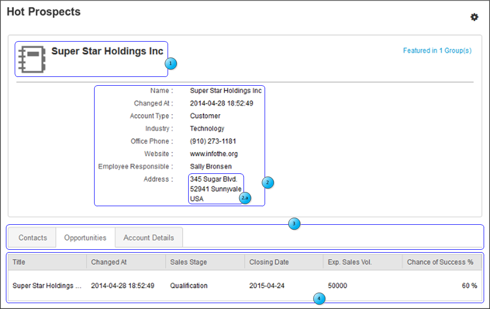
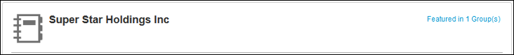
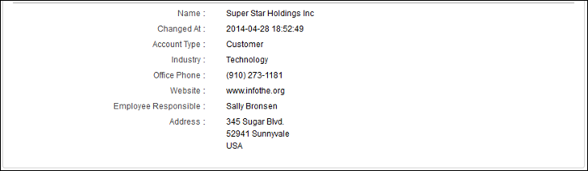
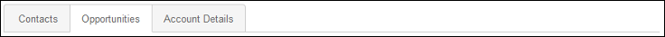
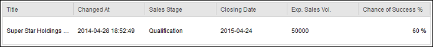
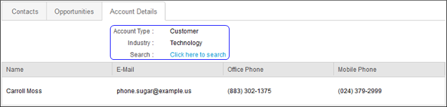

<!-- loio2332e84e2b5e4d34b0c52b22522db5b6 -->

# Develop an OData annotations file to display business records

The majority of the configuration procedures that you have performed so far have been to establish data communications that either allow SAP Build Work Zone, advanced edition to access an external business solution's OData APIs or that allow SAP Build Work Zone, advanced edition to communicate changes that have been made to that data back to the external business solution.

The data that is exchanged between these services is mostly short strings of text or numbers accessed from an XML or JSON file passed back and forth across your organization's network. To make this data presentable for human consumption, it is mapped into graphical objects using an OData Annotations file, which is organized in accordance with the layout of the graphical user interface \(GUI\) objects from SAP Build Work Zone, advanced edition, with indications of what type of data should populate each segment of the GUI.


## SAP Build Work Zone, advanced edition GUI objects that display business records

There are three basic types of GUI objects developed to display Business Records in SAP Build Work Zone, advanced edition menu *Tools* \> *Business Records*:

-   Business Record List View: Displays a table with a list of business records.
-   Business Record Details View: Displays a specific business record. Appears as a top-level navigation for workspaces which are associated directly with an External Object. The details can also be viewed when clicking on a business record in the List View.
-   The QuickView Control: Displays the details in a pop-up window when the user hovers their mouse over the object. This control can be active in a feed, in the external object browser, or when browsing through an object's relationships. The QuickView also includes several action buttons.

    The *Create Workspace* button enables the user to create a new workspace with the given object as its Primary Object. The *Feature in* button enables the user to associate an external object with an existing workspace, so that users can build up workspaces that reference many different external objects.

    The fields in the QuickView correspond to the "UI.Identification" annotation term. Each Record object in the UI.Identification collection corresponds to a row in the QuickView details. The values of the properties are bound to the OData properties of the object through the "Path" attribute.


## About Annotations

An EDMX file is an Entity Data Model XML file, which is made up of a conceptual model, a storage model, and the mapping between these models. An EDMX file also contains information that can be used to render a model graphically. An OData Annotations file leverages this technology to map data from a specified OData API to a layout of that data that can be easily consumed by a user interface \(UI\) component.

Using the annotations file, it is possible to map data from external applications for the graphical display of that data in a page in a workspace. For more information on OData Vocabularies, which is the basis of OData Annotations, see [http://www.odata.org/vocabularies/](http://www.odata.org/vocabularies/).

An annotations file consists of an EDMX wrapper around an OData Annotations core. The EDMX wrapper describes, and links to, the XML NameSpaces that are used in the mapping. An example of the EDMX parts of an Annotations file, along with the initial top-level Annotations tag, is shown in the following example.

```xml

<?xml version="1.0" encoding="utf-8"?>
<edmx:Edmx Version="4.0" xmlns:edmx="http://docs.oasis-open.org/odata/ns/edmx">
    <edmx:Reference>
        <edmx:Include Alias="UI" Namespace="com.sap.vocabularies.UI.v1"/>
    </edmx:Reference>
    <edmx:Reference>
        <edmx:Include Alias="Communication" Namespace="com.sap.vocabularies.Communication.v1"/>
    </edmx:Reference>
    <edmx:Reference Uri="http://docs.oasis-open.org/odata/odata/v4.0/cs01/vocabularies/Org.OData.Measures.V1.xml">
        <edmx:Include Alias="Measures" Namespace="Org.OData.Measures.V1"/>
    </edmx:Reference>
    <edmx:Reference>
        <edmx:Include Alias="SugarCRM" Namespace="com.sap.jam.samples.sugarcrm"/>
    </edmx:Reference>
    <edmx:DataServices>
        <Schema Alias="SugarAnnotation" Namespace="com.sap.jam.sugarcrm.Annotation"
                xmlns="http://docs.oasis-open.org/odata/ns/edm">
            <Annotations Target="SugarCRM.Opportunity/probability">
                <!-- ... -->
            </Annotations>
        </Schema>
    </edmx:DataServices>
</edmx:Edmx>
```

The core of the annotations file that is **not** shown in the preceding code snippet is the subject of this section.


## Annotations Markup Overview

Some examples of the significant structures of an Annotations file that are discussed in this section are shown in the following code snippet.

```xml

<Annotations Target="SugarCRM.Contact">
    <Annotation Term="UI.HeaderInfo">
        <Record>
            <PropertyValue Property="TypeName" String="Contact"/>
            <PropertyValue Property="ImageUrl" String="/images/exobj/account/account_grey_48.png"/>
            <PropertyValue Property="Title">
                <Record>
                    <PropertyValue Property="Value" Path="name"/>
                </Record>
            </PropertyValue>
        </Record>
    </Annotation>
    <Annotation Term="UI.Identification">
        <Collection>
            <Record Type="UI.DataField">
                <PropertyValue Property="Label" String="Name"/>
                <PropertyValue Property="Value" Path="full_name"/>
            </Record>
            <Record Type="UI.DataField">
                <PropertyValue Property="Label" String="Title"/>
                <PropertyValue Property="Value" Path="title"/>
            </Record>
            <Record Type="UI.DataField">
                <PropertyValue Property="Label" String="E-Mail"/>
                <PropertyValue Property="Value" Path="email1"/>
            </Record>
            <Record Type="UI.DataField">
                <PropertyValue Property="Label" String="Office Phone"/>
                <PropertyValue Property="Value" Path="phone_work"/>
            </Record>
            <Record Type="UI.DataField">
                <PropertyValue Property="Label" String="Mobile Phone"/>
                <PropertyValue Property="Value" Path="phone_mobile"/>
            </Record>
        </Collection>
    </Annotation>
    <Annotation Term="UI.LineItem">
        <Collection>
            <Record Type="UI.DataField">
                <PropertyValue Property="Label" String="Name"/>
                <PropertyValue Property="Value" Path="full_name"/>
            </Record>
            <Record Type="UI.DataField">
                <PropertyValue Property="Label" String="E-Mail"/>
                <PropertyValue Property="Value" Path="email1"/>
            </Record>
            <Record Type="UI.DataField">
                <PropertyValue Property="Label" String="Office Phone"/>
                <PropertyValue Property="Value" Path="phone_work"/>
            </Record>
            <Record Type="UI.DataField">
                <PropertyValue Property="Label" String="Mobile Phone"/>
                <PropertyValue Property="Value" Path="phone_mobile"/>
            </Record>
        </Collection>
    </Annotation>
</Annotations>
```


<a name="loio2332e84e2b5e4d34b0c52b22522db5b6__elements"/>

## Annotation Elements


<a name="loio2332e84e2b5e4d34b0c52b22522db5b6__annotations"/>

## Annotations

**Description**: Describes the data mapping for an External Object.

-   **Parent Element**:


    <table>
    <tr>
    <th valign="top">

    Element


    
    </th>
    <th valign="top">

    Description


    
    </th>
    </tr>
    <tr>
    <td valign="top">
    
    **Schema**


    
    </td>
    <td valign="top">
    
    For more information, see [odata-csdl-schemas](https://oasis-tcs.github.io/odata-csdl-schemas/).


    
    </td>
    </tr>
    </table>
    
-   **Attributes**:


    <table>
    <tr>
    <th valign="top">

    Attribute


    
    </th>
    <th valign="top">

    Use


    
    </th>
    <th valign="top">

    Description


    
    </th>
    </tr>
    <tr>
    <td valign="top">
    
    **Target**


    
    </td>
    <td valign="top">
    
    Mandatory


    
    </td>
    <td valign="top">
    
    A reference to an EntityType in the external solution's OData API $metadata.


    
    </td>
    </tr>
    </table>
    
-   **Child Elements**:


    <table>
    <tr>
    <th valign="top">

    Element


    
    </th>
    <th valign="top">

    Description


    
    </th>
    </tr>
    <tr>
    <td valign="top">
    
    **[Annotation](develop-an-odata-annotations-file-to-display-business-records-2332e84.md#loio2332e84e2b5e4d34b0c52b22522db5b6__annotation)**


    
    </td>
    <td valign="top">
    
    Describes a section of an External Object.


    
    </td>
    </tr>
    </table>
    
-   **Example**: A generalized Annotations element

    ```xml
    
    <Schema ...>
        <Annotations Target="[SomeBusinessRecordIdentifier].[EntityName]">
            <Annotation ...>
            </Annotation>
        </Annotations>
    </Schema>
    ```


<a name="loio2332e84e2b5e4d34b0c52b22522db5b6__annotation"/>

## Annotation

**Description**: Describes a the data mapping of a section of an External Object.

-   **Parent Element**:


    <table>
    <tr>
    <th valign="top">

    Element


    
    </th>
    <th valign="top">

    Description


    
    </th>
    </tr>
    <tr>
    <td valign="top">
    
    **[Annotations](develop-an-odata-annotations-file-to-display-business-records-2332e84.md#loio2332e84e2b5e4d34b0c52b22522db5b6__annotations)**


    
    </td>
    <td valign="top">
    
    Describes the data mapping for an External Object.


    
    </td>
    </tr>
    </table>
    
-   **Attributes**:


    <table>
    <tr>
    <th valign="top">

    Attribute


    
    </th>
    <th valign="top">

    Use


    
    </th>
    <th valign="top">

    Description


    
    </th>
    </tr>
    <tr>
    <td valign="top">
    
    **[Term](develop-an-odata-annotations-file-to-display-business-records-2332e84.md#loio2332e84e2b5e4d34b0c52b22522db5b6__terms)**


    
    </td>
    <td valign="top">
    
    Mandatory


    
    </td>
    <td valign="top">
    
    Can be one of:

    -   [UI.HeaderInfo](develop-an-odata-annotations-file-to-display-business-records-2332e84.md#loio2332e84e2b5e4d34b0c52b22522db5b6__headerinfo) is the title banner for the External Object.
    -   [UI.Identification](develop-an-odata-annotations-file-to-display-business-records-2332e84.md#loio2332e84e2b5e4d34b0c52b22522db5b6__identification) contains the identifying details for the External Object.
    -   [Communication.Address](develop-an-odata-annotations-file-to-display-business-records-2332e84.md#loio2332e84e2b5e4d34b0c52b22522db5b6__communicationAddress) presents a mailing address block for use in other UI segments.
    -   [UI.Facets](develop-an-odata-annotations-file-to-display-business-records-2332e84.md) defines a set of tabs in the ExternalObject "details" view.
    -   [UI.LineItem](develop-an-odata-annotations-file-to-display-business-records-2332e84.md#loio2332e84e2b5e4d34b0c52b22522db5b6__lineitem) defines a row in a table of items.
    -   [UI.FieldGroup](develop-an-odata-annotations-file-to-display-business-records-2332e84.md#loio2332e84e2b5e4d34b0c52b22522db5b6__fieldgroup) enables the display of a set of fields in a facet that are not in tabular form.
    -   [Core.Description](develop-an-odata-annotations-file-to-display-business-records-2332e84.md#loio2332e84e2b5e4d34b0c52b22522db5b6__coredesc)
    -   [UI.IsImageURL](develop-an-odata-annotations-file-to-display-business-records-2332e84.md#loio2332e84e2b5e4d34b0c52b22522db5b6__isimageurl)


    
    </td>
    </tr>
    <tr>
    <td valign="top">
    
    **Qualifier**


    
    </td>
    <td valign="top">
    
    Optional


    
    </td>
    <td valign="top">
    
    Qualifies the Term value to use a limited or alternate arrangement of that section of the External Object.


    
    </td>
    </tr>
    </table>
    
-   **Child Elements**:


    <table>
    <tr>
    <th valign="top">

    Element


    
    </th>
    <th valign="top">

    Description


    
    </th>
    </tr>
    <tr>
    <td valign="top">
    
    **[Collection](develop-an-odata-annotations-file-to-display-business-records-2332e84.md#loio2332e84e2b5e4d34b0c52b22522db5b6__collection)**


    
    </td>
    <td valign="top">
    
    A container of multiple records. An *Annotation* can contain a *Record* or a *Collection* of *Record*s.


    
    </td>
    </tr>
    <tr>
    <td valign="top">
    
    **[Record](develop-an-odata-annotations-file-to-display-business-records-2332e84.md#loio2332e84e2b5e4d34b0c52b22522db5b6__record)**


    
    </td>
    <td valign="top">
    
    A set of related data elements described in PropertyValue elements. An *Annotation* can contain either a *Collection* or a *Record*, but not both.


    
    </td>
    </tr>
    </table>
    
-   **Example 1**: An Annotation element, showing a Term attribute

    ```xml
    
    <Annotations ...>
        <Annotation Term="UI.HeaderInfo">
            <Record ...>
            </Record>
        </Annotation>
    </Annotations>
    ```

-   **Example 2**: An Annotation element, showing both a Term and a Qualifier attribute

    ```xml
    
    <Annotations ...>
        <Annotation Term="UI.FieldGroup" Qualifier="Overview">
            <Record ...>
            </Record>
        </Annotation>
    </Annotations>
    ```


<a name="loio2332e84e2b5e4d34b0c52b22522db5b6__collection"/>

## Collection

**Description**: A container of multiple records.

-   **Parent Element**:


    <table>
    <tr>
    <th valign="top">

    Element


    
    </th>
    <th valign="top">

    Description


    
    </th>
    </tr>
    <tr>
    <td valign="top">
    
    **[Annotation](develop-an-odata-annotations-file-to-display-business-records-2332e84.md#loio2332e84e2b5e4d34b0c52b22522db5b6__annotation)**


    
    </td>
    <td valign="top">
    
    Describes the data mapping of a section of an External Object.


    
    </td>
    </tr>
    </table>
    
-   **Attributes**:


    <table>
    <tr>
    <th valign="top">

    Attribute


    
    </th>
    <th valign="top">

    Use


    
    </th>
    <th valign="top">

    Description


    
    </th>
    </tr>
    <tr>
    <td valign="top" colspan="3">
    
    None


    
    </td>
    </tr>
    </table>
    
-   **Child Elements**:


    <table>
    <tr>
    <th valign="top">

    Element


    
    </th>
    <th valign="top">

    Description


    
    </th>
    </tr>
    <tr>
    <td valign="top">
    
    **[Record](develop-an-odata-annotations-file-to-display-business-records-2332e84.md#loio2332e84e2b5e4d34b0c52b22522db5b6__record)**


    
    </td>
    <td valign="top">
    
    A set of related data elements described in child PropertyValue elements.


    
    </td>
    </tr>
    </table>
    
-   **Example**: A Collection element

    ```xml
    
    <Annotation ...>
        <Collection>
            <Record ...>
            </Record>
        </Collection>
    </Annotation>
    ```


<a name="loio2332e84e2b5e4d34b0c52b22522db5b6__record"/>

## Record

**Description**: A set of related data elements described in PropertyValue elements.

-   **Parent Element**:


    <table>
    <tr>
    <th valign="top">

    Element


    
    </th>
    <th valign="top">

    Description


    
    </th>
    </tr>
    <tr>
    <td valign="top">
    
    **[Annotation](develop-an-odata-annotations-file-to-display-business-records-2332e84.md#loio2332e84e2b5e4d34b0c52b22522db5b6__annotation)**


    
    </td>
    <td valign="top">
    
    Describes a the data mapping of a section of an External Object.


    
    </td>
    </tr>
    <tr>
    <td valign="top">
    
    **[Collection](develop-an-odata-annotations-file-to-display-business-records-2332e84.md#loio2332e84e2b5e4d34b0c52b22522db5b6__collection)**


    
    </td>
    <td valign="top">
    
    A container of multiple records.


    
    </td>
    </tr>
    </table>
    
-   **Attributes**:


    <table>
    <tr>
    <th valign="top">

    Attribute


    
    </th>
    <th valign="top">

    Use


    
    </th>
    <th valign="top">

    Description


    
    </th>
    </tr>
    <tr>
    <td valign="top">
    
    **[Type](develop-an-odata-annotations-file-to-display-business-records-2332e84.md#loio2332e84e2b5e4d34b0c52b22522db5b6__types)**


    
    </td>
    <td valign="top">
    
    Optional


    
    </td>
    <td valign="top">
    
    Can be one of:

    -   [UI.CollectionFacet](develop-an-odata-annotations-file-to-display-business-records-2332e84.md#loio2332e84e2b5e4d34b0c52b22522db5b6__collectionfacet)
    -   [UI.DataField](develop-an-odata-annotations-file-to-display-business-records-2332e84.md#loio2332e84e2b5e4d34b0c52b22522db5b6__datafield)
    -   [UI.DataFieldForAnnotation](develop-an-odata-annotations-file-to-display-business-records-2332e84.md#loio2332e84e2b5e4d34b0c52b22522db5b6__datafieldforannotation)
    -   [UI.DataFieldWithNavigationPath](develop-an-odata-annotations-file-to-display-business-records-2332e84.md#loio2332e84e2b5e4d34b0c52b22522db5b6__datafieldwithnavigationpath)
    -   [UI.DataFieldWithUrl](develop-an-odata-annotations-file-to-display-business-records-2332e84.md#loio2332e84e2b5e4d34b0c52b22522db5b6__datafieldwithurl)
    -   [UI.ReferenceFacet](develop-an-odata-annotations-file-to-display-business-records-2332e84.md#loio2332e84e2b5e4d34b0c52b22522db5b6__referencefacet)
    -   UI.ReferenceURLFacet


    
    </td>
    </tr>
    </table>
    
-   **Child Elements**:


    <table>
    <tr>
    <th valign="top">

    Element


    
    </th>
    <th valign="top">

    Description


    
    </th>
    </tr>
    <tr>
    <td valign="top">
    
    **[PropertyValue](develop-an-odata-annotations-file-to-display-business-records-2332e84.md#loio2332e84e2b5e4d34b0c52b22522db5b6__propertyvalue)**


    
    </td>
    <td valign="top">
    
    A Property of a Record. Each Record Type has its own set of mandatory and optional PropertyValues.


    
    </td>
    </tr>
    </table>
    
-   **Example 1**: A Record element, as a child of an Annotation element, and showing a Type="UI.DataField" attibute-value pair

    ```xml
    
    <Annotation ...>
        <Record Type="UI.DataField">
            <PropertyValue ...>
            </PropertyValue>
        </Record>
    </Annotation>
    ```

-   **Example 2**: A Record element, as a child of a Collection element, and showing a Type="UI.CollectionFacet" attibute-value pair

    ```xml
    
    <Collection ...>
        <Record Type="UI.CollectionFacet">
            <PropertyValue ...>
            </PropertyValue>
        </Record>
    </Collection>
    ```


<a name="loio2332e84e2b5e4d34b0c52b22522db5b6__propertyvalue"/>

## PropertyValue

**Description**: A single piece of data, which typically can be either data from the source business application, or data related to the UI.

-   **Parent Element**:


    <table>
    <tr>
    <th valign="top">

    Element


    
    </th>
    <th valign="top">

    Description


    
    </th>
    </tr>
    <tr>
    <td valign="top">
    
    **[Record](develop-an-odata-annotations-file-to-display-business-records-2332e84.md#loio2332e84e2b5e4d34b0c52b22522db5b6__record)**


    
    </td>
    <td valign="top">
    
    A set of related data elements described in child PropertyValue elements.


    
    </td>
    </tr>
    </table>
    
-   **Attributes**:


    <table>
    <tr>
    <th valign="top">

    Attribute


    
    </th>
    <th valign="top">

    Use


    
    </th>
    <th valign="top">

    Description


    
    </th>
    </tr>
    <tr>
    <td valign="top">
    
    **[Property](develop-an-odata-annotations-file-to-display-business-records-2332e84.md#loio2332e84e2b5e4d34b0c52b22522db5b6__properties)**


    
    </td>
    <td valign="top">
    
    Mandatory


    
    </td>
    <td valign="top">
    
    Can be one of:

    -   [ImageUrl](develop-an-odata-annotations-file-to-display-business-records-2332e84.md#loio2332e84e2b5e4d34b0c52b22522db5b6__imageurl)
    -   [Label](develop-an-odata-annotations-file-to-display-business-records-2332e84.md#loio2332e84e2b5e4d34b0c52b22522db5b6__label)
    -   [Target](develop-an-odata-annotations-file-to-display-business-records-2332e84.md#loio2332e84e2b5e4d34b0c52b22522db5b6__target)
    -   [Title](develop-an-odata-annotations-file-to-display-business-records-2332e84.md#loio2332e84e2b5e4d34b0c52b22522db5b6__title)
    -   [TypeName](develop-an-odata-annotations-file-to-display-business-records-2332e84.md#loio2332e84e2b5e4d34b0c52b22522db5b6__typename)
    -   [TypeNamePlural](develop-an-odata-annotations-file-to-display-business-records-2332e84.md#loio2332e84e2b5e4d34b0c52b22522db5b6__typenameplural)
    -   [Value](develop-an-odata-annotations-file-to-display-business-records-2332e84.md#loio2332e84e2b5e4d34b0c52b22522db5b6__value)


    
    </td>
    </tr>
    <tr>
    <td valign="top">
    
    **String**


    
    </td>
    <td valign="top">
    
    Optional


    
    </td>
    <td valign="top">
    
    An alpha-numeric text string. Typically either a UI label string or the URL to a resource such as an image.


    
    </td>
    </tr>
    <tr>
    <td valign="top">
    
    **Path**


    
    </td>
    <td valign="top">
    
    Optional


    
    </td>
    <td valign="top">
    
    An alpha-numeric text string.


    
    </td>
    </tr>
    <tr>
    <td valign="top">
    
    **AnnotationPath**


    
    </td>
    <td valign="top">
    
    Optional


    
    </td>
    <td valign="top">
    
    An alpha-numeric text string.


    
    </td>
    </tr>
    <tr>
    <td valign="top">
    
    **NavigationPropertyPath**


    
    </td>
    <td valign="top">
    
    Optional


    
    </td>
    <td valign="top">
    
    An alpha-numeric text string.


    
    </td>
    </tr>
    </table>
    
-   **Child Elements**:


    <table>
    <tr>
    <th valign="top">

    Element


    
    </th>
    <th valign="top">

    Description


    
    </th>
    </tr>
    <tr>
    <td valign="top">
    
    **[Annotation](develop-an-odata-annotations-file-to-display-business-records-2332e84.md#loio2332e84e2b5e4d34b0c52b22522db5b6__annotation)**


    
    </td>
    <td valign="top">
    
    Describes a section of an External Object.


    
    </td>
    </tr>
    <tr>
    <td valign="top">
    
    **[Apply](develop-an-odata-annotations-file-to-display-business-records-2332e84.md#loio2332e84e2b5e4d34b0c52b22522db5b6__apply)**


    
    </td>
    <td valign="top">
    
    Defines an action.


    
    </td>
    </tr>
    <tr>
    <td valign="top">
    
    **[Collection](develop-an-odata-annotations-file-to-display-business-records-2332e84.md#loio2332e84e2b5e4d34b0c52b22522db5b6__collection)**


    
    </td>
    <td valign="top">
    
    A container of multiple records.


    
    </td>
    </tr>
    <tr>
    <td valign="top">
    
    **[Record](develop-an-odata-annotations-file-to-display-business-records-2332e84.md#loio2332e84e2b5e4d34b0c52b22522db5b6__record)**


    
    </td>
    <td valign="top">
    
    A set of related data elements described in PropertyValue elements.


    
    </td>
    </tr>
    </table>
    
-   **Example 1**: A pair of PropertyValue elements with no child elements

    ```xml
    
    <Record Type="UI.DataField">
        <PropertyValue Property="Label" String="Supplier ID" />
        <PropertyValue Property="Value" Path="SupplierID" />
    </Record>
    ```

-   **Example 2**: A PropertyValue element wrapping an Annotation element

    ```xml
    
    <Record ...>
        <PropertyValue Path="@UI.HeaderInfo/ImageUrl" Property="Value">
            <Annotation Term="UI.IsImageURL"/>
        </PropertyValue>
    </Record>
    ```

-   **Example 3**: A PropertyValue element wrapping an Apply element

    ```xml
    
    <Record ...>
        <PropertyValue Property="Value">
            <Apply Function="odata.concat">
                <Path>ContactTitle</Path>
                <String> - </String>
                <Path>ContactName</Path>
            </Apply>
        </PropertyValue>
    </Record>
    ```

-   **Example 4**: A PropertyValue element, wrapping a Collection element

    ```xml
    
    <Record ...>
        <PropertyValue Property="Data">
            <Collection>
                <Record ...>
                    <!-- ... -->
                </Record>
            </Collection>
        </PropertyValue>
    </Record>
    ```

-   **Example 5**: A PropertyValue element, wrapping a Record element

    ```xml
    
    <Record ...>
        <PropertyValue Property="Data">
            <Record ...>
                    <!-- ... -->
            </Record>
        </PropertyValue>
    </Record>
    ```


<a name="loio2332e84e2b5e4d34b0c52b22522db5b6__apply"/>

## Apply

**Description**: Defines an action to be performed on specified pieces of data.

-   **Parent Element**:


    <table>
    <tr>
    <th valign="top">

    Element


    
    </th>
    <th valign="top">

    Description


    
    </th>
    </tr>
    <tr>
    <td valign="top">
    
    **[PropertyValue](develop-an-odata-annotations-file-to-display-business-records-2332e84.md#loio2332e84e2b5e4d34b0c52b22522db5b6__propertyvalue)**


    
    </td>
    <td valign="top">
    
    A single piece of data, which typically can be either data from the source business application, or data related to the UI.


    
    </td>
    </tr>
    </table>
    
-   **Attributes**:


    <table>
    <tr>
    <th valign="top">

    Attribute


    
    </th>
    <th valign="top">

    Use


    
    </th>
    <th valign="top">

    Description


    
    </th>
    </tr>
    <tr>
    <td valign="top">
    
    **Function**


    
    </td>
    <td valign="top">
    
    Mandatory


    
    </td>
    <td valign="top">
    
    Valid value is "odata.concat", which concatenates the data indicated in the child Path elements and/or text indicated in the child String elements.


    
    </td>
    </tr>
    </table>
    
-   **Child Elements**:


    <table>
    <tr>
    <th valign="top">

    Element


    
    </th>
    <th valign="top">

    Description


    
    </th>
    </tr>
    <tr>
    <td valign="top">
    
    **Path**


    
    </td>
    <td valign="top">
    
    The URL for the piece of data to be used.


    
    </td>
    </tr>
    <tr>
    <td valign="top">
    
    **String**


    
    </td>
    <td valign="top">
    
    The alphanumeric text string that is to be concatenated with the other listed pieces of data and/or strings.


    
    </td>
    </tr>
    </table>
    
-   **Example 1**: An Apply element, showing a concatenation of a ContactTitle and a ContactName

    ```xml
    
    <Record ...>
        <PropertyValue Property="Value">
            <Apply Function="odata.concat">
                <Path>ContactTitle</Path>
                <String> - </String>
                <Path>ContactName</Path>
            </Apply>
        </PropertyValue>
    </Record>
    ```

-   **Example 2**: An Apply element, showing a concatenation of an employee's FirstName and LastName

    ```xml
    
    <Record ...>
        <PropertyValue Property="Value">
            <Apply Function="odata.concat">
                <Path>Employee/FirstName</Path>
                <String> </String>
                <Path>Employee/LastName</Path>
            </Apply>
        </PropertyValue>
    </Record>
    ```


> ### Note:  
> The only Annotation elements not documented in this section are the <Path\> and <String\> elements that can be seen in the code snippets above. Their use should be clear from these examples.


<a name="loio2332e84e2b5e4d34b0c52b22522db5b6__terms"/>

## Term attribute values

**Description**: *Term* is an attribute of the *Annotation* element. The various values of the *Term* attribute define sections of the External Object. Each of the values of *Term* element are described in this section.

For example, in the following screen capture, there are four different *Annotation* element *Term* attribute values demonstrated:



1.  **UI.HeaderInfo** is the title banner for the External Object.
2.  **UI.Identification** contains the identifying details for the External Object.
    1.  **Communication.Address** presents a mailing address block for use in other UI segments.

3.  **UI.Facets** defines a set of tabs.
4.  **UI.LineItem** defines a row in a table of items.

The code examples for these four sections are as follows:

1.  **UI.HeaderInfo** is the title banner for the External Object. 

    The UI.HeaderInfo Annotation Term in this example consists of three PropertyValue Property attributes with the following attribute-values:

    -   TypeName: the label to use for the object type.
    -   TypeNamePlural: the label to use for the plural of the object type.
    -   ImageUrl: the URL to the icon representing the object type.
    -   Title: the mapping between the object title field and the external OData source. Note that the HeaderInfo Title is mapped to the "name" property of the OData Account resource.

    ```xml
    
    <Annotations Target="SugarCRM.Opportunity">
        <Annotation Term="UI.HeaderInfo">
            <Record>
                <PropertyValue Property="TypeName" String="Opportunity" />
                <PropertyValue Property="TypeNamePlural" String="Opportunities" />
                <PropertyValue Property="ImageUrl" String="/images/exobj/opportunity/opportunity_grey_48.png" />
                <PropertyValue Property="Title">
                    <Record>
                        <PropertyValue Property="Value" Path="name" />
                    </Record>
                </PropertyValue>
            </Record>
        </Annotation>
    ```

2.  **UI.Identification** contains the identifying details for the External Object. 

    1.  **Communication.Address**, which is included in UI.Identification in the following example, presents a mailing address block for use in other UI segments.

    ```xml
    
    <Annotation Term="Communication.Address">
        <Record>
            <PropertyValue Property="street" Path="billing_address_street"/>
            <PropertyValue Property="locality" Path="billing_address_city"/>
            <PropertyValue Property="postalCode" Path="billing_address_postalcode"/>
            <PropertyValue Property="country" Path="billing_address_country"/>
        </Record>
    </Annotation>
    
    <Annotation Term="UI.Identification">
        <Collection>
            <Record Type="UI.DataField">
                <PropertyValue Property="Label" String="Name" />
                <PropertyValue Property="Value" Path="name" />
            </Record>
            <Record Type="UI.DataField">
                <PropertyValue Property="Label" String="Changed At" />
                <PropertyValue Property="Value" Path="date_modified" />
            </Record>
            <Record Type="UI.DataField">
                <PropertyValue Property="Label" String="Account Type" />
                <PropertyValue Property="Value" Path="account_type" />
            </Record>
            <Record Type="UI.DataField">
                <PropertyValue Property="Label" String="Industry" />
                <PropertyValue Property="Value" Path="industry" />
            </Record>
            <Record Type="UI.DataField">
                <PropertyValue Property="Label" String="Office Phone" />
                <PropertyValue Property="Value" Path="phone_office" />
            </Record>
            <Record Type="UI.DataField">
                <PropertyValue Property="Label" String="Website" />
                <PropertyValue Property="Value" Path="website" />
            </Record>
            <Record Type="UI.DataField">
                <PropertyValue Property="Label" String="Employee Responsible" />
                <PropertyValue Property="Value" Path="assigned_user_name" />
            </Record>
            <Record Type="UI.DataFieldForAnnotation">
                <PropertyValue Property="Label" String="Address" />
                <PropertyValue Property="Target" AnnotationPath="@Communication.Address" />
            </Record>
        </Collection>
    </Annotation>
    ```

    The UI.Identification Annotation Term of the object details appears immediately below the HeaderInfo. It is described by the "UI.Identification" annotation term.

    Each row of the Identification section should be described as a Record entry within an annotation Collection, as shown in the screen capture and the code example above. The row label and field bindings are described by the "Label" and "Value" properties in each Record.

    The "Type" attribute of the Record also defines how each field is to be rendered in the Identification section. The supported values are shown in the code example above, which shows the options of `UI.DataField` and `UI.DataFieldForAnnotation`.

3.  **UI.Facets** defines a set of tabs. 

    ```xml
    
    <Annotation Term="UI.Facets">
        <Collection>
            <Record Type="UI.ReferenceFacet">
                <PropertyValue Property="Label" String="Contacts" />
                <PropertyValue Property="Target" AnnotationPath="contacts/@UI.LineItem" />
            </Record>
            <Record Type="UI.ReferenceFacet">
                <PropertyValue Property="Label" String="Opportunities" />
                <PropertyValue Property="Target" AnnotationPath="opportunities/@UI.LineItem" />
            </Record>
            <Record Type="UI.ReferenceFacet">
                <PropertyValue Property="Label" String="Account Details" />
                <PropertyValue Property="Target" AnnotationPath="details/@UI.LineItem" />
            </Record>
        </Collection>
    </Annotation>
    ```

4.  **UI.LineItem** defines a row in a table of items. 

    ```xml
    
    <Annotation Term="UI.LineItem">
        <Collection>
            <Record Type="UI.DataField">
                <PropertyValue Property="Label" String="Title"/>
                <PropertyValue Property="Value" Path="name"/>
            </Record>
            <Record Type="UI.DataField">
                <PropertyValue Property="Label" String="Changed At"/>
                <PropertyValue Property="Value" Path="date_modified"/>
            </Record>
            <Record Type="UI.DataField">
                <PropertyValue Property="Label" String="Sales Stage"/>
                <PropertyValue Property="Value" Path="sales_stage"/>
            </Record>
            <Record Type="UI.DataField">
                <PropertyValue Property="Label" String="Closing Date"/>
                <PropertyValue Property="Value" Path="date_closed"/>
            </Record>
            <Record Type="UI.DataField">
                <PropertyValue Property="Label" String="Exp. Sales Vol."/>
                <PropertyValue Property="Value" Path="amount"/>
            </Record>
            <Record Type="UI.DataField">
                <PropertyValue Property="Label" String="Chance of Success %"/>
                <PropertyValue Property="Value" Path="probability"/>
            </Record>
        </Collection>
    </Annotation>
    ```


Other *Term* attribute value examples are:

-   **UI.FieldGroup**: enables the display of a set of fields in a facet that are not in tabular form. 

    ```xml
    
    <Annotation Term="UI.FieldGroup" Qualifier="Industry">
        <Record>
            <PropertyValue Property="Label" String="Industry Details"/>
            <PropertyValue Property="Data">
                <Collection>
                    <Record Type="UI.DataField">
                        <PropertyValue Property="Label" String="Account Type" />
                        <PropertyValue Property="Value" Path="account_type" />
                    </Record>
                    <Record Type="UI.DataField">
                        <PropertyValue Property="Label" String="Industry" />
                        <PropertyValue Property="Value" Path="industry" />
                    </Record>
                    <Record Type="UI.DataFieldWithUrl">
                        <PropertyValue Property="Label" String="Search" />
                        <PropertyValue Property="Value">
                            <Apply Name="odata.concat">
                                <String>search term: </String>
                                <Path>industry</Path>
                            </Apply>
                        </PropertyValue>
                        <PropertyValue Property="Url">
                            <Apply Name="odata.concat">
                                <String>http://www.google.com/custom?q=</String>
                                <Path>industry</Path>
                            </Apply>
                        </PropertyValue>
                    </Record>
                </Collection>
            </PropertyValue>
        </Record>
    </Annotation>
    ```

-   **Core.Description**:

    ```xml
    
    <Annotation Term="UI.LineItem">
        <Collection>
            <Record Type="UI.DataField">
                <PropertyValue Property="Value" String="/[path_to_images]/[filename].png">
                    <Annotation Term="UI.IsImageURL"/>
                </PropertyValue>
            </Record>
            <Record Type="UI.DataField">
                <PropertyValue Property="Label" String="Product ID" />
                <PropertyValue Property="Value" Path="ProductID" />
            </Record>
            <Record Type="UI.DataField">
                <PropertyValue Property="Label" String="Product" />
                <PropertyValue Property="Value" Path="ProductName">
                    <Annotation Term="Core.Description"/>
                </PropertyValue>
            </Record>
            <Record Type="UI.DataField">
                <PropertyValue Property="Label" String="Quantity / Unit" />
                <PropertyValue Property="Value" Path="QuantityPerUnit" />
            </Record>
            <Record Type="UI.DataField">
                <PropertyValue Property="Label" String="Unit Price" />
                <PropertyValue Property="Value" Path="UnitPrice" />
            </Record>
            <Record Type="UI.DataField">
                <PropertyValue Property="Label" String="Units In Stock" />
                <PropertyValue Property="Value" Path="UnitsInStock" />
            </Record>
        </Collection>
    </Annotation>
    ```

-   **UI.IsImageURL**:

    ```xml
    
    <Annotation Term="UI.LineItem">
        <Collection>
            <Record Type="UI.DataField">
                <PropertyValue Property="Value" String="/[path_to_images]/[filename].png">
                    <Annotation Term="UI.IsImageURL"/>
                </PropertyValue>
            </Record>
            <Record Type="UI.DataField">
                <PropertyValue Property="Label" String="Product ID" />
                <PropertyValue Property="Value" Path="ProductID" />
            </Record>
            <Record Type="UI.DataField">
                <PropertyValue Property="Label" String="Product" />
                <PropertyValue Property="Value" Path="ProductName">
                    <Annotation Term="Core.Description"/>
                </PropertyValue>
            </Record>
            <Record Type="UI.DataField">
                <PropertyValue Property="Label" String="Quantity / Unit" />
                <PropertyValue Property="Value" Path="QuantityPerUnit" />
            </Record>
            <Record Type="UI.DataField">
                <PropertyValue Property="Label" String="Unit Price" />
                <PropertyValue Property="Value" Path="UnitPrice" />
            </Record>
            <Record Type="UI.DataField">
                <PropertyValue Property="Label" String="Units In Stock" />
                <PropertyValue Property="Value" Path="UnitsInStock" />
            </Record>
        </Collection>
    </Annotation>
    ```


<a name="loio2332e84e2b5e4d34b0c52b22522db5b6__types"/>

## Type attribute values

**Description**: **Type** is an attribute of the **Record** element. The various values of the **Type** attribute specify the UI widget type that is used to present the data mapped in this **Record** element. Each widget type requires certain pieces of data, as is shown in the following examples.

The valid values for the **Type** attribute are:

-   **UI.CollectionFacet** 

    ```xml
    
    <Annotation Term="UI.Facets">
        <Collection>
            <Record Type="UI.CollectionFacet">
                <PropertyValue Property="Label" String="Supplier" />
                <PropertyValue Property="Facets">
                    <Collection>
                        <Record Type="UI.ReferenceFacet">
                            <PropertyValue Property="Label" String="Contacts" />
                            <PropertyValue Property="Target" AnnotationPath="Supplier/@UI.Identification" />
                        </Record>
                        <Record Type="UI.ReferenceFacet">
                            <PropertyValue Property="Label" String="Opportunities" />
                            <PropertyValue Property="Target" AnnotationPath="Supplier/@vCard.Address" />
                            <Annotation Term="UI.Map" />
                        </Record>
                    </Collection>
                </PropertyValue>
            </Record>
        </Collection>
    </Annotation>
    ```

-   **UI.DataField** 

    ```xml
    
    <Annotation Term="UI.Identification">
        <Collection>
            <Record Type="UI.DataField">
                <PropertyValue Property="Label" String="Category ID" />
                <PropertyValue Property="Value" Path="CategoryID" />
            </Record>
        </Collection>
    </Annotation>
    ```

-   **UI.DataFieldForAnnotation** 

    ```xml
    
    <Record Type="UI.DataFieldForAnnotation">
        <PropertyValue Property="Label" String="Supplier Adress" />
        <PropertyValue Property="Target" AnnotationPath="@vCard.Address" />
    </Record>
    ```

-   **UI.DataFieldWithNavigationPath** 

    ```xml
    
    <Record Type="UI.DataFieldWithNavigationPath">
        <PropertyValue Property="Label" String="Customer" />
        <PropertyValue Property="Value" Path="Customer/CompanyName" />
        <PropertyValue Property="Target" NavigationPropertyPath="Customer" />
    </Record>
    ```

-   **UI.DataFieldWithUrl** 

    ```xml
    
    <Record Type="UI.DataFieldWithUrl">
        <PropertyValue Property="Label" String="Homepage" />
        <PropertyValue Property="Value" Path="HomePage" />
        <PropertyValue Property="Url" Path="HomePage" />
    </Record>
    ```

-   **UI.ReferenceFacet** 

    ```xml
    
    <Record Type="UI.ReferenceFacet">
        <PropertyValue Property="Label" String="Overview" />
        <PropertyValue Property="Target" AnnotationPath="@UI.FieldGroup#Overview" />
    </Record>
    ```


<a name="loio2332e84e2b5e4d34b0c52b22522db5b6__properties"/>

## Property attribute values

**Description**: **Property** is an attribute of the **PropertyValue** element. The various values of the **Property** attribute specify the type of data involved, whether that is a UI element or a particular piece of data from the external application's OData API.

The valid values for the **Property** attribute are:

-   **ImageUrl** 

    ```xml
    
    <PropertyValue Property="ImageUrl" String="/images/exobj/account/account_grey_48.png" />
    ```

-   **Label** 

    ```xml
    
    <PropertyValue Property="Label" String="Product ID" />
    ```

-   **Target** 

    ```xml
    
    <PropertyValue Property="Target" NavigationPropertyPath="Supplier" />
    ```

-   **Title** 

    ```xml
    
    <PropertyValue Property="Title">
        <Record>
            <PropertyValue Property="Label" String="Category Name" />
            <PropertyValue Property="Value" Path="CategoryName" />
        </Record>
    </PropertyValue>
    ```

-   **TypeName** 

    ```xml
    
    <PropertyValue Property="TypeName" String="Supplier" />
    ```

-   **TypeNamePlural** 

    ```xml
    
    <PropertyValue Property="TypeNamePlural" String="Suppliers" />
    ```

-   **Value** 

    ```xml
    
    <PropertyValue Property="Value" Path="CompanyName" />
    ```


Once you have completed the development of your annotations XML file, you need to host it where it is publicly accessible to SAP Build Work Zone, advanced edition.

