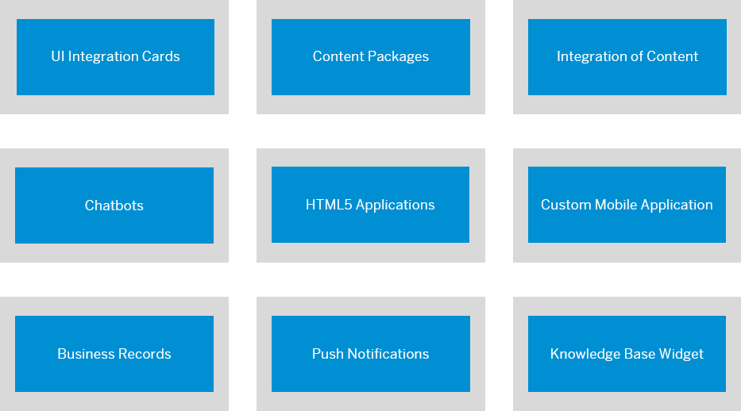

<!-- loio9cda49753e044fed9f8eb06c908f5890 -->

# Developer Guide at a Glance

This guide provides developers with information on how to implement dev-related tasks in SAP Build Work Zone, advanced edition.

As a developer, you can develop content in SAP Business Application Studio and deploy it to SAP Build Work Zone, advanced edition. The content is then exposed in the *Administration Console*, and from there can be added to pages and workspaces. In addition, you can perform configuration tasks that are code-related.

<a name="loio9cda49753e044fed9f8eb06c908f5890__section_rrm_3fl_mlb"/>

## Developer Flows

Click the shapes to get more detailed information about each of these flows:

