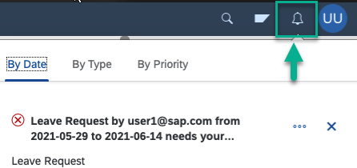
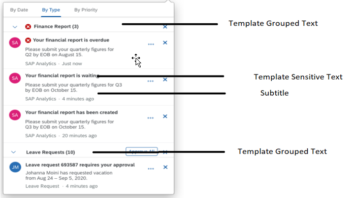

<!-- loiofe40c015d2b24487945f4b40ed86534e -->

# Developing Cloud Foundry Applications With Notifications

Custom apps that you develop and deploy to SAP BTP, Cloud Foundry environment can be configured to publish notifications. Users can access the notifications from the shell header of their site and they can act on these notifications.


## Background

When your app publishes a notification via the notification service APIs \(using destination details that you received from your administrator\), users are able to access the notifications from the bell icon in the shell header of their site and then act on the notifications.



When a user invokes an action, the notification service passes the action to the application. For example, if the app is a Leave Request app, managers can accept or reject the request.


<a name="loiofe40c015d2b24487945f4b40ed86534e__section_ovv_4lh_spb"/>

## How to develop an app with notifications

The steps below detail the main steps that you need to do in order to publish notifications from your application.

**Prerequisites**

-   Your administrator has generated notification credentials in the subaccount settings of your site.

-   Your administrator has configured a destination using these notification credentials and passed on the destination details to you.


For more information, see [Enabling Notifications for Custom Apps on SAP BTP Cloud Foundry](enabling-notifications-for-custom-apps-on-sap-btp-cloud-foundry-d5429a2.md).


### Step 1: Publish the notification type

> ### Tip:  
> Instead of doing the following steps, you can avoid some overhead by using SAP Cloud SDK. Scroll down to get more information about using SAP Cloud SDK.

When you publish a notification from your app, you must specify the notification type. So, the first step is to publish the notification type.

A notification type includes a template that defines the notification. The template is populated with values that are specified in the notification body.

> ### Note:  
> We assume that your application is bound to an XSUAA service and a destination service. We’ll use the VCAP\_SERVICES environment variable in order to access the credentials of these services:
> 
> > ### Sample Code:  
> > ```
> > const xsenv = require('@sap/xsenv');
> > 
> > xsenv.loadEnv();
> > const xsuaa = xsenv.serviceCredentials({ label: "xsuaa" });
> > const destination = xsenv.serviceCredentials({ label: "destination" });
> > 
> > ```

Now, do the following steps:

1.  Create a POST call to the endpoint: `<HOST>/NotificationType.svc/NotificationTypes`. You can obtain the `<HOST>` value from the destination object fetched from the destination service. In order to call the destination service, you must first retrieve an access token.

    1.  Retrieve the access token via the client credentials of the destination service instance \(bound to the application\), using the subscriber tenant-specific token service URL. For example,

        > ### Sample Code:  
        > ```
        > 
        > const xsuaaResponse = await axios.get("/oauth/token?grant_type=client_credentials", {
        >     baseURL: xsuaa.url,
        >     auth: {username: destination.clientid, password: destination.clientsecret}
        > });
        > const accessToken = xsuaaResponse.data.access_token;
        > 
        > ```

    2.  Retrieve the destination configuration for the notification service `URL: <destination.credentials.uri>/destination-configuration/v1/destinations/<destinationName>`.

        The token received in step ‘a’ above has to be added as part of the `Authorization` header. Here the `destinationName` is `SAP_Notifications`.

        The auth token of the notification service is returned as a part of the response. Add this token to all future calls as part of the `Authorization` header. The value is `Bearer` followed by a space and the auth token value.


    > ### Sample Code:  
    > ```
    > 
    > const destinationResponse = await axios.get(`/destination-configuration/v1/destinations/SAP_Notifications`, {
    >     baseURL: destination.uri,
    >     headers: {'Authorization': `Bearer ${accessToken}`},
    > });
    > const notificationServiceBaseUrl = destinationResponse.data.destinationConfiguration.URL;
    > const authToken = destinationResponse.data.authTokens[0].value;
    > 
    > ```

2.  Publish the notification type as follows:

    A POST call to the URL: `<HOST>/NotificationType.svc/NotificationTypes` with the following request body creates a notification type with the key `LeaveRequest` and version 0.3.

    > ### Sample Code:  
    > ```
    > 
    > const notificationType = {
    >     NotificationTypeKey: "LeaveRequest",
    >     NotificationTypeVersion: "0.3",
    >     Templates: [
    >         {
    >             Language: "en",
    >             TemplatePublic: "A new leave request needs ur attention!",
    >             TemplateSensitive: "Leave Request by {{requester_email}} from {{from}} to {{to}}",
    >             TemplateGrouped: "You have {{_group_count}} leave request(s) for approval",
    >             TemplateLanguage: "Mustache",
    >             Subtitle: "Leave Request",
    >             Description: "Leave Request notification",
    >             EmailSubject: "There is a Leave Request",
    >             EmailText: "This is a Leave Request. It needs your attention",
    >             EmailHtml: "&lt;html&gt;&lt;body&gt;&lt;p&gt;This is a Leave Request. It needs your attention&lt;/p&gt;&lt;/body&gt;&lt;/html&gt;",        
    >         }
    >     ],
    >     Actions: [
    >         {
    >             ActionId: "AcceptLRActionKey",
    >             Language: "en",
    >             ActionText: "Accept",
    >             GroupActionText: "Accept All",
    >             Nature: "POSITIVE",
    >         },
    >         {
    >             ActionId: "RejectLRActionKey",
    >             Language: "en",
    >             ActionText: "Reject",
    >             GroupActionText: "Reject All",
    >             Nature: "NEGATIVE",
    >         }
    >     ],
    >     DeliveryChannels: [
    >         {
    >             Type: "MAIL",
    >             Enabled: true
    >         }
    >     ]
    > };
    > 
    > const notificationTypeResponse = await axios.post("/NotificationType.svc/NotificationTypes", notificationType, {
    >     baseURL: notificationServiceBaseUrl,
    >     headers: {
    >         'Authorization': `Bearer ${authToken}`,
    >         'Accept': 'application/json'
    >     }
    > });
    > ```

    **Using SAP Cloud SDK**

    Instead of doing the above steps, you can avoid some overhead by using SAP Cloud SDK at: [SAP Cloud SDK.](https://sap.github.io/cloud-sdk)

    > ### Sample Code:  
    > ```
    > 
    > const { executeHttpRequest } = require("@sap-cloud-sdk/http-client");
    > const { getDestination, buildHeadersForDestination } = require("@sap-cloud-sdk/connectivity");
    >  
    > // Fetch the destination to the notifications service.
    > // It is required that your app is bound to both XSUAA and destination service
    > const notificationServiceDestination = await getDestination({destinationName: "SAP_Notifications"});
    >  
    > // Publish the Notification Type.
    > await executeHttpRequest(notificationServiceDestination, {
    >     url: "/NotificationType.svc/NotificationTypes",
    >     method: "post",
    >     data: notificationType, // the Notification Type payload
    > });
    > ```

    The following OData types are supported: String, Date, Integer.

    See the notification type properties in the table below:

    **Notification Type Properties**


    <table>
    <tr>
    <th valign="top">

    Field
    
    </th>
    <th valign="top">

    Mandatory
    
    </th>
    <th valign="top">

    Details
    
    </th>
    <th valign="top">

    Max Length in Characters
    
    </th>
    </tr>
    <tr>
    <td valign="top">
    
    `NotificationTypeKey`
    
    </td>
    <td valign="top">
    
    Yes
    
    </td>
    <td valign="top">
    
    Key for notification - to be used when publishing notifications.
    
    </td>
    <td valign="top">
    
    128
    
    </td>
    </tr>
    <tr>
    <td valign="top">
    
    `NotificationTypeVersion`
    
    </td>
    <td valign="top">
    
    Yes
    
    </td>
    <td valign="top">
    
    Version of notification - to be used when publishing notifications.
    
    </td>
    <td valign="top">
    
    20
    
    </td>
    </tr>
    <tr>
    <td valign="top">
    
     
    
    </td>
    <td valign="top">
    
     
    
    </td>
    <td valign="top">
    
     
    
    </td>
    <td valign="top">
    
     
    
    </td>
    </tr>
    <tr>
    <td valign="top">
    
    **TEMPLATES** \(mandatory\)
    
    </td>
    <td valign="top">
    
     
    
    </td>
    <td valign="top">
    
     
    
    </td>
    <td valign="top">
    
     
    
    </td>
    </tr>
    <tr>
    <td valign="top">
    
    `Language`
    
    </td>
    <td valign="top">
    
    Yes
    
    </td>
    <td valign="top">
    
    The following language keys, which specify the language of the notification, are supported:

    AF, AR, BG, CA, ZH, ZF, HR, CS, DA, NL, EN, ET, FI, FR, KM, DE, EL, HE, HU, IS, ID, IT, HI, JA, KO, LV, LT, MS, NO, NB, PL, PT, Z1, RO, RU, SR, SH, SK, VI, SL, ES, SV, TH, TR, UK, IW, IN.

    > ### Note:  
    > When creating a template for notification types, only 2-character language codes are supported as languages keys.


    
    </td>
    <td valign="top">
    
     
    
    </td>
    </tr>
    <tr>
    <td valign="top">
    
    `TemplateSensitive`
    
    </td>
    <td valign="top">
    
    Yes
    
    </td>
    <td valign="top">
    
    
    
    </td>
    <td valign="top">
    
    250
    
    </td>
    </tr>
    <tr>
    <td valign="top">
    
    `TemplatePublic`
    
    </td>
    <td valign="top">
    
    Yes
    
    </td>
    <td valign="top">
    
    The text which is used for push notifications \(for example, on your mobile device\). Since the push notification can pop up on your screen at any time and someone else can unintentionally see it, this text **should not** contain sensitive information.
    
    </td>
    <td valign="top">
    
    250
    
    </td>
    </tr>
    <tr>
    <td valign="top">
    
    `TemplateGrouped`
    
    </td>
    <td valign="top">
    
    Yes
    
    </td>
    <td valign="top">
    
    Refer to diagram above.
    
    </td>
    <td valign="top">
    
    500
    
    </td>
    </tr>
    <tr>
    <td valign="top">
    
    `Subtitle`
    
    </td>
    <td valign="top">
    
    Yes
    
    </td>
    <td valign="top">
    
    Refer to diagram above.
    
    </td>
    <td valign="top">
    
    5000
    
    </td>
    </tr>
    <tr>
    <td valign="top">
    
    `Description`
    
    </td>
    <td valign="top">
    
    No
    
    </td>
    <td valign="top">
    
    Describes the notification type when accessing user preferences through the consumer API.
    
    </td>
    <td valign="top">
    
    250
    
    </td>
    </tr>
    <tr>
    <td valign="top">
    
    `TemplateLanguage`
    
    </td>
    <td valign="top">
    
    No
    
    </td>
    <td valign="top">
    
    The template language is used to replace properties in the notification template text. Only `Mustache` is supported in addition to the default behaviour.

    -   `Mustache`: If the value is `Mustache`, the template texts must identify properties with double curly braces.

    -   Default behaviour is to consider single braces as the identifier for properties.


    
    </td>
    <td valign="top">
    
     
    
    </td>
    </tr>
    <tr>
    <td valign="top">
    
    `EmailSubject`
    
    </td>
    <td valign="top">
    
    No
    
    </td>
    <td valign="top">
    
    This value is used to define a custom subject for the email notifications.

    If `EmailSubject` is not specified, the value of property `TemplateSensitive` as email subject line is used.
    
    </td>
    <td valign="top">
    
    255
    
    </td>
    </tr>
    <tr>
    <td valign="top">
    
    `EmailHtml`
    
    </td>
    <td valign="top">
    
    No
    
    </td>
    <td valign="top">
    
    An HTML format of the payload for the email notifications.

    `EmailHtml` is with the highest priority. If it is not specified, we ignore it and fallback to `EmailText`.
    
    </td>
    <td valign="top">
    
    20000
    
    </td>
    </tr>
    <tr>
    <td valign="top">
    
    `EmailText`
    
    </td>
    <td valign="top">
    
    No
    
    </td>
    <td valign="top">
    
    A plain text format of the payload for the email notifications.

    If `EmailText` is not specified, the value of `Subtiltle` as email body is used.
    
    </td>
    <td valign="top">
    
    20000
    
    </td>
    </tr>
    <tr>
    <td valign="top">
    
     
    
    </td>
    <td valign="top">
    
     
    
    </td>
    <td valign="top">
    
     
    
    </td>
    <td valign="top">
    
     
    
    </td>
    </tr>
    <tr>
    <td valign="top">
    
    **ACTIONS** \(optional\)
    
    </td>
    <td valign="top">
    
     
    
    </td>
    <td valign="top">
    
     
    
    </td>
    <td valign="top">
    
     
    
    </td>
    </tr>
    <tr>
    <td valign="top">
    
    `ActionId`
    
    </td>
    <td valign="top">
    
    Yes
    
    </td>
    <td valign="top">
    
    The value used to identify the action performed. When an action is performed by the user, this is the value that is sent back to the application to identify the action performed.
    
    </td>
    <td valign="top">
    
    32
    
    </td>
    </tr>
    <tr>
    <td valign="top">
    
    `ActionText`
    
    </td>
    <td valign="top">
    
    Yes
    
    </td>
    <td valign="top">
    
    Text shown to the user.
    
    </td>
    <td valign="top">
    
    40
    
    </td>
    </tr>
    <tr>
    <td valign="top">
    
    `GroupActionText`
    
    </td>
    <td valign="top">
    
    Yes
    
    </td>
    <td valign="top">
    
    Text shown to the user when notifications of the same type are grouped.
    
    </td>
    <td valign="top">
    
    40
    
    </td>
    </tr>
    <tr>
    <td valign="top">
    
     
    
    </td>
    <td valign="top">
    
     
    
    </td>
    <td valign="top">
    
     
    
    </td>
    <td valign="top">
    
     
    
    </td>
    </tr>
    <tr>
    <td valign="top">
    
    **DELIVERY CHANNELS** \(optional\)
    
    </td>
    <td valign="top">
    
     
    
    </td>
    <td valign="top">
    
     
    
    </td>
    <td valign="top">
    
     
    
    </td>
    </tr>
    <tr>
    <td valign="top">
    
    `Type`
    
    </td>
    <td valign="top">
    
    Yes
    
    </td>
    <td valign="top">
    
    The type of the delivery channel. Currently only the `MAIL` type is supported.
    
    </td>
    <td valign="top">
    
     
    
    </td>
    </tr>
    <tr>
    <td valign="top">
    
    `Enabled`
    
    </td>
    <td valign="top">
    
    No
    
    </td>
    <td valign="top">
    
    Defines if the channel is enabled. If not provided, the default values per delivery channel type are as follows:

    `MAIL: false`
    
    </td>
    <td valign="top">
    
     
    
    </td>
    </tr>
    </table>
    
    > ### Note:  
    > A notification type with a specific combination of `NotificationTypeKey`, `NotificationTypeVersion` must only be created once per application. To check if and `NotificationType` already exists, make a GET call to the URL: `<HOST>/NotificationType.svc/NotificationTypes`


### Step 2: Publish notifications

1.  From **Step 1** above obtain the **authorization token**. The token is required to authenticate all subsequent requests.

    > ### Note:  
    > In this step, you can also use SAP Cloud SDK.

2.  To publish a notification, make a POST call to the URL: `<HOST>/Notification.svc/Notifications`. Add the **authorization header** retrieved in the previous steps. The request body will look like this:

    > ### Sample Code:  
    > ```
    > 
    > {
    >     "OriginId": "leave-req-dest",
    >     "NotificationTypeKey": "LeaveRequest",
    >     "NotificationTypeVersion": "0.3",
    >     "NavigationTargetAction": "display",
    >     "NavigationTargetObject": "LeaveRequest",
    >     "Priority": "High",
    >     "ActorId": "NAIRA",
    >     "ActorType": "",
    >     "ActorDisplayText": "",
    >     "ActorImageURL": "https://scn.sap.com/people/guest/avatar/NAIRA.png",
    >     "Properties": [
    >         {
    >             "Key": "requester_email",
    >             "Language": "en",
    >             "Value": "me@sap.com",
    >             "Type": "String",
    >             "IsSensitive": false
    >         },
    >         {
    >             "Key": "from",
    >             "Language": "en",
    >             "Value": "05-01-2021",
    >             "Type": "String",
    >             "IsSensitive": true
    >         },
    >         {
    >             "Key": "to",
    >             "Language": "en",
    >             "Value": "05-01-2022",
    >             "Type": "String",
    >             "IsSensitive": true
    >         }
    >     ],
    >     "Recipients": [
    >         {
    >             "RecipientId": "manager@sap.com"
    >         }
    >     ]
    > }
    > ```

    The following OData types are supported: String, Date, Integer.

    See the notification properties in the table below:

    **Notification Properties**


    <table>
    <tr>
    <th valign="top">

    Field
    
    </th>
    <th valign="top">

    Mandatory
    
    </th>
    <th valign="top">

    Details
    
    </th>
    <th valign="top">

    Max Length in Characters
    
    </th>
    </tr>
    <tr>
    <td valign="top">
    
    `Id`
    
    </td>
    <td valign="top">
    
    No
    
    </td>
    <td valign="top">
    
    Universally unique identifier \(UUID\) for the notification – used to identify notifications if actions are performed.

    If the ID isn't provided, it will be generated by the notification service.
    
    </td>
    <td valign="top">
    
    32
    
    </td>
    </tr>
    <tr>
    <td valign="top">
    
    `OriginId`
    
    </td>
    <td valign="top">
    
    No
    
    </td>
    <td valign="top">
    
    When actions are performed by users on notifications, these actions may result in some side effects on the application that sent the notification in the first place. The notification service searches for the SAP BTP destination with the name provided in this field and performs a POST call on that destination. If no actions are expected to be done by users, then this field can be ignored.
    
    </td>
    <td valign="top">
    
    200
    
    </td>
    </tr>
    <tr>
    <td valign="top">
    
    -   `NotificationTypeKey`

    -   `NotificationTypeVersion`


    
    </td>
    <td valign="top">
    
    Yes
    
    </td>
    <td valign="top">
    
    Used to identify the Notification Type to determine templates and so on.
    
    </td>
    <td valign="top">
    
    -   32

    -   20


    
    </td>
    </tr>
    <tr>
    <td valign="top">
    
    -   `NavigationTargetAction` 

    -   `NavigationTargetObject`


    
    </td>
    <td valign="top">
    
    No
    
    </td>
    <td valign="top">
    
    Used when navigation is required from the notification to the application.
    
    </td>
    <td valign="top">
    
    -   500

    -   500


    
    </td>
    </tr>
    <tr>
    <td valign="top">
    
    `Priority`
    
    </td>
    <td valign="top">
    
    Yes
    
    </td>
    <td valign="top">
    
    Indicates the priority of the notification:

    -   High

    -   Medium

    -   Neutral

    -   Low


    
    </td>
    <td valign="top">
    
     
    
    </td>
    </tr>
    <tr>
    <td valign="top">
    
    -   `ActorId`

    -   `ActorType`

    -   `ActorDisplayText`

    -   `ActorImageURL`


    
    </td>
    <td valign="top">
    
    No
    
    </td>
    <td valign="top">
    
    Details about the actor initiating the notification.

    In the example, the actor is a user whose details are provided in these fields.
    
    </td>
    <td valign="top">
    
    -   20

    -   20

    -   120


    
    </td>
    </tr>
    <tr>
    <td valign="top">
    
     
    
    </td>
    <td valign="top">
    
     
    
    </td>
    <td valign="top">
    
     
    
    </td>
    <td valign="top">
    
     
    
    </td>
    </tr>
    <tr>
    <td valign="top">
    
    **PROPERTIES**
    
    </td>
    <td valign="top">
    
     
    
    </td>
    <td valign="top">
    
     
    
    </td>
    <td valign="top">
    
     
    
    </td>
    </tr>
    <tr>
    <td valign="top">
    
    `Key`
    
    </td>
    <td valign="top">
    
    Yes
    
    </td>
    <td valign="top">
    
    Key used as a placeholder for properties in the template.

    For example, `po_number.`
    
    </td>
    <td valign="top">
    
    128
    
    </td>
    </tr>
    <tr>
    <td valign="top">
    
    `Value`
    
    </td>
    <td valign="top">
    
    Yes
    
    </td>
    <td valign="top">
    
    Value that replaces the property placeholder in the template.
    
    </td>
    <td valign="top">
    
    255
    
    </td>
    </tr>
    <tr>
    <td valign="top">
    
    `Language`
    
    </td>
    <td valign="top">
    
    No
    
    </td>
    <td valign="top">
    
    The following language keys, which specify the language of the notification, are supported:

    AF, AR, BG, CA, ZH, ZF, HR, CS, DA, NL, EN, ET, FI, FR, KM, DE, EL, HE, HU, IS, ID, IT, HI, JA, KO, LV, LT, MS, NO, NB, PL, PT, Z1, RO, RU, SR, SH, SK, VI, SL, ES, SV, TH, TR, UK, IW, IN, ZH\_HANS, ZH\_HANT, ZH\_CN, ZH\_TW

    > ### Note:  
    > If no language is specified, then it will be set to the default language \(EN\).


    
    </td>
    <td valign="top">
    
     
    
    </td>
    </tr>
    <tr>
    <td valign="top">
    
    `Type`
    
    </td>
    <td valign="top">
    
    Yes
    
    </td>
    <td valign="top">
    
    EDM type of data sent in the `Value` field.
    
    </td>
    <td valign="top">
    
    20
    
    </td>
    </tr>
    <tr>
    <td valign="top">
    
    `IsSensitive`
    
    </td>
    <td valign="top">
    
    No
    
    </td>
    <td valign="top">
    
    Identifies if the data is sensitive. If the data is sensitive, the data will be encrypted and stored in the database.
    
    </td>
    <td valign="top">
    
     
    
    </td>
    </tr>
    <tr>
    <td valign="top">
    
     
    
    </td>
    <td valign="top">
    
     
    
    </td>
    <td valign="top">
    
     
    
    </td>
    <td valign="top">
    
     
    
    </td>
    </tr>
    <tr>
    <td valign="top">
    
    **RECIPIENTS** \(mandatory\)
    
    </td>
    <td valign="top">
    
     
    
    </td>
    <td valign="top">
    
     
    
    </td>
    <td valign="top">
    
     
    
    </td>
    </tr>
    <tr>
    <td valign="top">
    
    **RecipientId**
    
    </td>
    <td valign="top">
    
    Yes
    
    </td>
    <td valign="top">
    
    E-mail ID of recipient user.
    
    </td>
    <td valign="top">
    
     
    
    </td>
    </tr>
    <tr>
    <td valign="top">
    
     
    
    </td>
    <td valign="top">
    
     
    
    </td>
    <td valign="top">
    
     
    
    </td>
    <td valign="top">
    
     
    
    </td>
    </tr>
    <tr>
    <td valign="top">
    
    **TARGETPARAMETERS** \(optional\)
    
    </td>
    <td valign="top">
    
     
    
    </td>
    <td valign="top">
    
     
    
    </td>
    <td valign="top">
    
     
    
    </td>
    </tr>
    <tr>
    <td valign="top">
    
    -   `Key`

    -   `Value`


    
    </td>
    <td valign="top">
    
    Yes
    
    </td>
    <td valign="top">
    
    Name value pairs that are forwarded to the target application specified in the`NavigationTargetObject` property.
    
    </td>
    <td valign="top">
    
    -   250

    -   250


    
    </td>
    </tr>
    </table>
    


### Step 3: Handling actions on notifications

This step is optional if notifications support actions.

If a notification supports actions, the user can perform the possible actions from the notifications UI. The action needs to be handled by the application that publishes the notification. This section describes the steps that you need to do in order for the application to publish the notification with actions.

1.  Create a destination to your app.

    > ### Example:  
    > 
    > <table>
    > <tr>
    > <th valign="top">
    > 
    > Property
    > 
    > </th>
    > <th valign="top">
    > 
    > Value
    > 
    > </th>
    > </tr>
    > <tr>
    > <td valign="top">
    > 
    > `Name`
    > 
    > </td>
    > <td valign="top">
    > 
    > Custom\_App
    > 
    > </td>
    > </tr>
    > <tr>
    > <td valign="top">
    > 
    > `Type`
    > 
    > </td>
    > <td valign="top">
    > 
    > HTTP
    > 
    > </td>
    > </tr>
    > <tr>
    > <td valign="top">
    > 
    > `Description`
    > 
    > </td>
    > <td valign="top">
    > 
    >  
    > 
    > </td>
    > </tr>
    > <tr>
    > <td valign="top">
    > 
    > `URL`
    > 
    > </td>
    > <td valign="top">
    > 
    > https://customapp.cfapps.sap.hana.ondemand.com
    > 
    > </td>
    > </tr>
    > <tr>
    > <td valign="top">
    > 
    > `Proxy Type`
    > 
    > </td>
    > <td valign="top">
    > 
    > Internet
    > 
    > </td>
    > </tr>
    > <tr>
    > <td valign="top">
    > 
    > `Authentication`
    > 
    > </td>
    > <td valign="top">
    > 
    > NoAuthentication
    > 
    > > ### Note:  
    > > Supported authentication types are:
    > > 
    > > -   NoAuthentication
    > > 
    > > -   OAuth2UserTokenExchange
    > > 
    > > -   OAuth2ClientCredentials
    > 
    > 
    > 
    > </td>
    > </tr>
    > <tr>
    > <td valign="top">
    > 
    > Add the following additional property:
    > 
    > </td>
    > <td valign="top">
    > 
    >  
    > 
    > </td>
    > </tr>
    > <tr>
    > <td valign="top">
    > 
    > `NOTIF_SERVICEPATH`
    > 
    > </td>
    > <td valign="top">
    > 
    > /cust\_app
    > 
    > </td>
    > </tr>
    > </table>

    > ### Remember:  
    > This is a destination to the application. It's not the same destination that the admin created using the notification credentials in the subaccount.

    > ### Note:  
    > -   The destination must be created with a destination name that is passed in the `originId` property when the notifications are published.
    > 
    > -   The destination should have details of the endpoint that provides an action callback implementation.

    The process of determining the application endpoint for performing actions is as follows:

    1.  The notifications service looks for a destination whose value matches the value of the `originId` field of the notification. In the example above, when a user performs an action on a notification that has an `originId` with value `Custom_App`, then the notification service picks this destination for further processing.

    2.  The notification service expects the URL to adhere to the following format – `<HOST>/<PATH>/ExecuteAction`. The <PATH\> variable \(which is mandatory\), is determined from the property `NOTIF_SERVICEPATH` and `<HOST>` is the value of the URL field in the destination.

2.  Implement action handling as follows:

    Once the destination is configured, the notification service performs a POST call using the following URL: `<HOST>/cust_app/ExecuteAction`.

    The application needs to implement the handling of the action when the call arrives at the endpoint configured in the destination. The action by the user on the UI triggers a POST call at the above endpoint and the body will contain the following details:

    > ### Sample Code:  
    > ```
    > 
    > {
    >     "NotificationId": "42010aee-2870-1eda-aaab-f67163e06fd3", 
    >     "ActionId": "0002"
    > }
    > 
    > ```

    The `NotificationId` and `ActionId` provide all the details necessary for the application to process the action.

    The application must return a JSON object with the following properties:


    <table>
    <tr>
    <th valign="top">

    Property
    
    </th>
    <th valign="top">

    Description
    
    </th>
    <th valign="top">

    Possible values
    
    </th>
    <th valign="top">

    Default value
    
    </th>
    </tr>
    <tr>
    <td valign="top">
    
    Success
    
    </td>
    <td valign="top">
    
    Indicates whether the action processed by the application was successful or not.
    
    </td>
    <td valign="top">
    
    "true" or "false"
    
    </td>
    <td valign="top">
    
    "false"
    
    </td>
    </tr>
    <tr>
    <td valign="top">
    
    MessageText
    
    </td>
    <td valign="top">
    
    A message to display in the UI after the action has been processed by the application.
    
    </td>
    <td valign="top">
    
    Any string
    
    </td>
    <td valign="top">
    
    An empty string
    
    </td>
    </tr>
    <tr>
    <td valign="top">
    
    DeleteOnReturn
    
    </td>
    <td valign="top">
    
    Indicates whether to delete the notification that the action was invoked from, after the action has successfully been processed by the application.
    
    </td>
    <td valign="top">
    
    "true" or "false"
    
    </td>
    <td valign="top">
    
    "false"
    
    </td>
    </tr>
    </table>
    
    > ### Note:  
    > If any of these values are undefined, the default value is used.

3.  Implement a bulk action as follows:

    It's also possible for users to perform actions by type. For example, to perform actions on all notifications of type `Leave Request`. When such an action is performed by the user on a notification on the UI, the notification service triggers a POST call on the application using the URL: `<HOST>/cust_app/BulkActionByHeader` with the following request body:

    > ### Sample Code:  
    > ```
    > 
    > {
    >     "ParentId": "52010aee-2870-1eda-aaab-f67163e06fd3", 
    >     "ActionId": "0002"
    > }
    > 
    > ```

    `ParentId` is the `NotificationTypeId`.


**Related Information**  


[CAP Notifications Plugin](https://github.com/cap-js/notifications#readme)

[CAP Documentation](https://cap.cloud.sap/docs/plugins/#notifications)

[Configuring an SMTP Mail Destination](configuring-an-smtp-mail-destination-e403f2c.md "Configure an SMTP Mail destination for email notifications.")

