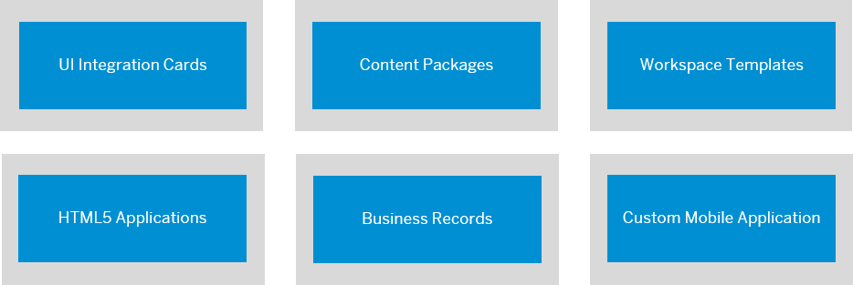

<!-- loio9cda49753e044fed9f8eb06c908f5890 -->

# Development

This guide provides developers with information on how to implement dev-related tasks in SAP Build Work Zone, advanced edition.

As a developer, you can develop content in SAP Business Application Studio and deploy it to SAP Build Work Zone, advanced edition. The content is then exposed in the *Administration Console*, and from there can be added to workpages and workspaces.

<a name="loio9cda49753e044fed9f8eb06c908f5890__section_rrm_3fl_mlb"/>

## Quick Reference

Click the shapes to get more detailed information about each of these most used development flows:

<a name="loio9cda49753e044fed9f8eb06c908f5890__section_avf_hx4_ywb"/>

## Additional Dev Flows

<table>
<tr>
<th valign="top">

Section

</th>
<th valign="top">

More Details

</th>
</tr>
<tr>
<td valign="top">

Information about creating business solutions as content providers.

</td>
<td valign="top">

[Developing Business Solutions](developing-business-solutions-1f79942.md)

</td>
</tr>
<tr>
<td valign="top">

Information about the common data model format that is a prerequisite for any content provider that wishes to integrate its content in a unified way in the site.

</td>
<td valign="top">

[About the Common Data Model](about-the-common-data-model-c961060.md)

</td>
</tr>
<tr>
<td valign="top">

Webhooks provide a means of tracking specific events that occur in SAP Build Work Zone, advanced edition and then sending the event notification metadata to third party applications that use them.

</td>
<td valign="top">

[Using Push Notifications for Webhooks](using-push-notifications-for-webhooks-3118574.md)

</td>
</tr>
<tr>
<td valign="top">

Information about a highly customizable widget that can be embedded in UI5 compatible SAP applications to provide in-context access to relevant knowledge.

</td>
<td valign="top">

[SAPUI5 Embeddable Knowledge Base Widget](sapui5-embeddable-knowledge-base-widget-8c8cc07.md)

</td>
</tr>
<tr>
<td valign="top">

Information about how to add SAP Build Work Zone, advanced edition div-embedded widgets to external web pages.

</td>
<td valign="top">

[HTML div-Embedded Widgets](html-div-embedded-widgets-d6526cf.md)

</td>
</tr>
<tr>
<td valign="top">

Information about SAP Build Work Zone, advanced edition APIs that can be used to incorporate content into external applications or for manipulating SAP Build Work Zone, advanced edition via APIs.

</td>
<td valign="top">

[API Documentation](api-documentation-5314daf.md)

</td>
</tr>
<tr>
<td valign="top">

Information about access and authorization configuration which are required in any integration scenario.

</td>
<td valign="top">

-   [Add a Trusted Certificate Authority](add-a-trusted-certificate-authority-f8d9305.md)
-   [Add an OAuth Client](add-an-oauth-client-5310092.md)
-   [Add a SAML Trusted IDP](add-a-saml-trusted-idp-dad776e.md)

</td>
</tr>
</table>

