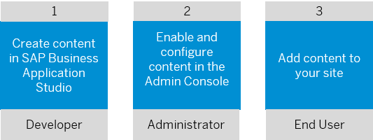

<!-- loio246486228d73484d91cd1bb578595171 -->

<link rel="stylesheet" type="text/css" href="css/sap-icons.css"/>

# Development Tools for SAP Build Work Zone 

Create cards, content packages, and workspace templates using the **Development Tools for SAP Build Work Zone** extension in SAP Business Application Studio.

<a name="loio246486228d73484d91cd1bb578595171__section_myr_brj_lyb"/>

## Content Integration Flow

A typical flow for integrating custom content that was developed in SAP Business Application Studio consists of the following actions:

1.  Create content in SAP Business Application Studio or another development tool.

2.  Enable and configure content in the Administration Console.

3.  Add content to your site.

## Prerequisites

Before you use the **Development Tools for SAP Build Work Zone** extension for the first time, complete the following configuration steps:

1.  Complete the initial setup steps in SAP Business Application Studio. For more information, see [Getting Started](https://help.sap.com/docs/bas/sap-business-application-studio/getting-started?version=Cloud).
2.  In SAP Business Application Studio, create a dev space. Select the dev space and add the **Development Tools for SAP Build Work Zone** extension from the *Additional SAP Extensions* column.
3.  Verify that your user is assigned to the *Workzone\_Admin* role collection. To do this, access the SAP BTP cockpit, *Security* \> *Role Collections* screen.
4.  Create a destination to the SAP Build Work Zone content repository.

    > ### Note:  
    > Depending on when you've onboarded to SAP Build Work Zone, advanced edition, it is possible that you already have a destination to the content repository configured by the onboarding booster. Before you proceed, check the *Destinations* screen in the SAP BTP cockpit to make sure if you already have a destination. If you don't, please complete the following steps.

    1.  In the SAP BTP cockpit, go to *Services* \> *Instances and Subscriptions*.
    2.  Select the relevant service \(SAP Build Work Zone, advanced edition or SAP SuccessFactors Work Zone\), and in the top right corner click *Create*. Fill in all the details of the new service instance. Note that you must enable Cloud Foundry and create a space before you create a service instance. For more information, see [Creating Service Instances in Cloud Foundry](https://help.sap.com/viewer/09cc82baadc542a688176dce601398de/Cloud/en-US/6d6846def3c443aa9f83d127353147ce.html) .
    3.  To create a service key, still in the *Instances and Subscriptions* screen, click  \(Actions\) next to the service instance entry in the table, and create a service key. For more information, see [Creating Service Keys in Cloud Foundry](https://help.sap.com/viewer/09cc82baadc542a688176dce601398de/Cloud/en-US/6fcac08409db4b0f9ad55a6acd4d31c5.html).
    4.  In the SAP BTP cockpit, navigate to the *Destinations* screen. Create a new destination with the following details:

        <table>
        <tr>
        <th valign="top">

        Attribute
        
        </th>
        <th valign="top">

        Description
        
        </th>
        </tr>
        <tr>
        <td valign="top">
        
        Name
        
        </td>
        <td valign="top">
        
        Provide a name
        
        </td>
        </tr>
        <tr>
        <td valign="top">
        
        Type
        
        </td>
        <td valign="top">
        
        HTTP
        
        </td>
        </tr>
        <tr>
        <td valign="top">
        
        Description
        
        </td>
        <td valign="top">
        
        Provide a description
        
        </td>
        </tr>
        <tr>
        <td valign="top">
        
        URL
        
        </td>
        <td valign="top">
        
        Enter the *<\{endpoints.portal-service\}\>* field value available in service key.
        
        </td>
        </tr>
        <tr>
        <td valign="top">
        
        Proxy Type
        
        </td>
        <td valign="top">
        
        Internet
        
        </td>
        </tr>
        <tr>
        <td valign="top">
        
        Authentication
        
        </td>
        <td valign="top">
        
        OAuth2ClientCredentials
        
        </td>
        </tr>
        <tr>
        <td valign="top">
        
        Client ID
        
        </td>
        <td valign="top">
        
        Enter the *<\{uaa.clientid\}\>* field value available in service key.
        
        </td>
        </tr>
        <tr>
        <td valign="top">
        
        Client Secret
        
        </td>
        <td valign="top">
        
        Enter the *<\{uaa.clientsecret\}\>* field value available in service key.
        
        </td>
        </tr>
        <tr>
        <td valign="top">
        
        Token Service URL
        
        </td>
        <td valign="top">
        
        Enter the *<\{uaa.url\}/oauth/token\>* field value available in service key.
        
        </td>
        </tr>
        <tr>
        <td valign="top">
        
        Token Service URL Type
        
        </td>
        <td valign="top">
        
        Dedicated
        
        </td>
        </tr>
        <tr>
        <td valign="top">
        
        **Add the following additional properties:**
        
        </td>
        <td valign="top">
        
         
        
        </td>
        </tr>
        <tr>
        <td valign="top">
        
        HTML5.DynamicDestination
        
        </td>
        <td valign="top">
        
        true

        > ### Caution:  
        > Adding an `HTML5.DynamicDestination`property and setting it to true, enables dynamic access to the destination to any logged-in user.
        > 
        > Therefore before adding this property to the destination, make sure that the underlying API is not public and requires the correct user credentials.

        
        </td>
        </tr>
        <tr>
        <td valign="top">
        
        HTML5.SetXForwardHeaders
        
        </td>
        <td valign="top">
        
        false
        
        </td>
        </tr>
        <tr>
        <td valign="top">
        
        WebIDEEnabled
        
        </td>
        <td valign="top">
        
        true
        
        </td>
        </tr>
        <tr>
        <td valign="top">
        
        WebIDEUsage
        
        </td>
        <td valign="top">
        
        content\_repository
        
        </td>
        </tr>
        </table>
        

<a name="loio246486228d73484d91cd1bb578595171__section_jj4_fh3_kyb"/>

## Development Flows

For detailed instructions about each development flow, see:

-   [UI Integration Cards](20-UIIntegrationCards/ui-integration-cards-b266652.md)
-   [Content Packages](30-ContentPackages/content-packages-d44d54f.md)
-   [Workspace Templates](40-WorkspaceTemplates/workspace-templates-ab3d0fd.md)

