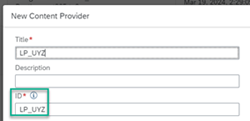
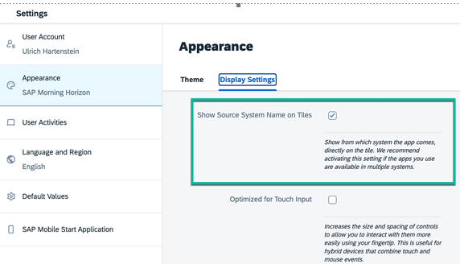
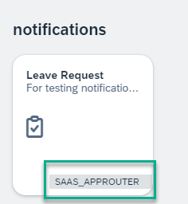
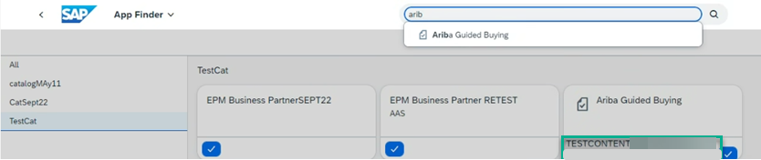
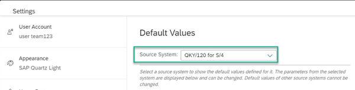
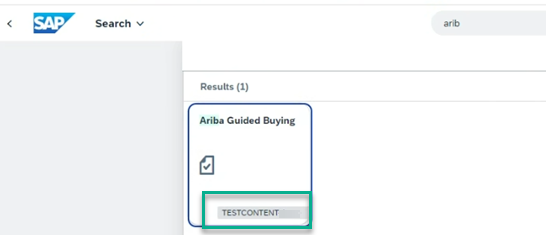
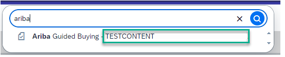

<!-- loio18cb7f8fa4504734945e4a8d4394dde9 -->

# Displaying System Information on Apps

For all apps that have a source system, you can configure them to display their source system information on the app tile as well as in additional locations.

Displaying the system information on tiles is useful when you have apps coming from different systems and you need to differentiate between them.

There are two options for configuring the display of system information on your app tiles.

**Option 1**: Displaying a label \(a friendly name for the system\)

For apps coming from remote content providers such as SAP S/4HANA, you need to create a destination to fetch the content. When you define the destination, you can enter a value for an additional destination property called, `sap-provider-label`. This property enables you to provide a user-friendly display name for the system on the app tile.

**Example of a destination for SAP S/4HANA remote content providers**

<table>
<tr>
<th valign="top">

Destination Property

</th>
<th valign="top">

Value

</th>
</tr>
<tr>
<td valign="top">

HTML5.DynamicDestination

</td>
<td valign="top">

true

</td>
</tr>
<tr>
<td valign="top">

launchpad.esearch.provider

</td>
<td valign="top">

abap\_odata

</td>
</tr>
<tr>
<td valign="top">

launchpad.wa.productId

</td>
<td valign="top">

SAP\_S4HANA\_ON-PREMISE

</td>
</tr>
<tr>
<td valign="top">

launchpad.wa.productVersion

</td>
<td valign="top">

2020.001

</td>
</tr>
<tr>
<td valign="top">

sap-client

</td>
<td valign="top">

200

</td>
</tr>
<tr>
<td valign="top">

sap-platform

</td>
<td valign="top">

ABAP

</td>
</tr>
<tr>
<td valign="top">

sap-provider-label

</td>
<td valign="top">

system label

**This property enables you to provide a user-friendly display name for the system on the app tile.**

</td>
</tr>
<tr>
<td valign="top">

sap-service

</td>
<td valign="top">

3200

</td>
</tr>
<tr>
<td valign="top">

sap-sysid

</td>
<td valign="top">

UYZ

</td>
</tr>
</table>

For more information, see [Configure Destinations \(On Premise\)](configure-destinations-on-premise-f337b80.md).

**Option 2**: Displaying the ID of the content provider

For apps that don’t require a runtime destination to fetch their content, such as HTML5, or Launchpad Module providers, or if the additional property `sap-provider-label` isn't maintained for remote content providers, the content provider ID is displayed on the app tile. The ID number is a property of the content provider that can be seen on the *New Content Provider* and *Edit Content Provider* screens, as well as in the *Content Channels*table from the *ID* column.

**=** 

<a name="loio18cb7f8fa4504734945e4a8d4394dde9__section_ccq_41r_w1c"/>

## Configure the display of system info on app tiles

In both cases above, you need to also enable the site setting *Show Source System Name on Tiles* to display the system name on all static or dynamic app tiles.

For more information, see [Site Settings](site-settings-ca74965.md).

> ### Note:  
> Custom and Smart Business app tiles do not support showing system information.

Once the administrator has enabled this feature, the end user sees the *Show Source System Name on Tiles* setting in the user *Settings* \> *Appearance* \> *Display Settings* screen to show the system information on a tile. They can also switch this setting off but it's recommended when working with apps that are available in multiple systems.

<a name="loio18cb7f8fa4504734945e4a8d4394dde9__section_bpc_nbr_w1c"/>

## Where can I see the apps with system information on their tiles?

In addition to displaying the source system on the app tile, you will see it in the App Finder, search results, and in the Default Values screen.

> ### Note:  
> For the system information to be displayed on an app tile, the administrator needs to have enabled a site setting \(see section above\). In all other cases, you'll see the system information automatically.

-   On all app tiles in your site:

    

-   In the App Finder:

    

-   In the *Source System* field in the *User Default Values* option located under the User Actions menu – *Settings* \> *Appearance* \> *Default Values*.

    

-   In the search results page:

    

-   In the search suggestions dropdown list

    

