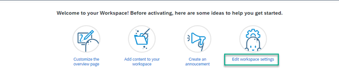

<!-- loio98ae51cfe96e467ebe3523e86c8350c5 -->

<link rel="stylesheet" type="text/css" href="css/sap-icons.css"/>

# Edit Workspace Settings

Workspace administrators can enable and configure a variety of settings that determine how workspace members can engage with their workspace.

To define workspace settings, open the  menu and choose *Workspace Admin Settings*.

> ### Note:  
> You can also access the workspace settings by clicking *Edit workspace settings* from the Quick Access Bar.
> 
> 

There are three tabs of settings that the workspace administrator can define:

<a name="loio98ae51cfe96e467ebe3523e86c8350c5__section_ujq_z5d_rnb"/>

## General

The general settings mainly include basic attributes of the workspace such as name, description, and workspace type. You can edit the following settings:

<table>
<tr>
<th valign="top">

Setting

</th>
<th valign="top">

More Information

</th>
</tr>
<tr>
<td valign="top">

*Name*

</td>
<td valign="top">

Modify the workspace name by changing the text and then checking to see if it's unique by clicking *Check Workspace Name*.

</td>
</tr>
<tr>
<td valign="top">

*Description*

</td>
<td valign="top">

Enter a brief but meaningful description that will help to recognize the purpose of your workspace.

</td>
</tr>
<tr>
<td valign="top">

*Workspace Type*

</td>
<td valign="top">

-   *Public* - any user in the company can join.

-   *Private* - only invited users inside the company can join.

-   *External* - only invited users, inside and outside the company can join.

</td>
</tr>
<tr>
<td valign="top">

*Invite Policy*

</td>
<td valign="top">

-   *All Members*: All users are allowed to invite new members.

    > ### Note:  
    > This option is available only for workspaces with the privacy level *Public*.

-   *All Workspace Members*: All workspace members are allowed to invite new members.

-   *Only Workspace Admins*: Only the workspace administrators are allowed to invite new members.

</td>
</tr>
<tr>
<td valign="top">

*Visibility Policy*

</td>
<td valign="top">

-   Select the *Visibility Policy*:

    > ### Note:  
    > This setting is only available for workspaces with the privacy level *Private*. It doesn’t support private sub-workspaces.

    -   *Allow others to discover this workspace*: The workspace becomes searchable to non-members, and they can see the workspace name and description. They must submit a request to join the workspace and be accepted before they can access the workspace content. Selecting this option also automatically selects *Allow others to request to join this workspace*. You can disable either or both options as necessary.

    -   *Allow others to request to join this workspace*: Non-members can submit a request to become a member. Once accepted, they can access the workspace content.

</td>
</tr>
<tr>
<td valign="top">

*Enable Silent Invites*

</td>
<td valign="top">

You can add member lists to the workspace without triggering a notification to the invited members. The invited members are automatically assigned to the workspace.

> ### Note:  
> If you enable this setting, users on the required member lists won’t receive notifications, feed entries, and e-mail notifications informing them about their assignment to the workspace. If you have configured terms of use for the workspace, the users still have to accept the terms of use before they can start working in the workspace.

</td>
</tr>
<tr>
<td valign="top">

*Privilege Policy*

</td>
<td valign="top">

Enable workspace members to ask for admin privileges.

</td>
</tr>
</table>

<a name="loio98ae51cfe96e467ebe3523e86c8350c5__section_wh4_ls2_rnb"/>

## Setup

From this tab you can configure the functional appearance of the workspace \(for example, calendar, workspace avatar, which features are enabled settings for trash, landing page, and if applicable, selection for the administrative area that the workspace belongs to.

<table>
<tr>
<th valign="top">

Setting

</th>
<th valign="top">

More Information

</th>
</tr>
<tr>
<td valign="top">

*Terms Of Use*

</td>
<td valign="top">

Create a custom Terms of Use that must be accepted by the member before they’re granted access to the workspace. When you change the terms, members must re-accept them before they can continue access to the workspace.

For more information about terms of use, see [How to Create a Workspace](how-to-create-a-workspace-770f1b0.md) - last section.

</td>
</tr>
<tr>
<td valign="top">

*Announcement*

</td>
<td valign="top">

Create a welcome message or user agreement for all workspace members to see on their first visit to the workspace.

</td>
</tr>
<tr>
<td valign="top">

*Default Calendar View*

</td>
<td valign="top">

Select how you want your calendar displayed.

</td>
</tr>
<tr>
<td valign="top">

*Select Primary Workspace Extension*

</td>
<td valign="top">

 

</td>
</tr>
<tr>
<td valign="top">

*Customize what is available in this workspace*

</td>
<td valign="top">

You can enable which features to display.

For example, if you enable *Recommendations Section*, you'll have the option to add a *Recommendations* page to your workspace that navigates to the *Recommendations* feature.

For more information about these features, see [Enable Features](enable-features-f069bc6.md)

</td>
</tr>
<tr>
<td valign="top">

Any external applications configured by the company administrator

</td>
<td valign="top">

External applications \(for example, SharePoint, Google Drive, Alfresco\) can be configured and accessible from the navigation bar in your workspace. You can also configure repositories for existing Microsoft Office 365 integrations that have been set up by your company administrator.

</td>
</tr>
<tr>
<td valign="top">

*Trash*

</td>
<td valign="top">

You can determine that items are deleted from the trash after a specified number of days.

</td>
</tr>
<tr>
<td valign="top">

*Administrative Area*

</td>
<td valign="top">

Select the administrative area that your workspace is available for.

</td>
</tr>
</table>

<a name="loio98ae51cfe96e467ebe3523e86c8350c5__section_pdx_ms2_rnb"/>

## Participation

From this tab you can configure the degree to which workspace members can collaborate, upload content, approve content, edit tasks, and enable @@notify and content ratings.

<table>
<tr>
<th valign="top">

Setting

</th>
<th valign="top">

More Information

</th>
</tr>
<tr>
<td valign="top">

*Collaboration Level*

</td>
<td valign="top">

-   *Read-only*: Only workspace administrators can create, edit, and post items in the workspace. Other workspace members can view and download workspace content, but they are not allowed to comment, tag, post, or edit. Forums, polls, and tasks aren’t available. This level is suitable for broadcasting information.

-   *Limited*: Only workspace administrators can create and upload new content. All members can edit, post, comment, like, and view workspace content.

-   *Full*: Workspace administrators can create, edit, post, comment, like, tag, and view workspace content, and customize the upload policy. Other members can create, edit, post, comment, like, tag, and view workspace content.

</td>
</tr>
<tr>
<td valign="top">

*Upload Policy*

</td>
<td valign="top">

-   *All members*: All users of your company can upload new content items.

    > ### Note:  
    > This option is available only for workspaces with a *Public* privacy level.

-   *All workspace members*: All members of your workspace can upload new content items.

-   *All workspace members from my company*: Only workspace members from your company can upload content items.

    > ### Note:  
    > This option is available only for workspaces with an *External* privacy level.

-   *Only workspace admins*: Only workspace administrators can upload new content items. All workspace members are allowed to comment or edit content.

</td>
</tr>
<tr>
<td valign="top">

*Content Approval*

</td>
<td valign="top">

Under *Full* collaboration, when workspace members upload documents, photos, videos, wikis, or blogs, the workspace administrator must first review and approve this content before it’s visible in the workspace. This provides content publishing safeguards to ensure that content is appropriate for the business context within a workspace. For more information, see [Approve Content](approve-content-5d4b062.md).

> ### Note:  
> You can apply an approval policy to all content in your workspace or to individual content items.

</td>
</tr>
<tr>
<td valign="top">

*Email Notifications*

</td>
<td valign="top">

Choose the default notification frequency for the workspace \(Immediate, Daily, Weekly, None\). If you change the notification at a later time, workspace members will receive a bell notification regarding the change. Members can accept or reject the change.

</td>
</tr>
<tr>
<td valign="top">

*Task Policy*

</td>
<td valign="top">

-   *Full*: All members can edit the details of any task.

-   *Limited*: All members can update the status of any task. Non-assignees can view, but not update, other task details.

-   *Read-only*: Assignees can update their own task status. Non-assignees can view tasks only.

</td>
</tr>
<tr>
<td valign="top">

*Enable @@notify*

</td>
<td valign="top">

If selected, users can send notifications to all workspace followers. As a workspace administrator, you can disable this to help minimize unwanted notifications in large groups. When you disable the @@notify feature for all workspace members, it’s still enabled for the workspace administrator.

</td>
</tr>
<tr>
<td valign="top">

*Enable Content Rating*

</td>
<td valign="top">

Allows users to rate content that has been uploaded to the site.

</td>
</tr>
</table>

Click *Save* in the top right corner of the screen when you're done.

