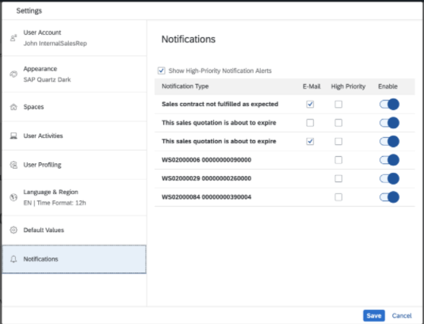
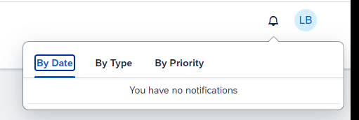
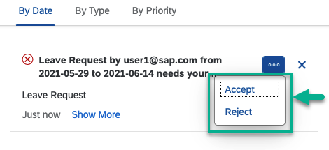
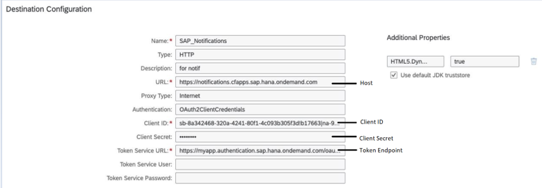

<!-- loiod5429a2a5d9a4425a461aa06c4ee84e4 -->

<link rel="stylesheet" type="text/css" href="css/sap-icons.css"/>

# Enabling Notifications for Custom Apps on SAP BTP Cloud Foundry

Custom apps that have been developed and deployed to SAP BTP, Cloud Foundry environment can be configured to publish notifications. Users can access the notifications from the shell header of their site and they can act on these notifications.

<a name="loiod5429a2a5d9a4425a461aa06c4ee84e4__section_ppt_1pp_dyb"/>

## Prerequisites

A user with an assigned *Subaccount Administrator* role must assign the *Business\_Notifications\_Admin* role to the respective [User](https://help.sap.com/docs/btp/sap-business-technology-platform/assign-users-to-role-collections?version=Cloud) or [User Group](https://help.sap.com/docs/btp/sap-business-technology-platform/assign-user-groups-to-role-collections?version=Cloud) role collections. Since this role is not included in any predefined Role Collection, the*Subaccount Administrator* must do one of the following:

-   [Define a new Role Collection](https://help.sap.com/docs/btp/sap-business-technology-platform/define-role-collection) and [add the Roles to it](https://help.sap.com/docs/btp/sap-business-technology-platform/add-roles-to-role-collection)

-   [Add the Roles in already existing Role Collection](https://help.sap.com/docs/btp/sap-business-technology-platform/add-roles-to-role-collection?version=Cloud)

## Overview

Notifications are the best way to make users aware of a situation that requires timely action or attention. Users access notifications by clicking the bell icon in the shell bar at the top right of the screen. In the notifications popover, the user can then act on the notification \(for example, accept or reject a leave request\).

Before developers can enable their custom apps to publish notifications, they'll need you to send them the details of a destination that you create in the SAP BTP cockpit. To create the destination, you'll first need to generate certain credentials in your subaccount settings.

The overall process for enabling notifications in custom apps is as follows:

<table>
<tr>
<th valign="top">

Step

</th>
<th valign="top">

Who does it?

</th>
<th valign="top">

More information

</th>
</tr>
<tr>
<td valign="top">

Open the *Site Manager*

</td>
<td valign="top">

Administrator

</td>
<td valign="top">

1.  Under your avatar, click *Administration Console*.

2.  Go to the *External Integrations* section, expand it, and click *Business Content*.

3.  In the screen that opens, click *Content Manager*.

    This takes you to the *Content Manager* screen in the *Site Manager*.

</td>
</tr>
<tr>
<td valign="top">

Choose the authentication identifier.

</td>
<td valign="top">

Administrator

</td>
<td valign="top">

Choose the authentication identifier that is relevant for your provider as follows:

1.  From the *Site Manager* side panel, click :gear: to open the subaccount settings.

2.  Select the *Notifications* tab.

3.  Under *Authentication Identifier*, either leave the default *Email* identifier or switch to *User ID*, depending on which is relevant for your provider.

For more information, see [Subaccount Settings](subaccount-settings-2d651c7.md).

</td>
</tr>
<tr>
<td valign="top">

Generate the credentials for your service

These credentials are used to connect between your system and the . SAP Build Work Zone, advanced edition.

</td>
<td valign="top">

Administrator

</td>
<td valign="top">

Generate the credentials for configuring the destination to the notifications service as follows:

Open the subaccount settings screen as you did above, and in the *Notifications* tab, click *Generate* to get the credentials required to configure your communication system.

For more information, see [Subaccount Settings](subaccount-settings-2d651c7.md)

</td>
</tr>
<tr>
<td valign="top">

Configure a destination to the notifications service in the SAP BTP cockpit using the generated credentials.

</td>
<td valign="top">

Administrator

</td>
<td valign="top">

For more information about how to do this, see the section below this table:**Configure the destination to the notifications service**

</td>
</tr>
<tr>
<td valign="top">

Give the developer the destination details.

</td>
<td valign="top">

Administrator

</td>
<td valign="top">

 

</td>
</tr>
<tr>
<td valign="top">

Develop the app that will generate notifications.

</td>
<td valign="top">

Developer

</td>
<td valign="top">

Use SAP Business Application Studio or any other developer environment

For more information, see [Developing Cloud Foundry Applications With Notifications](developing-cloud-foundry-applications-with-notifications-fe40c01.md).

</td>
</tr>
<tr>
<td valign="top">

Enable the display of notifications in the *Site Settings* screen.

</td>
<td valign="top">

Administrator

</td>
<td valign="top">

Enable the display of the notifications in your site settings as follows:

1.  From the *Site Manager* side panel of your site, click :globe_with_meridians: to open the *Site Directory*.

2.  Click :gear: on the site's tile.

3.  Enable *Show Notifications* under the *Display* section of your *Settings* screen.

4.  Click *Save*.

</td>
</tr>
<tr>
<td valign="top">

Select the notifications.

> ### Note:  
> Users select the notifications that they want to receive.

</td>
<td valign="top">

User

</td>
<td valign="top">

Open user *Settings* \> *Notifications*

> ### Note:  
> For more information about setting your notification preferences, see [Setting Notification Preferences.](https://help.sap.com/viewer/a7b390faab1140c087b8926571e942b7/1809BW.001/en-US/efec622a9eed4217a0a3fb6255801e41.html)

</td>
</tr>
<tr>
<td valign="top">

Open the notifications.

</td>
<td valign="top">

User

</td>
<td valign="top">

In the site header of your site, click the :bell:\(notifications\) icon:

</td>
</tr>
<tr>
<td valign="top">

Complete any actions if required.

</td>
<td valign="top">

User

</td>
<td valign="top">

From the notification

</td>
</tr>
</table>

<a name="loiod5429a2a5d9a4425a461aa06c4ee84e4__section_w2k_fq4_spb"/>

## Configure the destination to the notifications service

Configure a destination between SAP BTP and the notifications service using the credentials you generated in Step 1 as follows:

1.  Open the SAP BTP cockpit and click on your subaccount.

2.  From the side navigation panel, go to *Destinations* \> *New Destination*.

3.  Enter the following destination properties:

    <table>
    <tr>
    <th valign="top">

    Property
    
    </th>
    <th valign="top">

    Value
    
    </th>
    </tr>
    <tr>
    <td valign="top">
    
    `Name` 
    
    </td>
    <td valign="top">
    
    SAP\_Notifications
    
    </td>
    </tr>
    <tr>
    <td valign="top">
    
    `Type` 
    
    </td>
    <td valign="top">
    
    HTTP
    
    </td>
    </tr>
    <tr>
    <td valign="top">
    
    `Description` 
    
    </td>
    <td valign="top">
    
    Enter more details.
    
    </td>
    </tr>
    <tr>
    <td valign="top">
    
    `URL` 
    
    </td>
    <td valign="top">
    
    https://notifications.cfapps.sap.hana.ondemand.com

    Value generated from the *Host* field in the subaccount settings.
    
    </td>
    </tr>
    <tr>
    <td valign="top">
    
    `Proxy Type` 
    
    </td>
    <td valign="top">
    
    Internet
    
    </td>
    </tr>
    <tr>
    <td valign="top">
    
    `Authentication` 
    
    </td>
    <td valign="top">
    
    OAuth2ClientCredentials
    
    </td>
    </tr>
    <tr>
    <td valign="top">
    
    `Client ID` 
    
    </td>
    <td valign="top">
    
    Value generated in the *OAuth2.0 Client ID* field in the subaccount settings.
    
    </td>
    </tr>
    <tr>
    <td valign="top">
    
    `Client Secret` 
    
    </td>
    <td valign="top">
    
    Value generated from the *Client Secret* field in the subaccount settings.
    
    </td>
    </tr>
    <tr>
    <td valign="top">
    
    `Token Service URL` 
    
    </td>
    <td valign="top">
    
    Value generated from the *Token Endpoint* field in the subaccount settings.
    
    </td>
    </tr>
    </table>
    
    This is how it'll look:

    

4.  Click *Save*.

5.  Send the destination details to the developer who is developing the apps that will publish the notifications.

    For more information, see [Developing Cloud Foundry Applications With Notifications](developing-cloud-foundry-applications-with-notifications-fe40c01.md)

> ### Note:  
> App notifications are not supported within a launchpad module.

<a name="loiod5429a2a5d9a4425a461aa06c4ee84e4__section_xms_yxy_sxb"/>

## Configure Email Notifications Using Custom SMTP Server

If you want to receive an email notification, you need to configure custom SMTP destination. Proceed as described in [Configuring an SMTP Mail Destination](configuring-an-smtp-mail-destination-e403f2c.md).

