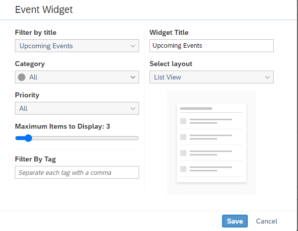

<!-- loio6d0cdcdcc9f64a928bf7ca8a2798b1b6 -->

# Event Widget

Add an *Event* widget to enable workspace members to view a current and recent list of events.

When you insert an event widget, you can change the following settings:

<table>
<tr>
<th valign="top">

Setting

</th>
<th valign="top">

More Information

</th>
</tr>
<tr>
<td valign="top">

Event type

</td>
<td valign="top">

Choose to display upcoming events in ascending order by date or recent events in descending order by date.

</td>
</tr>
<tr>
<td valign="top">

Category

</td>
<td valign="top">

Choose a color-coded category to help the workspace member visually identify the type of event \(for example, brainstorm, conference, meeting, milestone, other, social, training, webinar, uncategorized, or custom event\).

</td>
</tr>
<tr>
<td valign="top">

Priority

</td>
<td valign="top">

Choose to display events of high, normal, low, or all priorities.

</td>
</tr>
<tr>
<td valign="top">

Maximum number of items

</td>
<td valign="top">

Click and drag the scale slider to set a maximum between 1 and 25 event items to display.

</td>
</tr>
<tr>
<td valign="top">

Filter by tag

</td>
<td valign="top">

Enter text that refines what appears in the events list; one or more tags are allowed, comma-separated.

</td>
</tr>
<tr>
<td valign="top">

Widget title

</td>
<td valign="top">

Enter a name for the events list or accept the default name provided by the selection for event type.

</td>
</tr>
<tr>
<td valign="top">

Select layout

</td>
<td valign="top">

Select how you want to view the event - your choices are List View or Month View \(in this case, the calendar opens displaying your events\).

</td>
</tr>
</table>

For more information about events, see [About Events](about-events-68ff1db.md).

For more information about how to create events, see [How to Create and Manage Events](how-to-create-and-manage-events-c966cf4.md).

