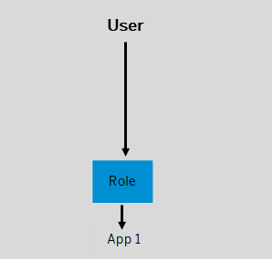
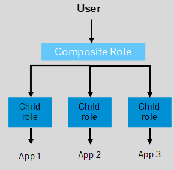
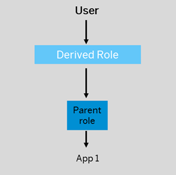

<!-- loio7eed56972a2b4f1ab3f862fad6370b77 -->

# Exploring Role Assignments

Administrators can explore the role assignments that were provisioned by the Identity Provisioning service.

<a name="loio7eed56972a2b4f1ab3f862fad6370b77__section_c5p_j4w_k1c"/>

## Prerequisites

In addition to the SAP Build Work Zone, advanced edition connector that you set up during onboarding, you've also configured the Identity Provisioning connector of SAP Build Work Zone, standard edition to use it to provision authorizations from remote content providers. The connectors status is `Connected`. For more information, see [Post Booster Configuration](post-booster-configuration-e567b51.md)

## Overview

If you are using the Identity Provisioning service to provision users and their authorizations of remote content providers, you can explore the role assignments for a specific user by searching for the user email or Global User ID. This capability increases the transparency and allows checking which authorizations exist in the system for a given user.

You can filter the results according the role IDs or provider ID.

<a name="loio7eed56972a2b4f1ab3f862fad6370b77__section_osy_pmw_k1c"/>

## Procedure

1.  In the Site Manager, go to *Settings* \> *Identity Provisioning* screen.
2.  Enter the user email of Global User ID and click *View Assigned Roles*.

<a name="loio7eed56972a2b4f1ab3f862fad6370b77__section_ncr_zmw_k1c"/>

## Search Results

> ### Note:  
> -   The role assignment table reflects the authorizations that were successfully provisioned to SAP Build Work Zone, advanced edition.
> 
>     If the connection with Identify Provisioning fails for any reason but user authorizations were previously synced, the search will still return results, however they might not be up to date and reflect the stored data.
> 
> -   If the subaccount is connected with multiple IdPs and there are users with identical emails \(for example, one IdP for employees and one for customers\):
> 
>     -   Same email from different IdPs is associated with the same user.
>     -   Same email from different content providers - the search results will show all roles with all content providers.
> 
>     the Explore role assignment will show all roles with different provider IDs

The table of role assignments contains the following information:

<table>
<tr>
<th valign="top">

Column

</th>
<th valign="top">

More Info

</th>
</tr>
<tr>
<td valign="top">

Role ID

</td>
<td valign="top">

This is the role that is directly assigned to the content \(app/group/catalog\) and to the site. The same role ID is also visible in the Content Manager table. To be able to view content in the site, the user must be assigned to this role directly \(scenario 1\), or indirectly via derived/composite roles \(scenario 2 & 3\).

</td>
</tr>
<tr>
<td valign="top">

Derived/Composite Role ID

</td>
<td valign="top">

Derived and Composite roles \(PFCG roles\) can be assigned to ABAP applications on the content provider's side. These roles are not visible in the Content Manager table.

-   Composite roles are a collection of single roles that are grouped together into a common composite role menu. By assigning users to a composite role, users are indirectly assigned to multiple single roles.
-   Derived roles are single roles that have inherited authorization characteristics from a “master” parent role.

</td>
</tr>
<tr>
<td valign="top">

Provider ID

</td>
<td valign="top">

The system ID of the remote content provider.

</td>
</tr>
<tr>
<td valign="top">

Provisioned On

</td>
<td valign="top">

The date when the role was first provisioned to SAP Build Work Zone, advanced edition. Note that this date doesn’t change when the role is updated.

</td>
</tr>
</table>

**Scenario 1:** The user is assigned directly to a single role. This role is also assigned to the content and is visible in the Content Manager table.

**Scenario 2:** The user is assigned to a composite role which groups together a few single roles. These single roles are assigned to the content and therefore are visible in the Content Manager table. The composite role that groups them is not visible in the Content Manager table.

**Scenario 3:** The user is assigned to a derived role which inherits its authorization from a parent role. The parent role is assigned to the content and therefore is visible in the Content Manager table. The derived role is not visible in the Content Manager table.

