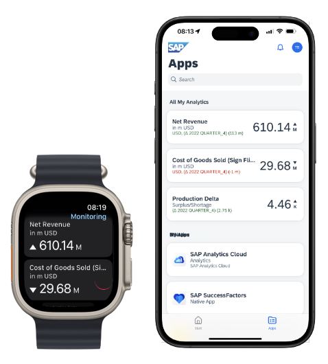

<!-- loio59f79cf1eeac41deaa6d7e0d3530499e -->

<link rel="stylesheet" type="text/css" href="css/sap-icons.css"/>

# Exposing SAP Analytics Cloud KPIs in the Joule Work Mobile App

The steps required to expose SAP Analytics Cloud KPIs as tiles in the Joule Work mobile app and widgets on the home or lock screen.

## Overview

You can expose SAP Analytics Cloud KPIs as tiles in the Joule Work mobile app as well as widgets on the home or lock screen. The SAP Analytics Cloud KPIs are also available as dynamic tiles in the runtime site of SAP Build Work Zone, advanced edition.

The SAP Analytics Cloud KPIs can be exposed in the Joule Work mobile app as tiles \(numeric point charts\) that include a KPI, coloring, and a trend indicator. These tiles can also be added as widgets to the iOS Home Screen and monitored in the Apple Watch and Wear OS apps. All native widget capabilities are supported in the Joule Work mobile app.

<a name="loio59f79cf1eeac41deaa6d7e0d3530499e__section_sht_cmw_m1c"/>

## Prerequisites

The following table lists the prerequisites that are required to enable integration between SAP Analytics Cloud and SAP Build Work Zone, advanced edition running on SAP BTP:

<table>
<tr>
<th valign="top">

Where?

</th>
<th valign="top">

Prerequisites

</th>
</tr>
<tr>
<td valign="top">

SAP BTP tenant

</td>
<td valign="top">

-   You have a subscription to SAP Build Work Zone, advanced edition

-   You have an admin user assigned to the *WorkZone\_Admin* role.

    For more information, see [Onboarding to SAP Build Work Zone, advanced edition](https://help.sap.com/docs/build-work-zone-advanced-edition/sap-build-work-zone-advanced-edition/onboarding-to-sap-build-work-zone-advanced-edition).

</td>
</tr>
<tr>
<td valign="top">

SAP Analytics Cloud tenant

</td>
<td valign="top">

-   You have the *Viewer* role for the story.

    > ### Note:  
    > Make sure that the story designer or the admin have selected the *Copy Widget ID* option in the *Build* panel of the story.

-   You are using one of the following live connection models that are supported:

    -   SAP BW, tunnel, with *Save this credential for all users on this system.* selected

    -   SAP HANA, tunnel

    -   SAP S/4HANA, tunnel

-   The story is enabled for mobile when opening the app as a native SAP Analytics Cloud mobile app \(Scenario B in the procedure below\).

    For more information, see the [FAQs](exposing-sap-analytics-cloud-kpis-in-the-joule-work-mobile-app-59f79cf.md#loio59f79cf1eeac41deaa6d7e0d3530499e__section_faqs) section below.

</td>
</tr>
<tr>
<td valign="top">

Both tenants

</td>
<td valign="top">

You have configured SSO \(Single Sign On\) between the SAP BTP tenant and the SAP Analytics Cloud tenant.

For more information, see [Configuring SSO Between SAP BTP and SAP Analytics Cloud](configuring-sso-between-sap-btp-and-sap-analytics-cloud-1615cc3.md).

</td>
</tr>
</table>

<a name="loio59f79cf1eeac41deaa6d7e0d3530499e__section_dvy_gmw_m1c"/>

## Procedure

You integrate SAP Analytics Cloud with both SAP Build Work Zone, advanced edition and the Joule Work mobile app. First, you create in the Site Manager of SAP Build Work Zone, advanced edition an app that will display the SAP Analytics Cloud widget as a tile. Then, you assign the app to a group and a role, and assign the role to the site. You also need to assign the relevant users to the role in your subaccount on SAP BTP. When you launch the site, you can access this tile using the SAP Build Work Zone, advanced edition Web client, or you can scan a QR code to see the results in the Joule Work mobile app.

The following procedure describes these steps in detail:

1.  In the Site Manager, go to the *Content Manager* and create a new app in the app editor as described in the following steps.

2.  In the *Configuration* tab of the app editor, enter the field values according to the scenario you are using:

    1.  **Scenario A** \(recommended\): The app will be opened from the Joule Work mobile app as an SAP Analytics Cloud Story in a mobile browser. This scenario requires one app.

        <table>
        <tr>
        <th valign="top">

        Field
        
        </th>
        <th valign="top">

        Value
        
        </th>
        </tr>
        <tr>
        <td valign="top">
        
        *Title*
        
        </td>
        <td valign="top">
        
        A placeholder representing the SAP Analytics Cloud widget. It will be replaced in runtime by the title of the widget in SAP Analytics Cloud.
        
        </td>
        </tr>
        <tr>
        <td valign="top">
        
        *Description*
        
        </td>
        <td valign="top">
        
        Optional
        
        </td>
        </tr>
        <tr>
        <td valign="top">
        
        *Open App*
        
        </td>
        <td valign="top">
        
        In a new tab
        
        </td>
        </tr>
        <tr>
        <td valign="top">
        
        *System*
        
        </td>
        <td valign="top">
        
        No System
        
        </td>
        </tr>
        <tr>
        <td valign="top">
        
        *App UI Technology*
        
        </td>
        <td valign="top">
        
        URL
        
        </td>
        </tr>
        <tr>
        <td valign="top">
        
        *URL*
        
        </td>
        <td valign="top">
        
        The URL pointing the SAP Analytics Cloud Web UI.

        Format:

        `https://<SAC tenant URL>/sap/fpa/ui/tenants/8c92c/bo/story/<id>`

        Example:

        `https://mySACtenant.cloud.sap/sap/fpa/ui/tenants/8c92c/bo/story/<id>`
        
        </td>
        </tr>
        </table>
        
    2.  **Scenario B**: The app will be opened in a native SAP Analytics Cloud mobile app, and the native app will be installed if it is not already installed on the mobile client. This scenario requires an app per operating system.

        <table>
        <tr>
        <th valign="top">

        Field
        
        </th>
        <th valign="top">

        Value
        
        </th>
        </tr>
        <tr>
        <td valign="top">
        
        *Title*
        
        </td>
        <td valign="top">
        
        A placeholder representing the SAP Analytics Cloud widget. It will be replaced in runtime by the title of the widget in SAP Analytics Cloud.
        
        </td>
        </tr>
        <tr>
        <td valign="top">
        
        *Description*
        
        </td>
        <td valign="top">
        
        Optional
        
        </td>
        </tr>
        <tr>
        <td valign="top">
        
        *Open App*
        
        </td>
        <td valign="top">
        
        In Place
        
        </td>
        </tr>
        <tr>
        <td valign="top">
        
        *System*
        
        </td>
        <td valign="top">
        
        No System
        
        </td>
        </tr>
        <tr>
        <td valign="top">
        
        *App UI Technology*
        
        </td>
        <td valign="top">
        
        Native iOS/Android
        
        </td>
        </tr>
        <tr>
        <td valign="top">
        
        *URL to Launch App*
        
        </td>
        <td valign="top">
        
        The native URL pointing to the SAP Analytics Cloud tenant site including the type and StoryID.

        Format:

        `sap-analytics-cloud://<tenant URL without "https://">/?type=story&id=<StoryID>`

        Example:

        `sap-analytics-cloud://<mySACtenant.cloud.sap>/?type=story&id=<StoryID>`
        
        </td>
        </tr>
        <tr>
        <td valign="top">
        
        *URL to Install App*
        
        </td>
        <td valign="top">
        
        The web URL pointing to the SAP Analytics Cloud App in the Apple/Google Play store. This allows the user to install the app in case it’s not available on the device.

        <table>
        <tr>
        <th valign="top">

        Field
        
        </th>
        <th valign="top">

        Value
        
        </th>
        </tr>
        <tr>
        <td valign="top">
        
        *Native iOS*
        
        </td>
        <td valign="top">
        
        `https://apps.apple.com/us/app/sap-analytics-cloud/id981727250`
        
        </td>
        </tr>
        <tr>
        <td valign="top">
        
        *Native Android*
        
        </td>
        <td valign="top">
        
        `https://play.google.com/store/apps/details?id=com.sap.epm.fpa&hl=en&gl=US&pli=1`
        
        </td>
        </tr>
        </table>
        

        
        </td>
        </tr>
        </table>
        

3.  In the *Navigation* tab of the app editor, enter the following values:

    <table>
    <tr>
    <th valign="top">

    Field
    
    </th>
    <th valign="top">

    Value
    
    </th>
    </tr>
    <tr>
    <td valign="top">
    
    *Semantic Object*
    
    </td>
    <td valign="top">
    
    A string representing the object you navigate to. For example: <`widget name`\>.
    
    </td>
    </tr>
    <tr>
    <td valign="top">
    
    *Semantic Action*
    
    </td>
    <td valign="top">
    
    A string representing the action you perform in the navigation. For example: `show`.
    
    </td>
    </tr>
    </table>
    
    > ### Note:  
    > These values are not seen by the business user.

4.  In the *Visualization* tab of the app editor, enter the following values:

    <table>
    <tr>
    <th valign="top">

    Field
    
    </th>
    <th valign="top">

    Value
    
    </th>
    </tr>
    <tr>
    <td valign="top">
    
    *Visualization Type*
    
    </td>
    <td valign="top">
    
    Dynamic App Launcher
    
    </td>
    </tr>
    <tr>
    <td valign="top">
    
    *Title*
    
    </td>
    <td valign="top">
    
    A placeholder representing the SAP Analytics Cloud widget. It will be replaced in runtime by the title of the widget in SAP Analytics Cloud.
    
    </td>
    </tr>
    <tr>
    <td valign="top">
    
    *Subtitle*
    
    </td>
    <td valign="top">
    
    A placeholder representing the subtitle of the widget. It will be replaced in runtime by the subtitle of the widget in SAP Analytics Cloud.
    
    </td>
    </tr>
    <tr>
    <td valign="top">
    
    *Supported Devices*
    
    </td>
    <td valign="top">
    
    Select *Desktop*, *Tablet*, and *Mobile*.
    
    </td>
    </tr>
    <tr>
    <td valign="top">
    
    *System*
    
    </td>
    <td valign="top">
    
    Select the name of the destination you added in Step 3 of [Configuring SSO Between SAP BTP and SAP Analytics Cloud](configuring-sso-between-sap-btp-and-sap-analytics-cloud-1615cc3.md).

    For example, `SAC`.
    
    </td>
    </tr>
    <tr>
    <td valign="top">
    
    *Service URL*
    
    </td>
    <td valign="top">
    
    The relative API URL that returns the data structure needed for the monitoring tiles.

    Format:

    `widgetquery/getWidgetData?storyId=<id>&widgetId=<widgetID>&type=story`

    Where:

    -   `StoryID` - Obtain this value from the URL of the SAP Analytics Cloud tenant in which you see the story board. For example, in the URL `https://.../s2/19F03902279139EC3896DB38A0F60557`, the story ID is 19F03902279139EC3896DB38A0F60557

    -   `WidgetID` - In edit time, obtain this value from the `ID` field under the *Generic Properties* in the *Styling* panel of the SAP Analytics Cloud tenant.

        In view time, go to the widget's  \(More Actions\) menu, and select *More Options* \> *Copy Widget ID*.

    For example:

    `widgetquery/getWidgetData?storyId=<id>&widgetId=<widgetID>&story`.
    
    </td>
    </tr>
    </table>
    
5.  Save the app.

6.  Create a group named, for example, `My SAC KPIs`, and assign to it the newly created app. Save.

7.  Create a role named, for example, `My SAC KPI Role`, and assign to it the newly created app. Save.

8.  In the *Site Directory*, assign the role you created to the site. Save.

> ### Note:  
> For every role you add to the Site Manager, a corresponding role collection is automatically created in the SAP BTP cockpit. Make sure that you assign these role collections to the relevant users in the the *Role Collections* screen in the cockpit.

<a name="loio59f79cf1eeac41deaa6d7e0d3530499e__section_b5b_yxd_n1c"/>

## Viewing the Results

To view the results, in the *Site Directory*, launch the site. This opens the Web app \(runtime site\) of SAP Build Work Zone, advanced edition where you will see the tiles that represent the integrated SAP Analytics Cloud KPIs.

For example:

To also view the results in the Joule Work mobile app, you can perform the following steps:

1.  In the *Site Directory*, launch the site.

2.  In the runtime site, from the User Actions menu \(click your avatar at the right of the header bar\), select *Settings*.

3.  Select *Joule Work Mobile App* \> *Register* \(if you haven’t done so yet\), and scan the QR code to access the Joule Work mobile app.

    For more information, see [Setting Up the Joule Work Mobile App](setting-up-the-joule-work-mobile-app-3257133.md).

<a name="loio59f79cf1eeac41deaa6d7e0d3530499e__section_faqs"/>

## FAQs

### When do I receive this error message -"This story is currently not enabled for the mobile app"?

**Answer**: If when clicking a tile, the navigation works but in the SAP Analytics Cloud app you see the following message: "This story is currently not enabled for the mobile app", it indicates that the story does not have the following setting enabled: *Enable mobile support for Canvas Page*.

For information about this setting, see the section about the **Optimized Story Experience** in:

-   [iOS Mobile App Feature Compatibility](https://help.sap.com/docs/SAP_ANALYTICS_CLOUD/00f68c2e08b941f081002fd3691d86a7/5ca20164cc7c4a8d95acd539d98ec2b4.html)

-   [Android Mobile App Feature Compatibility](https://help.sap.com/docs/SAP_ANALYTICS_CLOUD/00f68c2e08b941f081002fd3691d86a7/6dd774eb8175422c881665409c12c958.html)

**Related Information**  

[Configuring SSO Between SAP BTP and SAP Analytics Cloud](configuring-sso-between-sap-btp-and-sap-analytics-cloud-1615cc3.md "The steps required to establish a system-to-system trust between the SAP BTP tenant and the SAP Analytics Cloud tenant to enable single sign on (SSO).")

