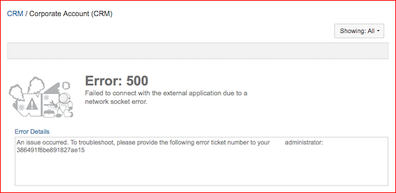
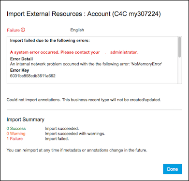

<!-- loio7cf7ba0821bf4bc5bc241725eb071396 -->

# External Application Error Messages

Information about error messages when integrating external applications.

This section explains the External Application error messages developed to help integrators deal with problems that are encountered when developing or troubleshooting external application integrations. These error messages are designed to assist integrations developers understand issues involving communications with the external applications, problems viewing external application metadata, and errors that are encountered when viewing OData Annotations in the Business Record Viewer \(BRV\), the Business Record Browser \(BRB\), the Business Record Editor \(annotation importer\), the Related Object page, the Feature Object page, the Quick Card pop-ups, and other view pages. The objective of External Application error messages is to give users, administrators, and integrators informative error messages that identify the source and nature of the issues encountered at any stage of the communications and data exchanges with external systems and the display of that data in the SAP Build Work Zone, advanced edition user and admin interfaces.

For more information, see [Getting Support.](https://help.sap.com/docs/WZ/b03c84105ff74f809631e494bd612e83/37b79483b56c4f088ce01f1d9f444459.html)

The goals of the External Application error messages subsystem are:

-   To provide sufficient information to each level of end user to allow them to follow up with the issue, and to allow organizations to troubleshoot any issues that they encounter.
-   To provide error messages that identify the source of the issue, whether that be the connection to the external application, problems with the external application's OData implementation, problems accessing or parsing the external application's OData metadata file, or problems encountered with the import process of the localized business record type annotation, or its formatting.
-   To ensure that all areas of business record error reports or exceptions are caught and identified in sufficiently detailed text.
-   To ensure that any external application error messages are forwarded and displayed to end users, company administrators, and integration developers.

> ### Note:  
> Error messages should be available in each language selected when you add a business record. The error messages should match the language in use in that business record. However, if a language is used that is not enabled in the business record configuration, the language in which the error message is displayed will revert to the default language set for the business record.

> ### Note:  
> Each of these error messages refers to an "Error Key". Users should quote these keys when reporting the encountered problem to their company administrators. External application integrators should quote these keys when reporting the encountered problem to their company administrators if they are unable to resolve the encountered problem using the provided error message information. Company administrators should quote these keys when and if they report the encountered problem or file a bug on the issue with SAP Jam Support.

Below you can find examples of External Application error messages:

-   The display of error messages in the Annotations-filled UI objects.
-   The display of error messages in workpages.

## SSL Error

SSL Errors occur when an invalid SSL Certificate is provided to the external application.

  
  
**Importing Annotation**

  
  
**BRV/BRB/Quick card**

## OAuth Error

OAuth Errors occur when the external call failed to retrieve an OAuth token from the Gateway to make the OData call to the external system.

  
  
**Importing Annotation**

  
  
**BRV/BRB/Quick card**

## Time Out Error

Time Out Errors occur when the external application is taking too long to respond.

  
  
**Importing Annotation**

  
  
**BRV/BRB/Quick card**

## Socket/Protocol Error

Socket/Protocol Errors occur when the connection fails to retrieve a socket or an invalid protocol is used.

  
  
**Importing Annotation**

  
  
**BRV/BRB/Quick card**

  
  
**BRV/BRB/Quick card \(2\)**

")

## Standard Error

Standard Errors occur when there is some run-time crash or failure caused by code relating to invalid functions, variables, arguments, or IO, for example.

  
  
**Importing Annotation**

  
  
**BRV/BRB/Quick card**

## Generic Error

Generic Errors occur when there is an unknown run-time error or exception that was not caught by any of the above handlers. A ticket is provided that can help investigate the underlying problem if reported.

  
  
**Importing Annotation**

  
  
**BRV/BRB/Quick card**

SAP Build Work Zone, advanced edition

